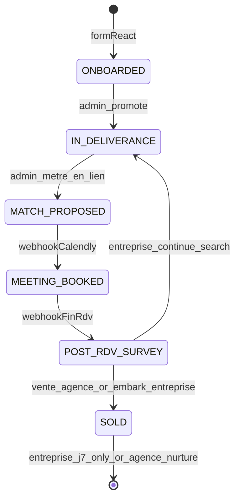

# Hercule — Vue d'ensemble tech stack

> Voir aussi : [Modèle des 4 lignes](./01-four-lines-model.md) · [Modèle de données](./02-data-model.md) · [Profile JSON](./02-profile-json.md) · [Capacity & SLA](./capacity/README.md) · [Index](./README.md)  
> Modules : [Capacity](./capacity/README.md) · [Onboarding](./onboarding/README.md) · [Deliverance](./deliverance/README.md) · [Matching](./matching/README.md) · [Post-RDV](./post-rdv/README.md)

---

## 1. Intro (langage simple)

**Hercule** met en relation des **entreprises** (PME, TPE…) avec des **agences web**.

- **L'agence** paie (~1 500 € à l'entrée ; renouvellement / nouveau cycle **1 489 €**).
- **L'entreprise** ne paie **rien** — jamais d'upsell.

**Promesse livraison (capacity) :** **3 à 4 RDV honorés / mois** par agence @ allocation standard (30 inbox). Plafond marketing « 3–5 » — détail [capacity/00-deliverables.md](./capacity/00-deliverables.md).

Il y a **3 progressions visuelles** reliées par la même base :

1. **Admin (Streamlit)** — tu vois toutes les fiches, tu déclenches le service.
2. **Agence (React)** — suivi read-only + survey commercial post-RDV.
3. **Entreprise (React)** — suivi read-only + survey embarquement.

Tout repose sur **2 tables** + colonne **`profile` JSON**.

**Règle clé :** seul l'admin modifie le parcours — sauf `POST onboarding` et `POST survey/[token]`.

---

## 2. Architecture développée (pour IA de coding)

### 4 modules produit

| # | Module | Rôle |
|---|--------|------|
| 1 | [Onboarding](./onboarding/README.md) | Formulaire → profile JSON |
| 2 | [Deliverance](./deliverance/README.md) | Timeline + emails datés |
| 3 | [Matching](./matching/README.md) | Mettre en lien → Calendly |
| 4 | [Post-RDV](./post-rdv/README.md) | Survey → SOLD · flows commerciaux distincts |

### Post-SOLD — agence vs entreprise

| | Entreprise | Agence |
|---|------------|--------|
| Question survey | « Embarqué avec l'agence ? » | « **Avez-vous fait la vente ?** » |
| Si oui / vente | Félicitations page — **fin contact commercial** | Félicitations + CTA **1 489 €** in-page |
| Si non | Continuer recherche possible | Offre **898 €** (3 RDV) — **page survey uniquement** |
| Si refus total | — | Nurturing 60j (J+7 1489€ → J+14 conseil → hebdo) |
| Emails post-SOLD | **1 seul** : J+7 « onboarding OK ? » (répondre par mail) | Nurturing si refus — **pas** de renewal auto à SOLD |

Détail agence : [post-rdv/agence-commercial.md](./post-rdv/agence-commercial.md)

### Enum `lead_statut` (produit)

`ONBOARDED` → `IN_DELIVERANCE` → `MATCH_PROPOSED` → `MEETING_BOOKED` → `POST_RDV_SURVEY` → `SOLD`



### Client read-only — exceptions

| Action | Route |
|--------|-------|
| Créer fiche | `POST /api/onboarding/[category]` |
| Lire suivi | `GET /api/deliverance/...` |
| Survey (+ offres agence) | `POST /api/post-rdv/survey` |

### Règle d'or

> **Supabase = vérité.** Profile JSON alimente UI + emails + offres. Pas de table communications séparée.

---

## 3. Prompt d'action IA

```
Contexte Hercule — lire :
- doc/tech-stack/00-overview.md
- doc/tech-stack/02-profile-json.md
- doc/tech-stack/post-rdv/agence-commercial.md

Règles post-survey :
- Entreprise SOLD : félicitations + entreprise_onboarding_check_j7 ONLY
- Agence : sale_made → 1489 in-page ; no → 898 exclusive ; decline → nurturing 60j
- NO renewal_agence_1489 email auto at SOLD
- NO commercial emails to entreprise after SOLD (except J+7 onboarding)
- NO abo 2500 MVP ; NO avis client MVP

Références : lib/booking-communication/orchestrator.ts, crm/crm_api.py
```
