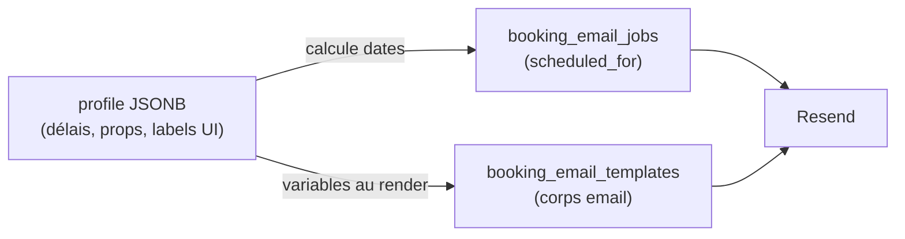
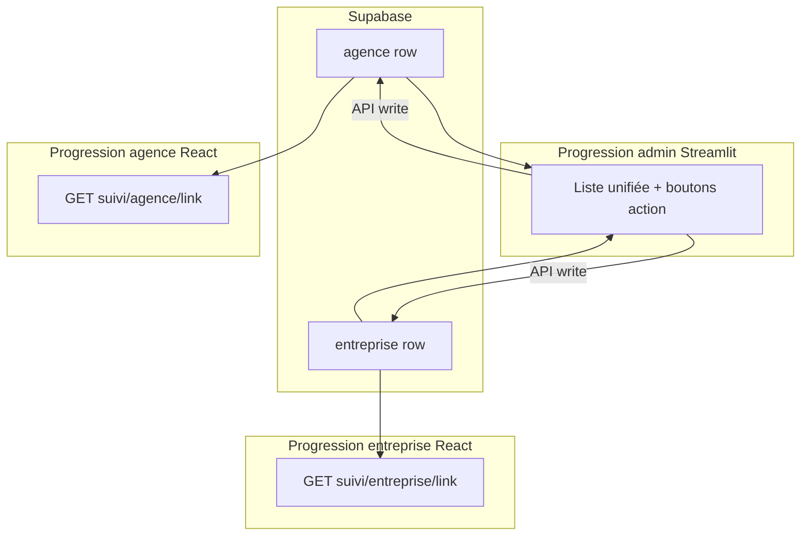

# Modèle de données — 2 tables, pas de table communications

> Voir aussi : [Profile JSON](./02-profile-json.md) · [Vue d'ensemble](./00-overview.md) · [4 lignes](./01-four-lines-model.md)

---

## 1. Intro (langage simple)

Toute la machine repose sur **un seul projet Supabase** et **deux tableaux** :

- `agence` — une ligne = une agence web
- `entreprise` — une ligne = une entreprise cliente

Toi (admin), l'agence et l'entreprise avez chacun **votre progression visuelle**, mais c'est la **même row en base** qui alimente tout. Pas besoin d'une table séparée pour « les communications » : la fiche client (`profile` JSON) + la queue d'emails existante suffisent.

---

## 2. Architecture développée (pour IA de coding)

### Tables

| Table | Rôle | Écriture |
|-------|------|----------|
| `public.agence` | Fiche agence + statut + profile + match | Admin via API ; onboarding POST client |
| `public.entreprise` | Fiche entreprise + statut + profile + match | Idem |
| `public.matches` | Historique lien agence↔entreprise | Admin via API (transaction) |
| `public.booking_email_jobs` | **Quand** envoyer un email | API Next.js + cron |
| `public.booking_email_templates` | **Quoi** envoyer (template) | Admin / seed |

Migration de base : [`supabase/migrations/20260903120000_agence_entreprise_leads.sql`](../../supabase/migrations/20260903120000_agence_entreprise_leads.sql)

### Faut-il une table « communications » ?

**Non.** Répartition des responsabilités :



| Besoin | Où ça vit |
|--------|-----------|
| Réponses formulaire onboarding | `profile.form` |
| Délais email (+4j rétractation…) | `profile.communication.delays` |
| Labels timeline client | `profile.display.timeline` |
| Date d'envoi programmé | `booking_email_jobs.scheduled_for` |
| Type d'email | `booking_email_jobs.email_type` |
| Corps + sujet | `booking_email_templates` |

Ajouter une 6e table « communications » dupliquerait `profile` + `booking_email_jobs`.

### Colonnes clés par table lead

**`agence` / `entreprise` (miroir) :**

| Colonne | Type | Rôle |
|---------|------|------|
| `id` | UUID | PK |
| `email`, `first_name`, `company` | TEXT | Identité |
| `statut` | `lead_statut` | Progression parcours |
| `slug` | TEXT | Token URL 6 chars (Calendly `utm_content`) |
| `reservation_agence_link` | TEXT | Full URL `/reservation.html/{slug}` |
| `reservation_entreprise_link` | TEXT | Full URL `/reservation-entreprise.html/{slug}` |
| `confirmation_agence_link` | TEXT | Full URL `/confirm-reservation.html/{slug}?email=` (Resend email 2 agence) |
| `profile` | JSONB | **Contrat central** — voir [02-profile-json.md](./02-profile-json.md) |
| `matched_agence_id` / `matched_entreprise_id` | UUID FK | Partenaire lié |
| `onboarding_completed_at` | TIMESTAMPTZ | Fin onboarding |
| `deliverance_step`, `deliverance_total_steps` | INT | Timeline |
| `deliverance_started_at`, `estimated_completion_at` | TIMESTAMPTZ | Dates suivi |
| `calendly_invitee_uri`, `scheduled_at` | TEXT/TIMESTAMPTZ | RDV Calendly (existant) |

**`matches` :**

| Colonne | Rôle |
|---------|------|
| `agence_id`, `entreprise_id` | Paire liée |
| `matched_at` | Timestamp admin « Mettre en lien » |
| `created_by` | `streamlit` |
| `notes` | Optionnel |

### Trois progressions, une source



- **Admin** : seul à pouvoir déclencher mises à jour DB + emails (via Streamlit → API).
- **Client agence/entreprise** : lecture seule (GET), sauf 2 exceptions documentées dans [01-four-lines-model.md](./01-four-lines-model.md).

### Enum `lead_statut` (complet)

| Statut | Parcours |
|--------|----------|
| `ONBOARDED` | Produit — fiche créée |
| `IN_DELIVERANCE` | Produit — recherche / timeline |
| `MATCH_PROPOSED` | Produit — admin a lié, Calendly envoyé |
| `MEETING_BOOKED` | Calendly — RDV match booké |
| `POST_RDV_SURVEY` | Post-RDV — en attente réponses |
| `SOLD` | Mission accomplie (soldé) |
| `NOTBOOKED`, `CLICKED` | CRM legacy |
| `MEETING_BOOKED`, `CONFIRMED`, `CANCELLED` | CRM booking agence commercial |

---

## 3. Prompt d'action IA

```
Modèle de données Hercule — respecter doc/tech-stack/02-data-model.md.

Règles :
- 2 tables leads (agence, entreprise) + matches + booking_email_jobs + booking_email_templates
- PAS de table communications séparée
- profile JSONB = config client (délais, display, form)
- booking_email_jobs = quand envoyer ; templates = quoi envoyer
- Admin écrit via API ; client lit via GET (exceptions onboarding + survey)

Réutiliser :
- supabase/migrations/20260903120000_agence_entreprise_leads.sql
- supabase/migrations/20260904100000_crm_booking_communication.sql

Tests :
- profile.communication.delays impacte scheduled_for des jobs
- Pas de duplication config entre profile et une hypothétique table comms
```
