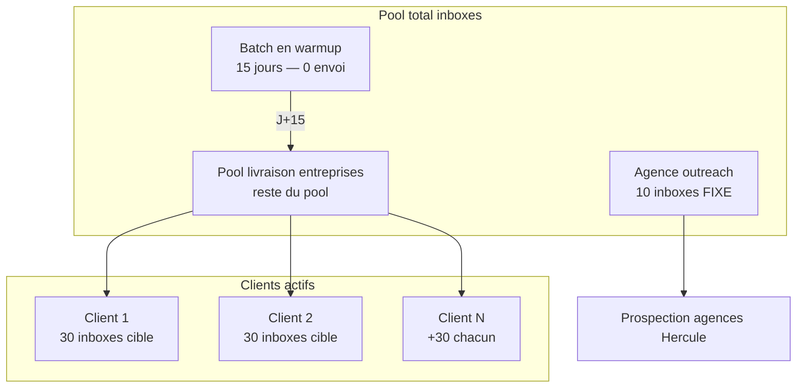

# Capacity — Modèle inbox

> Module : [Capacity](./README.md) · Suite : [Funnel math](./02-funnel-math.md)

---

## 1. Intro (langage simple)

Tu gères **60 inbox aujourd'hui** (120 après batch +60 warmup). Une partie sert **toujours** à prospecter de nouvelles agences ; le reste sert à **livrer des RDV entreprises** pour chaque client payant. Ce doc fixe qui reçoit combien d'inboxes et quand.

---

## 2. Architecture pool



---

## 3. Règles d'allocation

| Règle | Valeur |
|-------|--------|
| Réserve agence | **10 inboxes** — jamais réallouées à la livraison |
| Cible par client actif | **30 inboxes** dédiées livraison entreprises |
| Phase contrainte | **15 inboxes** + `profile.capacity.constrained = true` |
| Warmup nouveau batch | **15 jours** avant envoi |
| Incrément achat | **+60 inboxes** par batch |
| Niche entreprise | **Unique** pour toutes les agences — routage par match admin |

---

## 4. Capacité par taille de pool

| État pool | Total | Livraison dispo | Clients @ 30 | Clients @ 15 |
|-----------|-------|-----------------|--------------|--------------|
| **Actuel** | 60 | 50 | **1** + 20 spare | 3 max (45) — serré |
| **Post-warmup** | 120 | 110 | **3** + 20 spare | 7 max |

Formule :

```
inboxes_livraison = total_inboxes - 10
clients_max_30 = floor(inboxes_livraison / 30)
clients_max_15 = floor(inboxes_livraison / 15)
```

---

## 5. Règle vente

Ne pas signer au-delà de `clients_max` sans :

1. Batch +60 **commandé** et date fin warmup communiquée, ou
2. Acceptation écrite waitlist (`QUEUED_WARMUP` / `QUEUED_CAPACITY`).

Le goulot principal : **~5 closes agence/mois** possibles (funnel 10 inbox) vs **1–3 slots livraison @ 30** — voir [02-funnel-math.md](./02-funnel-math.md).

---

## 6. Table `inbox_pool` (implémentation future)

| Colonne | Rôle |
|---------|------|
| `id` | PK |
| `status` | `active` \| `warmup` \| `reserved_agency` |
| `allocated_to_agence_id` | FK nullable |
| `warmup_started_at` | TIMESTAMPTZ |

Voir [06-profile-integration.md](./06-profile-integration.md).

---

## 7. Prompt d'action IA

```
Modèle inbox (doc/tech-stack/capacity/01-inbox-model.md).

- 10 inbox agence fixe ; livraison = total - 10
- 30 inbox/client cible ; 15 si constrained
- Warmup 15j ; batch +60
- clients_max = floor(livraison / allocation)

Références : capacity/05-waiting-list.md, capacity/09-bootstrap-timeline.md
```
