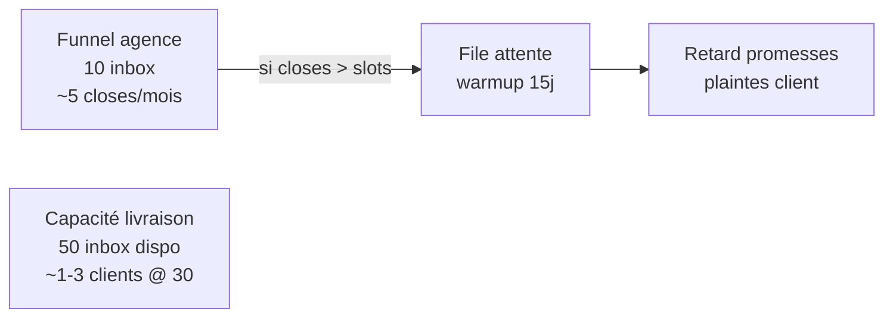

# Capacity — Funnel math

> Module : [Capacity](./README.md) · Suite : [SLA client](./03-sla-client.md)

---

## 1. Intro (langage simple)

Deux funnels cold email **séparés** : un pour **vendre** Hercule aux agences, un pour **livrer** des RDV entreprises à chaque client payant. Les coefficients ci-dessous sont la **baseline validée** — recalibrer via [`app/streamlit_stats/app.py`](../../../app/streamlit_stats/app.py) si dérive > 20 %.

---

## 2. Funnel A — Livraison entreprise (par client payant)

| Étape | Coefficient | Définition |
|-------|-------------|------------|
| Reply rate | **1%** | Réponse cold email entreprise |
| Positive rate | **30%** | Réponse qualifiable / intéressée |
| Booking rate | **30%** | Positive → U3 booké (Calendly match) |
| Closing rate | **60%** | U3 booké → U4 honoré (facturable) |

### Formules mensuelles

Hypothèse par défaut : **20 sends / inbox / jour ouvré**, **22 jours ouvrés / mois**.

```
envois_mois   = inboxes × 20 × 22
replies       = envois × 0.01
positives     = replies × 0.30
rdv_bookés    = positives × 0.30                    → U3
rdv_honorés   = rdv_bookés × 0.60                   → U4
```

### Taux combinés

| Conversion | Taux | Emails par unité |
|------------|------|------------------|
| send → U3 | **0,09%** | ~1 111 |
| send → U4 | **0,054%** | ~1 852 |

### Projections @ baseline

| Allocation | Envois/mois | U3 bookés | U4 honorés | Promesse safe |
|------------|-------------|-----------|------------|---------------|
| **30 inbox** | 13 200 | **~12** | **~7** | 3–4 honorés |
| **15 inbox** | 6 600 | **~6** | **~3,6** | 2–3 honorés |

### Délai théorique premier U3 (envoi seul)

```
jours_pour_u3 = 1111 / (inboxes × 20)
```

| Allocation | Jours ouvrés (envoi seul) |
|------------|---------------------------|
| 30 inbox | ~**2j** |
| 15 inbox | ~**4j** |

Ajouter **+7j buffer ops** (live qual + admin match + Calendly entreprise) pour les promesses client — voir [03-sla-client.md](./03-sla-client.md).

### Jalons U4 cumulés

```
jours_pour_N_u4 = (N × 1852) / (inboxes × 20) + buffer_ops(7)
```

| N U4 | ~30 inbox | ~15 inbox |
|------|-----------|-----------|
| 1 | 14–18j | 22–28j |
| 5 | 28–32j | 42–48j |
| 10 | 52–58j | 80j+ |

---

## 3. Funnel B — Acquisition agence (10 inboxes réservées)

| Étape | Coefficient |
|-------|-------------|
| Reply rate | **3%** |
| Positive rate | **50%** |
| Booking rate | **20%** |
| Closing rate | **40%** (signature / paiement) |

Projection @ 4 400 envois/mois (10 × 20 × 22) :

| Étape | Volume/mois |
|-------|-------------|
| Replies | ~132 |
| Positives | ~66 |
| RDV commerciaux bookés | **~13** |
| Clients signés | **~5,3** |

### Projection bootstrap — 11 RDV calendrier / 14 jours

Les **11 RDV = vente agence**, pas U4 livrés.

```
closes_14j ≈ calls_complétés_14j × 0.40
           ≈ 7 × 0.40 = 2.8 → planifier 2–3 nouveaux clients payants
```

Voir [09-bootstrap-timeline.md](./09-bootstrap-timeline.md).

---

## 4. Insight : goulot acquisition vs livraison



Le funnel **entreprise** tient (7 U4/mois @ 30 inbox). Le stress vient du **déséquilibre** closes vs slots inbox.

---

## 5. Effet « + de clients »

| Situation | Effet U4/client |
|-----------|-----------------|
| +1 client sans +30 inbox | Partage pool → baisse linéaire (ex. 2 × 15 inbox → ~1,8 U4 chacun) |
| +30 inbox dédiées / client | Débit **indépendant** ~7 U4/mois |
| Même niche entreprise | Pool leads partagé — routage match, pas duplication sourcing |

---

## 6. Simulateur capacity

```
clients_max = floor(inboxes_livraison / allocation_par_client)
predicted_u4_monthly = inboxes × 20 × 22 × 0.01 × 0.30 × 0.30 × 0.60
```

Snapshot à l'onboarding : `profile.capacity.funnel_baseline` — voir [06-profile-integration.md](./06-profile-integration.md).

**Règle vente :** ne pas signer > `clients_max` sans batch en warmup commandé.

---

## 7. Prompt d'action IA

```
Funnel capacity (doc/tech-stack/capacity/02-funnel-math.md).

Baseline entreprise : 1% / 30% / 30% / 60%
Baseline agence : 3% / 50% / 20% / 40%
computeDeliveranceMilestones(allocation, activationAt, n_u4)

Réutiliser : app/streamlit_stats pour recalibrer
Références : capacity/09-bootstrap-timeline.md, lib/booking-communication/schedule.ts
```
