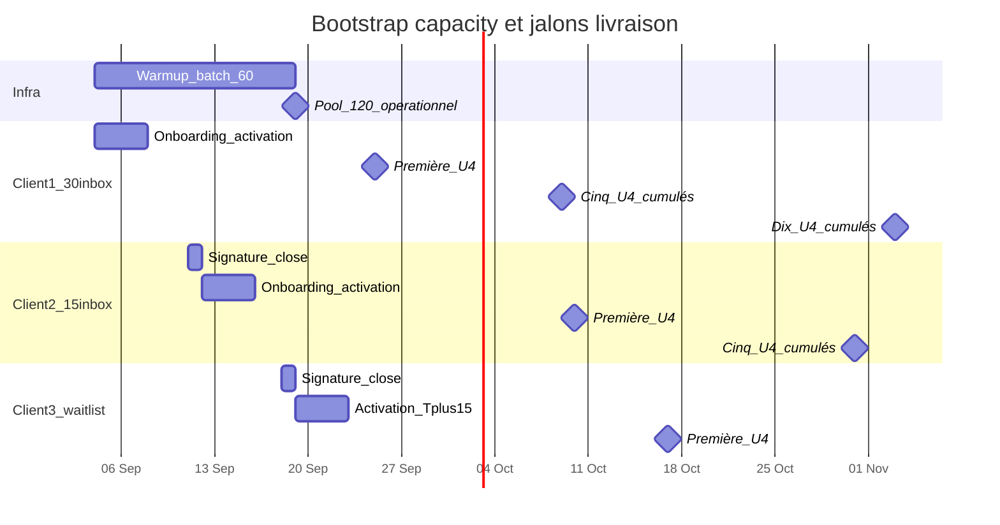

# Capacity — Timeline bootstrap (phase démarrage)

> Module : [Capacity](./README.md) · Hypothèses T0 relatives — ajuster dates absolues à l'exécution.

---

## 1. Hypothèses

| Paramètre | Valeur |
|-----------|--------|
| **T0** | Jour 0 = achat batch +60 / démarrage warmup |
| **Warmup fin** | **T+15** |
| **11 RDV calendrier** | RDV **commerciaux agence** (vente Hercule) — pas U4 livrés |
| **Calls complétés en 14j** | ~**7 / 11** |
| **Close rate agence** | **40%** |
| **Buffer ops** | **+7j** (qual + match + Calendly) |
| **Sends** | 20 / inbox / jour ouvré |

---

## 2. Combien de clients dans les 2 prochaines semaines ?

```
closes_14j = 7 × 0.40 = 2.8 → planifier 2 à 3 nouveaux clients payants
```

| Scénario | Closes 14j | Action capacity |
|----------|------------|-----------------|
| Conservateur | **2** | C1 @ 30 + C2 @ 15 constrained |
| Central | **3** | C3 **QUEUED_WARMUP** jusqu'à T+15 |
| Agressif (11 calls en 14j) | **4–5** | **Interdit** sans waitlist explicite |

**Règle vente bootstrap :** max **2 closes immédiats** + 1 en file **QUEUED_WARMUP**.

---

## 3. Allocation par client (pool 60 → 120)

| Client | Signe | Inboxes | Activation envoi | Statut |
|--------|-------|---------|------------------|--------|
| **#1** | T0 | **30** | T+4 max | ACTIVE |
| **#2** | T+7 | **15** | T+11 | CONSTRAINED_15 |
| **#3** | T+14 | 15 → **30** à T+15 | **T+19** | QUEUED_WARMUP → upgrade |

### Pool inbox

| Date | Pool livraison | Alloué | Libre |
|------|----------------|--------|-------|
| T0 | 50 | 30 (C1) | 20 |
| T+7 | 50 | 45 (30+15) | 5 |
| **T+15** → 110 | 110 | 60 puis 75 | 50 → 35 |
| Steady 3×30 | 110 | 90 | 20 spare |



*(Exemple calendrier si T0 = 4 sept. 2026 — utiliser T+N en ops.)*

---

## 4. Jalons U4 par client

### Client #1 @ 30 inbox (activation ~T+4)

| Jalon | Après activation | Calendrier type |
|-------|------------------|-----------------|
| **1er U4** | 14–18j | T+18 à T+22 |
| **5 U4** | ~28–32j | **~T+36** (promettre **35j**) |
| **10 U4** | ~52–58j | **~T+58–62** (promettre **60j**) |

### Client #2 @ 15 inbox (activation ~T+11)

| Jalon | Promesse |
|-------|----------|
| 1er U4 | **~T+32** — promettre **28j** après activation |
| 5 U4 | **~T+50** — promettre **45j** |

### Client #3 waitlist (activation T+19)

| Jalon | Calendrier type |
|-------|-----------------|
| 1er U4 | **~T+40** |
| 5 U4 | **~T+55** |

---

## 5. Tableau réponses directes

| Question | Bootstrap | Infra stabilisée (T+15+, pool 120) |
|----------|-----------|-------------------------------------|
| Clients en 2 semaines ? | **2–3** | Max **3 @ 30** simultanés |
| Servir comment ? | C1@30, C2@15, C3 file | 3 × 30 dédiées |
| 1er U4 client #1 ? | T+18 à T+22 | ≤ **21j** après activation |
| 1er U4 client #2 ? | T+25 à T+32 | ≤ **28j** @ 15 inbox |
| 1er U4 client #3 ? | T+33 à T+40 | Après fin queue |
| 5 U4 complets C1 ? | **~T+36** | ≤ **35j** après activation |
| +5 U4 (total 10) C1 ? | **~T+58–62** | ≤ **60j** |
| Warmup fini ? | **T+15** | — |

---

## 6. SLA finaux (T+15+, stable)

| Métrique | Promesse client | Cible interne |
|----------|-----------------|---------------|
| Activation | ≤ 4j | ≤ 2j |
| 1er U4 | ≤ 21j | ≤ 14j |
| 5 U4 | ≤ 35j | ≤ 28j |
| 10 U4 | ≤ 60j | ≤ 50j |
| Rythme mensuel | 3–4 U4/mois | ~7 prédits |
| File d'attente | ≤ 15j + position | warmup-driven |

---

## 7. Checklist ops bootstrap

- [ ] Ne pas signer client #4 avant T+15 sans waitlist écrite
- [ ] Communiquer `estimated_activation_at` à chaque signature si queue
- [ ] C2 en CONSTRAINED_15 : copy « montée en charge » + date upgrade T+15
- [ ] Monitorer closes vs `clients_max` ([04-sla-internal.md](./04-sla-internal.md))
- [ ] Après T+15 : upgrade C2 15→30 si pool le permet

---

## 8. Prompt d'action IA

```
Bootstrap timeline (doc/tech-stack/capacity/09-bootstrap-timeline.md).

- Utiliser T0 relatif ; gantt dates = exemple seulement
- computeDeliveranceMilestones(phase: bootstrap) adds +7d buffer
- Streamlit Capacity : afficher scénario 2-3 closes / 14j

Références : capacity/02-funnel-math.md, capacity/05-waiting-list.md
```
