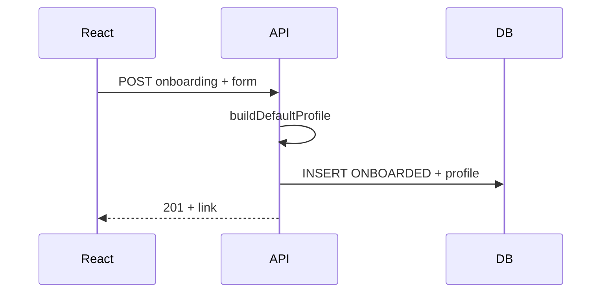

# Onboarding — Database

> Module : [Onboarding](./README.md) · Lignes : [Front client](./front-client.md) · [Front interne](./front-interne.md) · [Communication](./communication.md)  
> Contexte : [Vue d'ensemble](../00-overview.md) · [Profile JSON](../02-profile-json.md)

---

## 1. Intro (langage simple)

Le formulaire React crée **une ligne** en base (agence ou entreprise) avec un gros **`profile` JSON** qui contient tout : réponses du form, délais emails, labels de la timeline.

C'est la **seule écriture client** autorisée après laquelle l'agence/entreprise passe en mode lecture seule.

---

## 2. Architecture développée (pour IA de coding)

### Trigger

| Événement | Source |
|-----------|--------|
| `POST /api/onboarding/[category]` | Formulaire React |
| `POST /api/onboarding/manual` | Streamlit (optionnel, même logique) |

### Actions DB

1. Valider payload Zod : `email`, `first_name`, `company`, champs form
2. `buildDefaultProfile(form, category)` — voir [02-profile-json.md](../02-profile-json.md)
3. Générer `link` slug unique ([`crm/slug.py`](../../../crm/slug.py))
4. INSERT :
   - `statut = 'ONBOARDED'`
   - `onboarding_completed_at = NOW()`
   - `profile = buildDefaultProfile(...)` (**tout** dedans, pas de colonnes éparpillées)
5. Duplicate email → 409

### Migration

```sql
ALTER TYPE public.lead_statut ADD VALUE IF NOT EXISTS 'ONBOARDED';

ALTER TABLE public.agence
  ADD COLUMN IF NOT EXISTS onboarding_completed_at TIMESTAMPTZ,
  ADD COLUMN IF NOT EXISTS profile JSONB NOT NULL DEFAULT '{}'::jsonb;

-- Idem public.entreprise
```

**Ne pas ajouter** `service_type`, `estimated_match_days` en colonnes — utiliser `profile.communication.delays`.

### Side effect

`startOnboardingSequence({ lead, category })` → [communication.md](./communication.md)

### Schéma



---

## 3. Prompt d'action IA

```
Couche DB onboarding Hercule (doc/tech-stack/onboarding/db.md + 02-profile-json.md).

1. Migration : ONBOARDED enum + profile JSONB (agence + entreprise)
2. buildDefaultProfile() : form, communication.delays, display.timeline
3. POST /api/onboarding/[category] : INSERT, 409 duplicate, startOnboardingSequence

Pas de colonnes service_type / estimated_match_days — tout dans profile.

Réutiliser : crm/slug.py, lib/link-tracking/supabase.ts

Tests :
- profile complet persisté
- retraction dans form → profile.communication.delays.retraction_days=4
```
