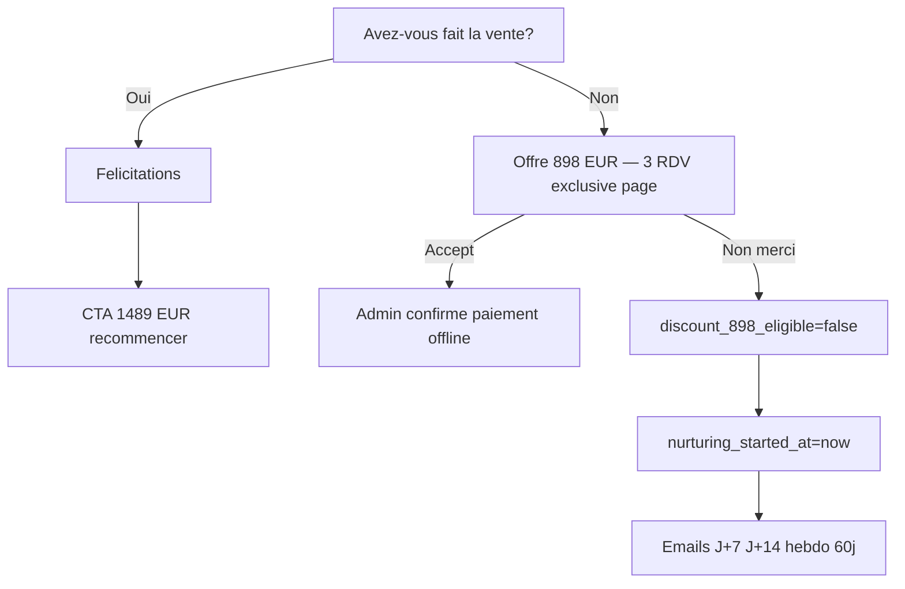

# Post-RDV — Agence commercial (1489€ / 898€ / nurturing)

> Module : [Post-RDV](./README.md) · Voir aussi : [Profile JSON](../02-profile-json.md) · [Front client](./front-client.md) · [Communication](./communication.md)

---

## 1. Intro (langage simple)

Sur la page survey **agence**, on demande : **« Avez-vous fait la vente ? »**

- **Oui** → félicitations sur la même page → proposition **1 489 €** pour recommencer.
- **Non** → offre exclusive **898 €** (3 rendez-vous) — **uniquement sur cette page**.
- Si elle refuse l'898 € (« non merci ») → on la laisse tranquille, puis emails nurturing sur **60 jours**.

L'offre 898 € **disparaît à jamais** dès qu'elle dit non. Ensuite, seul le tarif normal (1 489 €) est proposé par email.

**Hors MVP (implémentation technique) :** flux post-RDV / Stripe / routes pour l'abonnement **2 500 €/mois** — l'offre est **commercialisée** sur la landing et dans les [CGV](./cvg_master.md) § 5.2 ; ne pas implémenter le parcours abo dans le MVP produit.

---

## 2. Architecture développée (pour IA de coding)

### Flow same-page (wizard sans redirect)



### profile.offers (agence)

```typescript
offers: {
  discount_898_eligible: true,  // init à GET survey agence
  discount_898_declined_at?: string,
  nurturing_started_at?: string,
}
```

| Action UI | Effet profile |
|-----------|---------------|
| Ouvre survey agence | `discount_898_eligible = true` si absent |
| Clic « Non merci » sur 898€ | `discount_898_eligible = false`, `discount_898_declined_at = now()`, `nurturing_started_at = now()` |
| Clic accept 898€ | `survey.offer_choice = '898'` → admin confirme paiement |
| Vente oui + CTA 1489€ | `survey.offer_choice = '1489'` → admin confirme paiement |

### POST body agence

```typescript
POST /api/post-rdv/survey
{
  token: string;
  sale_made: boolean;
  offer_choice?: "1489" | "898" | "decline";
}
```

- `sale_made=true` + `offer_choice=1489` → statut **SOLD** + upsell in-page (pas d'email renewal auto)
- `sale_made=false` + `offer_choice=898` → attente paiement admin
- `sale_made=false` + `offer_choice=decline` → start nurturing sequence

### Séquence nurturing (booking_email_jobs)

Base : `profile.offers.nurturing_started_at`

| email_type | Offset | Contenu |
|------------|--------|---------|
| `nurture_agence_1489_j7` | +7j | Proposition 1 489 € |
| `nurture_agence_conseil_j14` | +14j | Conseil + lien site — **sans prix** |
| `nurture_agence_weekly_1` … `_6` | +21j à +56j | 1 mail/semaine (6 envois) |

Annuler jobs pending si agence paie 1489€ ou 898€ (admin confirm).

### Règle 898€ exclusive

- API GET survey : retourne `offers.discount_898_eligible`
- Si `false` → ne jamais afficher offre 898€ (même si user retrouve le lien)
- Pas d'email avec offre 898€ — **page survey uniquement**

### Paiement (MVP)

- CTA → lien ou instruction ; confirmation **admin Streamlit** (`POST /api/post-rdv/admin/payment-confirmed`)
- Paiement confirmé → `statut = ONBOARDED` (nouveau cycle) ou selon règle métier

---

## 3. Prompt d'action IA

```
Flow commercial agence post-survey (doc/tech-stack/post-rdv/agence-commercial.md).

1. GET /api/post-rdv/survey/[token] : init offers.discount_898_eligible=true si agence
2. Page /survey/[token] wizard same-page : sale_made → branche 1489 ou 898
3. POST survey : offer_choice decline → offers.nurturing_started_at + enqueue nurturing jobs
4. startAgenceNurturingSequence(profile) — J+7 1489, J+14 conseil, weekly 60j
5. discount_898_eligible=false permanent après decline

Pas de renewal_agence_1489 email à SOLD — upsell in-page only.

Réutiliser :
- lib/booking-communication/orchestrator.ts
- doc/tech-stack/02-profile-json.md

Tests :
- decline 898 → eligible false + 8 nurture jobs scheduled
- eligible false → GET survey ne montre pas 898
- sale_made yes → CTA 1489 visible, no auto renewal email
```
