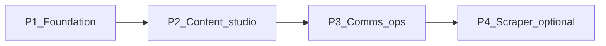
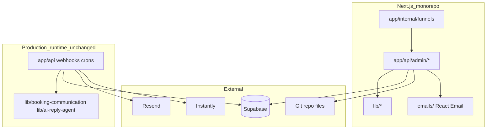

# Migration: Streamlit internal tools → Next.js Funnel Builder

> **Audience:** AI coding agents implementing the migration.  
> **Status:** Planning / P0 documentation — Next admin **not yet implemented**.  
> **Prototype:** [`app/streamlit_funnels/`](../../app/streamlit_funnels/) (Streamlit v1 shell, validates IA).  
> **Architecture:** [01-four-lines-model.md](../tech-stack/01-four-lines-model.md) · [00-overview.md](../tech-stack/00-overview.md)

---

## 1. Executive summary

### What we are doing

Replace **fragmented Python Streamlit admin tools** with a **unified Next.js internal app** — working title **Hercule Funnel Builder** — at route group `app/internal/funnels/` (exact path TBD; use this unless human overrides).

### Why now

1. [`app/streamlit_funnels/`](../../app/streamlit_funnels/) proved the **information architecture** (Agence / Entreprise → Sales → Onboarding → Dashboard → Legal → Emails).
2. Streamlit is adequate for **thin ops panels** but not for a **full funnel & onboarding builder** that must:
   - Edit repo files (templates, legal markdown, AI prompts)
   - Preview React Email HTML
   - Support deep nested navigation and future drag-and-drop funnel steps
   - Deploy alongside the production Next.js app on Vercel
3. Production **business logic already lives in TypeScript** (`lib/*`, API routes, crons). Streamlit was always a **control panel**, not the runtime.

### What stays unchanged

| Layer | Location |
|-------|----------|
| Client-facing site | `app/page.tsx`, `app/suivi/*`, `components/agence/*` |
| Production APIs & webhooks | `app/api/*` |
| Email orchestration | `lib/booking-communication/` |
| AI reply handler | `lib/ai-reply-agent/` |
| Database schema | Supabase migrations (additive only) |
| Four-lines model | DB · Client · Admin · Communication |

### Agent rule of thumb

**Migrate UI and admin write paths. Do not rewrite production `lib/` handlers unless consolidating duplicate logic.**

---

## 2. End-state vision — purpose of the tool

The **Hercule Funnel Builder** is the single internal surface to configure the full commercial lifecycle:

```
PRE-CLOSE (outreach → subsequence → reply → booking)
    → CLOSE (onboarding comms → notifications)
    → ONBOARDING (real fiches in DB)
    → DELIVERANCE / MATCHING (existing product modules)
```

### Capabilities (target)

| Capability | Description | Primary source of truth |
|------------|-------------|-------------------------|
| **Funnel cockpit** | Agence (buyer) + Entreprise (seller) navigation tree | UI state + docs IA below |
| **Sales funnel** | Discovery / Pitch / Closing stage content (future) | TBD — likely Supabase or repo markdown |
| **Demand mockups** | Homepage carousel cards (`agence_demandes`) | Supabase |
| **Onboarding builder** | Create real `agence` / `entreprise` rows + `profile` JSONB | Supabase + [02-profile-json.md](../tech-stack/02-profile-json.md) |
| **Legal studio** | Per-audience CGV, mentions, confidentialité, FAQ | `doc/tech-stack/*.md` |
| **Email template studio** | Booking + subsequence templates, React Email preview | `lib/booking-communication/templates.ts`, `emails/`, Supabase `booking_email_templates` |
| **Prompt editor** | AI reply agent niche prompts | `app/streamlit_reply_agent/prompts/*.md` |
| **Ops panels** | Instantly pipeline, inbox, scraper (until ported) | Deep-links or embedded views |
| **Dashboard** | Funnel KPIs (conversion discovery → booked) | Supabase analytics (future) |

### Success criteria

- Operator runs **one URL** (e.g. `/internal/funnels`) instead of 6+ `npm run streamlit-*` commands.
- All admin writes go through **`/api/admin/*`** with service role on server only.
- Template/legal/prompt edits are **auditable** (git history or PR bot).
- Zero regression on client-facing site and production crons/webhooks.

---

## 3. Why migrate — problems with Streamlit today

### Split stack

| Concern | Streamlit (Python) | Production (TypeScript) |
|---------|-------------------|-------------------------|
| Booking emails | `app/streamlit_booking_resend/`, `crm/booking_templates.py` | `lib/booking-communication/`, `emails/` |
| AI replies | `app/streamlit_reply_agent/` | `lib/ai-reply-agent/` |
| Legal content | `app/streamlit_funnels/legal_content.py` | `lib/site/legal-content.ts` |
| Send window | `app/streamlit_subsequence/send_window.py` | `lib/booking-communication/send-window.ts` |

Duplication and drift risk increase with every new feature.

### Import and runtime fragility

Example: `app/streamlit_funnels` added `app/streamlit_demands` to `sys.path`, causing `crm/slug.py` to import `config` from the wrong module (`streamlit_demands/config.py` instead of `crm/config.py`). Python path hacks do not scale.

### No first-class React Email preview

Booking templates render via [`emails/booking-html-email.tsx`](../../emails/booking-html-email.tsx) and [`lib/booking-communication/render-service.ts`](../../lib/booking-communication/render-service.ts). Streamlit cannot preview these without a round-trip to Node.

### Codebase writes from Python

[`crm/template_code_sync.py`](../../crm/template_code_sync.py) regex-patches both `crm/booking_templates.py` and `lib/booking-communication/templates.ts`. This belongs in a **Next API route** that shares types with `lib/`.

### Architecture mismatch

[01-four-lines-model.md](../tech-stack/01-four-lines-model.md) specifies:

- **Front interne** should trigger actions via **POST to Next API**
- Many Streamlit tools **write Supabase directly** with `SUPABASE_SERVICE_ROLE_KEY` in Python

The migration aligns admin with the documented architecture.

### UX and deploy ceiling

- Nested funnel navigation (hubs → sections → steps → leaves) fights Streamlit session/rerun model
- Separate Python processes vs single Vercel deployment
- No URL-addressable deep links without custom work

---

## 4. Source of truth map (critical)

**Streamlit apps are admin UIs. They do not own production logic.**

| Domain | Source of truth | Written by (today) | Consumed by (production) |
|--------|-----------------|--------------------|---------------------------|
| Lead rows | Supabase `agence`, `entreprise` | Streamlit funnels, `crm/admin_tool.py` | Next API, deliverance, matching |
| Lead `profile` JSONB | Same tables, column `profile` | Streamlit funnels fiche form | `profile.display`, emails, timeline |
| Carousel demandes | Supabase `agence_demandes` | streamlit_funnels, streamlit_demands | [`lib/agence/demandes-repo.ts`](../../lib/agence/demandes-repo.ts), homepage |
| Booking coded defaults | [`lib/booking-communication/templates.ts`](../../lib/booking-communication/templates.ts) + [`crm/booking_templates.py`](../../crm/booking_templates.py) | `template_code_sync` | [`orchestrator.ts`](../../lib/booking-communication/orchestrator.ts) |
| Booking runtime templates | Supabase `booking_email_templates` | streamlit_booking_resend | cron + orchestrator |
| Booking jobs | Supabase `booking_email_jobs` | API / Calendly webhooks | `/api/cron/*` |
| Subsequence templates | Supabase + [`default_templates.py`](../../app/streamlit_subsequence/default_templates.py) | streamlit_subsequence | Instantly bypass webhooks |
| AI reply prompts | [`app/streamlit_reply_agent/prompts/*.md`](../../app/streamlit_reply_agent/prompts/) | streamlit_reply_agent `save_prompt` | [`lib/ai-reply-agent/knowledge.ts`](../../lib/ai-reply-agent/knowledge.ts) |
| AI reply config | Supabase `ai_reply_agent_*` tables | streamlit_reply_agent | [`lib/ai-reply-agent/handler.ts`](../../lib/ai-reply-agent/handler.ts) |
| Legal / CGV | `doc/tech-stack/cvg_master.md`, `cvg_entreprise.md`, `mentions_legales.md`, `confidentialite.md` | Manual git (Streamlit read-only today) | [`lib/site/legal-content.ts`](../../lib/site/legal-content.ts), `/cvg` pages |
| Agence FAQ | [`lib/site/agence-faq.ts`](../../lib/site/agence-faq.ts) | Manual git | `/faq`, deliverance FAQ |
| Entreprise FAQ | [`doc/tech-stack/deliverance/front-client.md`](../tech-stack/deliverance/front-client.md) | Manual git | Deliverance page |
| Niche scraper configs | [`app/streamlit_scraper/configs/*.py`](../../app/streamlit_scraper/configs/) | streamlit_scraper bootstrap | Outbound Instantly campaigns |
| Instantly link vars | Supabase lead rows (`slug`, `reservation_*_link`) | crm admin provision | Instantly campaigns |
| Business logic | `lib/*`, `app/api/*` | TypeScript only | Vercel runtime |

### What is NOT "all TypeScript + Supabase"

Agents must not assume everything moves to Supabase. **Git-tracked files** (markdown prompts, legal docs, coded template defaults) remain source of truth for content that must be reviewed in PRs.

---

## 5. Streamlit inventory — what to migrate

| App | Path | npm script | Migrate? | Phase | Notes |
|-----|------|------------|----------|-------|-------|
| **streamlit_funnels** | `app/streamlit_funnels/` | `streamlit-funnels` | **Yes — first** | P1 | IA prototype; navigation in [`navigation.py`](../../app/streamlit_funnels/navigation.py) |
| **streamlit_demands** | `app/streamlit_demands/` | `streamlit-demands` | Yes (fold in) | P1 | Superseded by Sales › Fiches mockup |
| **streamlit_booking_resend** | `app/streamlit_booking_resend/` | `streamlit-booking-resend` | Yes | P2 | Templates, sequences, Calendly bookings |
| **streamlit_subsequence** | `app/streamlit_subsequence/` | `streamlit-subsequence` | Partial | P3 | Pipeline, E1–E4, template sync |
| **streamlit_reply_agent** | `app/streamlit_reply_agent/` | `streamlit-reply-agent` | Partial | P3 | Inbox, Problem tab, prompt editor |
| **streamlit_scraper** | `app/streamlit_scraper/` | `streamlit-scraper` | Optional | P4 | Heavy Python; bootstrap CLI may stay |
| **streamlit_clean** | `app/streamlit_clean/` | `streamlit-clean` | **No** | — | Data cleaning ops pipeline |
| **streamlit_stats** | `app/streamlit_stats/` | — | **No** | — | Funnel math calibration ([capacity/02-funnel-math.md](../tech-stack/capacity/02-funnel-math.md)) |
| **crm admin** | `crm/admin_tool.py` | `crm` | Partial | P2 | Leads list, Instantly provision — overlaps onboarding |

### Do not delete Streamlit apps until Next parity is verified

Add deprecation captions pointing to the Next admin URL. Keep apps runnable for rollback during migration.

---

## 6. Phased roadmap



### P1 — Foundation (target first PR)

**Goal:** Next shell with funnel navigation + core Supabase CRUD.

| Task | Details |
|------|---------|
| Route group | `app/internal/funnels/` + layout (sidebar + breadcrumb) |
| Auth | Middleware gate — see [Open decisions](#12-open-decisions) |
| Navigation | Port tree from [`app/streamlit_funnels/navigation.py`](../../app/streamlit_funnels/navigation.py) |
| Landing | Agence / Entreprise cards |
| API | `GET/PATCH /api/admin/demandes` → `agence_demandes` |
| API | `POST /api/admin/onboarding/[category]` → insert `agence`/`entreprise` + `profile` |
| Profile builder | Port logic from [`fiches/profile_builder.py`](../../app/streamlit_funnels/fiches/profile_builder.py) to `lib/admin/profile-builder.ts` |
| Legal | Read-only preview (reuse `lib/site/legal-content.ts`) |
| Emails / Sales funnel | Placeholder leaves matching Streamlit shells |

**Deprecate:** `npm run streamlit-funnels` caption → Next URL.

### P2 — Content studio

**Goal:** Edit repo-backed content with preview.

| Task | Details |
|------|---------|
| Legal editor | Read/write `doc/tech-stack/*.md` via API; preview via existing loaders |
| **Funnel builder** | Spec-driven vente/onboarding briefs in `content/funnels/` — layout, steps, Cursor tickets (`lib/admin/funnels/*`, `/api/admin/funnels/*`) |
| Booking templates | Editor UI + React Email preview via `render-service.ts` |
| Template sync | Port or wrap [`crm/template_code_sync.py`](../../crm/template_code_sync.py) |
| Runtime templates | CRUD `booking_email_templates` (from booking_resend) |
| CRM leads | Optional: leads list from `crm/admin_tool.py` |

### P3 — Comms ops

**Goal:** Replace remaining Streamlit comms panels.

| Task | Details |
|------|---------|
| Reply agent | Prompt editor (`.md` files), config UI, inbox (or link to existing until ported) |
| Subsequence | Pipeline view, template editor, webhook status |
| Email leaves | Wire PRE-CLOSE / CLOSE sections to real UIs instead of placeholders |

### P4 — Optional

| Task | Details |
|------|---------|
| Scraper | Niche config UI or keep `streamlit-scraper` |
| Dashboard | KPI queries across funnel stages |
| Sales funnel content | Discovery / Pitch / Closing CMS |

---

## 7. Target architecture



### Rules for agents

1. **Never expose `SUPABASE_SERVICE_ROLE_KEY` to the browser.**
2. **Reuse `lib/`** — import types and helpers; do not copy orchestration logic into components.
3. **Admin writes → `/api/admin/*`** — align with four-lines model.
4. **File writes** — server-side only; log what changed; prefer PR workflow in production.
5. **Additive migrations** — do not break existing client or cron paths.
6. **Tests** — port or add smoke scripts under `scripts/` for each admin API.

---

## 8. What NOT to migrate or rewrite

| Asset | Action |
|-------|--------|
| `lib/ai-reply-agent/handler.ts` | Keep — add admin UI only |
| `lib/booking-communication/orchestrator.ts` | Keep |
| `app/api/webhooks/*` | Keep |
| `app/api/cron/*` | Keep |
| Client pages `app/suivi/*`, `app/page.tsx` | Untouched |
| `app/streamlit_scraper/bootstrap/` CLI | Keep until P4 |
| `app/streamlit_clean/` | Keep as ops tool |
| `app/streamlit_stats/` | Keep for funnel coefficient calibration |
| Existing Supabase data | Never destructive migration in admin PR |

---

## 9. Navigation IA — streamlit_funnels → Next mapping

Canonical tree (from [`tool/streamlit_funnels.md`](../tech-stack/tool/streamlit_funnels.md)):

```
Landing
├── Agence | Entreprise
└── Workspace (per audience)
    ├── Sales
    │   ├── Funnel
    │   │   ├── Discovery
    │   │   ├── Pitch
    │   │   └── Closing
    │   └── Fiches mockup          → agence_demandes (entreprise: placeholder)
    ├── Onboarding
    │   ├── Funnel                 → placeholder
    │   └── Fiche form             → INSERT agence | entreprise
    ├── Dashboard                  → leaf
    ├── CVG & légal
    │   ├── CGV
    │   ├── Mentions légales
    │   ├── Confidentialité
    │   └── FAQ
    └── Emails
        ├── PRE-CLOSE
        │   ├── Outreach           → streamlit-scraper (P4) / future UI
        │   ├── Subsequence        → P3
        │   ├── Reply prompt       → P3
        │   └── Booking            → P2
        └── CLOSE
            ├── Onboarding         → P2
            └── Notifications      → P3
```

### Leaf → implementation map

| Path (segments after audience) | Supabase | Repo files | lib/ modules | API (target) |
|-------------------------------|----------|------------|--------------|--------------|
| `sales/funnel/discovery` | — | `content/funnels/{audience}/vente/discovery/` | `lib/admin/funnels/*` | `/api/admin/funnels` |
| `sales/funnel/pitch` | — | `content/funnels/{audience}/vente/pitch/` | same | same |
| `sales/funnel/closing` | — | `content/funnels/{audience}/vente/closing/` | same | same |
| `sales/mockup` | `agence_demandes` | — | `lib/agence/demandes-repo.ts` (read on site) | `GET/PATCH /api/admin/demandes` |
| `onboarding/funnel` | — | `content/funnels/{audience}/onboarding/` | `lib/admin/funnels/*` | `/api/admin/funnels` |
| `onboarding/fiche_form` | `agence`, `entreprise` | — | profile builder (new `lib/admin/`) | `POST /api/admin/onboarding/[category]` |
| `dashboard` | — | — | — | placeholder / analytics |
| `legal/cgv` | — | `doc/tech-stack/cvg_master.md` or `cvg_entreprise.md` | `lib/site/legal-content.ts` | `GET/PUT /api/admin/legal/[doc]` |
| `legal/mentions` | — | `doc/tech-stack/mentions_legales.md` | same | same |
| `legal/confidentialite` | — | `doc/tech-stack/confidentialite.md` | same | same |
| `legal/faq` | — | `lib/site/agence-faq.ts` or deliverance doc | — | `GET/PUT /api/admin/faq` |
| `emails/pre_close/outreach` | — | scraper configs | — | link or P4 |
| `emails/pre_close/subsequence` | pipeline tables | `default_templates.py` | instantly-bypass | P3 |
| `emails/pre_close/reply_prompt` | `ai_reply_agent_*` | `prompts/*.md` | `lib/ai-reply-agent/` | P3 |
| `emails/pre_close/booking` | `booking_email_*` | `templates.ts`, `booking_templates.py` | `lib/booking-communication/` | P2 |
| `emails/close/onboarding` | `booking_email_jobs` | — | orchestrator | P2 |
| `emails/close/notifications` | matches / post-rdv | — | matching module | P3 |

### Audience semantics

| Audience | Code label | Instantly `target_type` |
|----------|------------|-------------------------|
| Agence | `agence` | `buyer` |
| Entreprise | `entreprise` | `seller` |

---

## 10. Agent implementation checklist

For **each** feature ported from Streamlit to Next:

1. **Read** the Streamlit module(s) listed in [inventory](#5-streamlit-inventory--what-to-migrate).
2. **Identify source of truth** using [section 4](#4-source-of-truth-map-critical) — table vs file vs `lib/`.
3. **Design API** — `app/api/admin/<feature>/route.ts` with Zod validation.
4. **Implement UI** — under `app/internal/funnels/...` matching navigation segment IDs.
5. **Reuse types** — import from `lib/` (e.g. `LeadCategory`, `BookingEmailTemplateType`).
6. **Server-only secrets** — Supabase service role, file write permissions.
7. **Test** — smoke script in `scripts/admin/` or Vitest for pure helpers.
8. **Document** — update phase status in this README.
9. **Deprecate** — add caption in old Streamlit app with Next URL.

### Suggested Next file layout (P1)

```
app/
  internal/
    funnels/
      layout.tsx              # sidebar + auth
      page.tsx                # landing redirect or audience hub
      [audience]/
        [[...path]]/
          page.tsx            # hub or leaf resolver
  api/
    admin/
      demandes/
        route.ts
      onboarding/
        [category]/
          route.ts
lib/
  admin/
    profile-builder.ts        # port from Python
    navigation.ts             # port NAV tree types
```

---

## 11. Streamlit → Next feature correspondence

### streamlit_funnels (P1)

| Streamlit file | Next target |
|----------------|-------------|
| `navigation.py` | `lib/admin/navigation.ts` |
| `landing.py` | `app/internal/funnels/page.tsx` |
| `sidebar.py` | `app/internal/funnels/layout.tsx` |
| `content.py` | `[audience]/[[...path]]/page.tsx` + leaf components |
| `demands/demandes_repo.py` | `app/api/admin/demandes/route.ts` |
| `fiches/form.py` + `fiches/repo.py` | onboarding API + form component |
| `legal_content.py` | reuse `lib/site/legal-content.ts` |

### streamlit_booking_resend (P2)

| Streamlit file | Next target |
|----------------|-------------|
| `templates_ui.py` | Email template studio |
| `auto_tab.py`, `booking_jobs.py` | Bookings list (read-mostly) |
| `shared.py` | Types from `lib/booking-communication/` |

### streamlit_reply_agent (P3)

| Streamlit file | Next target |
|----------------|-------------|
| `prompt_store.py` | `PUT /api/admin/prompts/[preset]_[buyer\|seller]` |
| `app.py` inbox | Admin inbox or keep Streamlit link |
| `onboarding.py` | Campaign readiness panel |

### streamlit_subsequence (P3)

| Streamlit file | Next target |
|----------------|-------------|
| `send_queue.py` | Pipeline operations API |
| `template_code_sync.py` | Shared with booking template sync |

---

## 12. Open decisions (human)

| Decision | Options | Impact |
|----------|---------|--------|
| **Auth** | Clerk / env `ADMIN_SECRET` header / Vercel password protect | Middleware implementation |
| **Route prefix** | `/internal/funnels` vs `/admin` | URLs, SEO (noindex either way) |
| **Git write strategy** | Direct `fs.writeFile` in dev vs GitHub PR bot in prod | API design, audit trail |
| **Delete Streamlit** | Remove vs keep stubs | Repo cleanup timing |
| **Entreprise mockup demandes** | New table vs shared model | P4 schema |

Agents should **default** to `/internal/funnels` + env-gated admin secret + direct fs write in development unless human specifies otherwise.

---

## 13. Related documentation

| Doc | Purpose |
|-----|---------|
| [01-four-lines-model.md](../tech-stack/01-four-lines-model.md) | Admin must POST API |
| [02-profile-json.md](../tech-stack/02-profile-json.md) | Onboarding fiche shape |
| [02-data-model.md](../tech-stack/02-data-model.md) | Tables overview |
| [tool/streamlit_funnels.md](../tech-stack/tool/streamlit_funnels.md) | Current Streamlit IA |
| [tool/streamlit_reply_agent.md](../tech-stack/tool/streamlit_reply_agent.md) | AI agent architecture |
| [cvg_site-sync.md](../tech-stack/cvg_site-sync.md) | Legal vs landing alignment |
| [onboarding/db.md](../tech-stack/onboarding/db.md) | Onboarding INSERT flow |
| [crm/README.md](../../crm/README.md) | Legacy CRM Streamlit |

---

## 14. Phase status tracker

Update this table as migration progresses.

| Phase | Status | Notes |
|-------|--------|-------|
| P0 — Migration doc | Done | This file |
| P1 — Next shell + CRUD | Done | `/internal/funnels` + `/api/admin/*` |
| P2 — Content studio | In progress | Funnel builder (spec JSON) shipped; legal/booking editors pending |
| P3 — Comms ops | Not started | |
| P4 — Scraper optional | Not started | |

---

## 15. Prompt template for coding agents

When assigned a migration task, start with:

```
Read doc/migration/README.md sections 4, 6, 9, and 10.
Task: implement <feature> for phase <P1|P2|P3>.
Source Streamlit: <path>
Source of truth: <table|file|lib>
Do not modify production webhook/cron handlers unless explicitly required.
Add API route under app/api/admin/ and UI under app/internal/funnels/.
```
