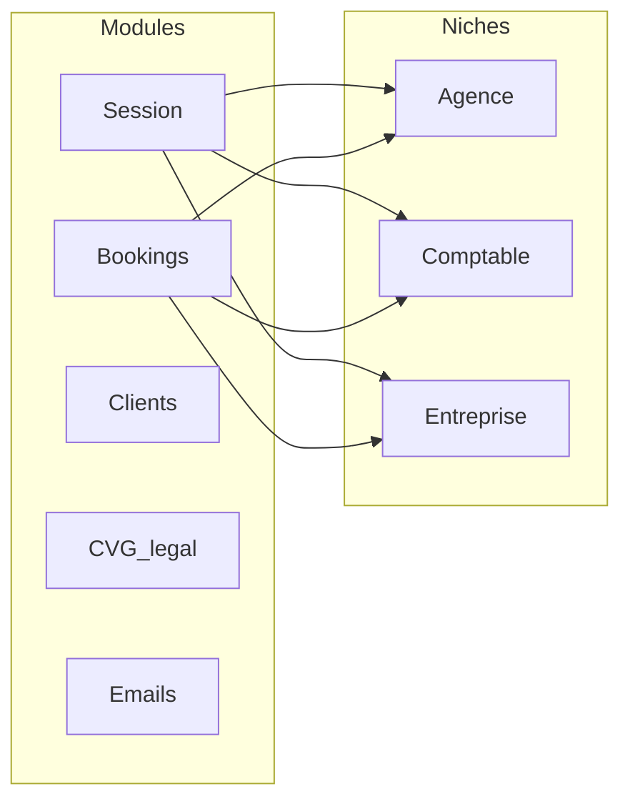

# Patch Bookings — cockpit internal 3 niches

```
status: implementation-spec
audience: coding-agent
date: 2026-09-08
depends_on:
  - ../tech-stack/00-decisions.md
  - ../tech-stack/03-data-model.md
  - ../tech-stack/09-surfaces.md
  - ../tech-stack/10-emails.md
  - ../tech-stack/modules/sales-ops.md
do_not:
  - Empiler 3 CRM sous /internal/funnels/agence/sales (c’est le hub Session)
  - Unifier agence / entreprise / comptable en une table lead
  - Faire de Stripe la gate d’apparition Clients
  - Dupliquer les éditeurs de séquences (Emails vs Bookings vs Clients)
  - Hardcoder la liste des variables dans SequenceDropdown
  - Spawn un CLI depuis le navigateur (verify = lib partagée + API)
  - Matching cabinet↔TPE dans ce patch
  - Backfill des rows comptable déjà dans entreprise
  - Supprimer components-registry.ts / database-registry.ts
  - Ajouter un login /internal
```

Canon inchangé : `lead_statut` = acquisition ; `product_statut` = livraison ; `sales_calls.status` ≠ livraison ; pas de table `communications` ; orchestrateur = webhook → job → cron.

---

## 0. Décisions verrouillées (session de spec)

| Sujet | Choix |
|-------|--------|
| IA / URLs | Aplatir : `/internal/funnels/{module}/{niche}` + redirects depuis les anciennes URLs |
| Storage Comptable | **Nouvelle table `comptable`** (miroir buyer, pas `entreprise`) |
| Session Entreprise | **Garder le funnel existant** comme 3e session live |
| Séquences | **Un** `SequenceWorkspace` ; Emails = catalogue ; Bookings/Clients composent le même éditeur |
| Gate Clients | `onboarding_completed_at IS NOT NULL` uniquement. Stripe = événement, pas SoT |
| `/internal/components` et `/internal/database` | **Retirer de la nav**, garder registries + pages (URL directe) |
| Calendly Comptable | **Nouvel event type** + `CALENDLY_EVENT_TYPE_URI_COMPTABLE` (pas encore créé) |
| Campagnes Instantly | Table/config `niche → campaign_id` éditable dans Bookings → DB |
| Mapping séquences Bookings | Voir §6.3 |
| Métriques | Sent = emails sent Instantly ; Reply% / Positive% / Booking rate vs sent ; fenêtre = lifetime campagne ; cache 5 min |
| Matching Comptable | **Hors scope** |
| Migration rows existantes | **Pas de backfill** — table vide, nouveaux leads seulement |

---

## 1. Diagnostic — pourquoi Comptable n’est pas accessible

L’audience `comptable` existe déjà (`Audience`, landing, session funnel, FAQ, pricing, CGV). Elle est **coupée de l’ops** par plusieurs bugs d’IA / modèle, pas par absence de pages.

| Cause | Fichier | Effet |
|-------|---------|--------|
| Sidebar regex `agence\|entreprise` | `components/internal/funnels/sidebar-nav.tsx` `audienceFromPathname` | Sur `/internal/funnels/agence/sales`, le parcours reste Agence. Comptable n’apparaît jamais dans la sidebar. |
| Sidebar ignore `getModulesForAudience` | même fichier, `MODULES` hardcodé | Même si l’URL est `/comptable`, la nav affiche Bookings/Clients/Emails. |
| Modules Comptable tronqués | `lib/admin/navigation.ts` `COMPTABLE_MODULES` | Sales + Legal seulement. |
| Bookings/Clients placeholder non-agence | `components/internal/funnels/leaf-content.tsx` | Entreprise/Comptable → « Disponible pour l’audience agence uniquement. » |
| `LeadCategory` = `agence \| entreprise` | `lib/link-tracking/types.ts` | Pas de 3e CRM. |
| Comptable mappé vers `entreprise` | `lib/admin/funnels/sales-audience.ts` | `salesAudienceToLeadCategory("comptable")` → `"entreprise"`. Les sales calls cabinets polluent la table matière. |
| Calendly 2 events seulement | `lib/calendly/availability.ts` | Pas d’event type comptable. |
| Variables éditeur hardcodées | `sequence-editor/adapters/booking-adapter.ts` | Liste `{{…}}` figée, indépendante de Supabase. |

**Correction d’intention :** ne pas « ajouter un module Comptables *dans* la page Session agence ». Session = live call. Les 3 niches sont un **axe transversal** du cockpit (Session, Bookings, Clients, Légal, Emails).

Rôles métier (ne pas inverser) :

| Niche | Rôle | Table SoT lead |
|-------|------|----------------|
| **Agence** | Acheteur — agences web partenaires | `agence` |
| **Comptable** | Acheteur — cabinets | `comptable` (**nouvelle**) |
| **Entreprise** | Matière — TPE mises en relation (web) | `entreprise` |



---

## 2. IA cible (un cockpit, 3 niches)

### 2.1 Sidebar

Retirer de `GLOBAL_NAV` :

- Composants → `/internal/components`
- Database → `/internal/database`

Les pages et registries (`lib/admin/architecture/*`) **restent**. Accès URL directe pour doctor / audit.

Nav produit (un seul groupe, plus de silo audience) :

```
Parcours
  Session
  Bookings
  Clients
  CVG & légal
  Emails
```

**Niche switcher** persistant (header de page + sidebar) : `ToggleGroup` shadcn (`agence` / `comptable` / `entreprise`). L’URL est la SoT ; `localStorage` ne sert qu’à mémoriser la dernière niche pour les liens sidebar. Pas d’état React orphelin.

Tokens `.internal` uniquement. Pas de `zinc-*`, pas de `#09090B`. MCP shadcn avant tout nouveau block (Tabs, ToggleGroup, DataTable, Dialog, Sheet).

### 2.2 URLs

Nouveau contrat :

| Surface | URL |
|---------|-----|
| Accueil cockpit | `/internal/funnels` |
| Session hub (ops) | `/internal/funnels/session/{niche}` |
| Session live (plein écran) | `/internal/funnels/{niche}/sales/funnel` **inchangé** — hors catch-all workspace |
| Bookings | `/internal/funnels/bookings/{niche}` |
| Clients liste | `/internal/funnels/clients/{niche}` |
| Client cockpit | `/internal/clients/{niche}/{slug}` (étendre le catch-all actuel) |
| Légal | `/internal/funnels/legal/{niche}/{doc}` |
| Emails catalogue | `/internal/funnels/emails/{niche}` |
| Emails éditeur | `/internal/funnels/emails/{niche}/{slug}` |

Redirects **301/308** (Next `redirect`) depuis l’existant :

| Ancien | Nouveau |
|--------|---------|
| `/internal/funnels/agence` | `/internal/funnels/session/agence` |
| `/internal/funnels/agence/sales` | `/internal/funnels/session/agence` |
| `/internal/funnels/agence/bookings` | `/internal/funnels/bookings/agence` |
| `/internal/funnels/agence/clients` | `/internal/funnels/clients/agence` |
| `/internal/funnels/agence/legal/*` | `/internal/funnels/legal/agence/*` |
| `/internal/funnels/agence/emails` | `/internal/funnels/emails/agence` |
| idem `entreprise` / `comptable` | idem |

Live session **ne pas** rediriger : `/internal/funnels/{niche}/sales/funnel` et `/…/funnel/settings` restent le shell plein écran (`sales-funnel-module.tsx`).

Landing `/internal/funnels` : 3 cartes niche → Session de la niche (plus 3 produits parallèles).

### 2.3 Type `Niche`

Remplacer l’usage « audience = premier segment d’URL » par :

```ts
export type Niche = "agence" | "comptable" | "entreprise";
```

`Audience` peut rester un alias transitoire = `Niche`. Étendre `LeadCategory` à `"comptable"` — ne **pas** réutiliser `entreprise` pour les cabinets.

`isLeadCategory` aujourd’hui exclut `comptable` — à corriger partout (webhooks, provisionning, bookings, sales_calls).

---

## 3. Data model

### 3.1 Table `comptable`

Nouvelle table **buyer**, miroir fonctionnel d’`agence` pour l’acquisition + onboarding, **sans** copier le matching web (`matches.agence_id`).

Colonnes minimales (alignées `LinkTrackingLead`) :

- identité : `id`, `email`, `first_name`, `company`, `slug` unique
- CRM acquisition : `statut` (`lead_statut`), `instantly_lead_id`, `instantly_campaign_id`
- liens : `reservation_comptable_link`, `confirmation_comptable_link`, `dashboard_link`, colonnes Calendly (`invitee_uri`, join/reschedule/cancel, `scheduled_at`, `confirmed_at`, payload/questions)
- produit : `product_statut` default `NONE`, `onboarding_completed_at`, `profile` JSONB (`form`, …)
- timestamps `created_at` / `updated_at`

RLS on, 0 policy, service role serveur (comme `agence` / `entreprise`).

**Ne pas** y mettre `active_match_id` / crédits matching web dans ce patch (matching hors scope).

### 3.2 FKs à étendre (nouveaux rows seulement)

| Table | Changement |
|-------|------------|
| `sales_calls` | `comptable_id UUID REFERENCES comptable(id)`. CHECK : **exactement un** de `agence_id` / `entreprise_id` / `comptable_id`. Commentaire actuel « entreprise_id = cabinet » → **obsolète**. |
| `payments` | `comptable_id` nullable. Checkout comptable **futur** écrit ici, plus `entreprise_id`. |
| `booking_email_jobs` | `lead_category` CHECK inclut `comptable`. Toujours **sans FK** `lead_id` (ENG-08). |
| `booking_email_templates` | `category` CHECK inclut `comptable`. |

Pas de backfill. Les paiements / sales_calls cabinets déjà sur `entreprise_id` restent. Le code **nouveau** n’écrit plus de cabinet dans `entreprise`.

### 3.3 Config campagnes Instantly

Table `niche_outreach_config` (1 row / niche) :

```
niche text PK  -- agence | comptable | entreprise
instantly_campaign_id uuid not null
calendly_event_type_uri text  -- optionnel, fallback env
updated_at, updated_by text
```

Éditable dans Bookings → onglet DB. Pas d’IDs hardcodés dans `provision-from-list.ts` pour le chemin internal.

Env **reste** le fallback / bootstrap :

- `CALENDLY_EVENT_TYPE_URI_AGENCE` / `_ENTREPRISE` / `_COMPTABLE` (nouveau)
- Instantly API key inchangée

### 3.4 Catalogue variables (SoT)

Deux couches, pas une liste magique dans le React :

1. **Code (IDE)** — `lib/email-variables/catalog.ts` : définition d’une variable (`key`, `niche[]`, `supabaseColumn`, `instantlyKey`, `baseUrlBuilder`, `family`: outreach \| booking \| product). **Ajouter une variable = PR** (types + builder URL + migration colonne si besoin). L’UI n’a pas de « create variable ».
2. **Supabase (runtime SoT)** — table `email_variable_bindings` :

```
niche, variable_key, enabled, base_url_preview
PK (niche, variable_key)
```

Seed = catalogue code. L’éditeur n’affiche une puce `{{key}}` **que si** une row `enabled` existe pour cette niche.

Verify (API, pas CLI browser) :

- pour chaque séquence **live** de la niche, extraire `{{vars}}` du copy
- pour chaque lead de la campagne liée : colonne Supabase non vide **et** custom_variable Instantly présente
- mismatch → rouge ; tout vert sinon
- si un `variable_key` est `enabled` sur **≥ 2 niches** et utilisé dans des séquences de niches différentes → **warning + Dialog confirm** (collision sémantique, pas blocage dur)

Provision : Dialog read-only des snippets actuels (`{{reservation_comptable_link}}` → URL type) + bouton qui PATCHe Instantly depuis les colonnes Supabase (même logique que `lib/link-tracking/provision-from-list.ts`, par niche). Échec partiel = rapport, pas silent.

Script optionnel `scripts/verify-email-variables.ts` **importe la même lib** que `POST /api/admin/niches/[niche]/variables/verify`.

### 3.5 Snapshots métriques Instantly

Réutiliser la table prévue `instantly_campaign_snapshots` (`03-data-model.md` SOT-02) : `campaign_id`, `fetched_at`, `payload jsonb`.

Fetch : Instantly `GET` analytics campagne (équivalent MCP `get_campaign_analytics`) via `lib/instantly`. Cache mémoire 5 min **et** snapshot DB (ops peut relire sans re-hit).

---

## 4. Module Session

Page `/internal/funnels/session/{niche}` = hub ops (aujourd’hui `SalesHubLanding` : un bouton « Ouvrir la session »).

Trois hubs distincts (même composant, `niche` en param) :

| Niche | État |
|-------|------|
| Agence | Live — funnel actuel |
| Comptable | Live — funnel actuel (`content/funnels/comptable/sales`, questions, checkout comptable) |
| Entreprise | Live — **conserver** le funnel existant (décision spec) |

Le hub n’est **pas** un CRM. CTA unique : ouvrir `/internal/funnels/{niche}/sales/funnel`.

Corriger `salesAudienceToLeadCategory` :

- `agence` → table `agence`
- `comptable` → table `comptable`
- `entreprise` → table `entreprise`

Provision session test (`provision-test-meeting.ts`) : seed dans la **bonne** table.

Calendly session Comptable : nouvel event (ops crée l’event dans Calendly, ensuite URI en env + row config). En attendant l’URI, le hub Comptable reste ouvrable mais l’agenda live affiche un `InternalStatusAlert` « Event Calendly comptable non configuré » — pas de fallback silencieux vers `30min` agence.

---

## 5. Module Bookings — 3 CRM

### 5.1 Shell

`/internal/funnels/bookings/{niche}` — un CRM par niche, **1 event Calendly + 1 campagne Instantly**.

Onglets page (shadcn `Tabs`) :

1. **Pipeline** — table bookings actuelle (actions Confirmer / No-show / Non payé…)
2. **Séquences** — éditeurs pre-close de la niche (§6.3)
3. **DB** — variables + verify + provision + binding campagne/event (§8)

Niche switcher au-dessus (pas un 4e tab « choisir la niche » noyé dans Pipeline).

Filtrer Calendly par **event type URI** de la niche, plus par `salesAudienceToLeadCategory` qui mélangeait comptable→entreprise.

Étendre `CalendlyBookingEvent` : `"agence" | "entreprise" | "comptable"`.

`listUpcomingBookings` / `GET /api/admin/calendly/bookings` : query `niche` obligatoire côté UI (plus de `category=all` par défaut sur cette page — chaque CRM est étanche).

### 5.2 Stats bar (nouvelle SoT outreach)

Aujourd’hui : Total booked, No-show %, Sold % (`lib/admin/bookings/stats.ts`).

Ajouter, **à côté** du booked, les métriques campagne liée :

| Métrique | Définition | Source |
|----------|------------|--------|
| **Sent** | Emails sent lifetime campagne | Instantly analytics |
| **Reply %** | `replies / sent` | Instantly |
| **Positive %** | `interested (lead_interested) / sent` | Instantly + webhook existant |
| **Booked** | Count RDV Calendly de **cet** event (déjà là) | Calendly enrichi |
| **Booking rate** | `booked / sent` | dérivé |

Affichage : `29 (0,8 %)` si 29 bookings pour 3 600 sent — `formatBookingPercent` existant.

Sold % / No-show % **restent** (dénominateur = RDV passés, pas sent).

États UI : campagne non liée → cartes sent/reply/positive/booking-rate en `—` + hint « Lier une campagne dans DB ». Fetch error → `InternalStatusAlert`, ne pas inventer des 0.

### 5.3 Pipeline table

Réutiliser `BookingsTable` + `ArchitectureDataTable` patterns (`hercule-tables`). Pas de `<table>` HTML brut.

Colonnes / actions actuelles conservées par niche (workflow Resend déjà branché agence). Comptable/Entreprise : mêmes toggles **si** les `email_type` de la niche existent ; sinon désactiver avec `title` explicite (pas de no-op silencieux).

---

## 6. Séquences — framework unique

### 6.1 `SequenceWorkspace`

Étendre `SequenceDropdown` (ne pas créer un 2e éditeur). Même chrome pour **toutes** les séquences (Bookings, Clients, catalogue Emails).

```
[ Éditeur ] [ Historique ]
Toolbar: Enregistrer | Tester | Ouvrir les logs
Puces variables = bindings Supabase de la niche (pas la liste hardcodée)
```

| Pièce | Comportement |
|-------|----------------|
| **Éditeur** | Accordion steps actuel + preview Sheet. Insert variable = click puce. Save refuse les `{{var}}` absentes des bindings. |
| **Tester** | `Dialog` : email destinataire (défaut ops), step à envoyer, preview rendu. `POST /api/admin/sequences/{slug}/test` → job `triggered_by=manual` vers cet email, **sans** avancer le lead. |
| **Historique** | 30 jours, table jobs de **cette** séquence (Resend : `booking_email_jobs` ; Instantly bypass : `instantly_bypass_jobs` / events). Colonnes : date, lead/email, step, status, provider id. |
| **Ouvrir les logs** | `Sheet` debug : payload job, `resend_email_id` / Instantly message id, erreur brute. Lien externe Resend/Instantly si id présent. |

UI : `flex flex-col gap-*`, `CardHeader`+`Title`+`Description`+`Content`, `FieldGroup` pour le Dialog test. `DialogTitle` obligatoire.

Adapters existants (`booking-adapter`, `bypass-adapter`, `reply-agent-adapter`) : `variables` devient **async from API** `GET /api/admin/niches/{niche}/variables`.

### 6.2 Où ça vit (composition, pas copie)

| Surface | Séquences montrées |
|---------|-------------------|
| **Bookings → Séquences** | Pre-close / meeting de la niche (§6.3) |
| **Clients → Séquences** | Post-onboarding / produit de la niche (§7.2) |
| **Emails** | Catalogue **filtré niche** : toutes les entries `registry` dont `audiences` contient la niche. Clic → même `SequenceWorkspace` |

`lib/admin/email-sequences/registry.ts` reste le catalogue. Étendre `audiences: Niche[]` (supprimer `"both"` magique — expliciter `["agence","comptable","entreprise"]` si vraiment partagé). **Copywriting jamais partagé par défaut** entre niches : 1 row template par `(category=niche, email_type)`.

### 6.3 Bookings — mapping verrouillé

| Onglet UI | Registry / provider actuel | Notes |
|-----------|----------------------------|-------|
| **E1 / E2 / E3** | `subsequence-interested` — Instantly bypass | Templates **par campagne** déjà (`instantly_bypass_templates`). 1 campagne / niche ⇒ copy isolé. |
| **Reply agent** | `reply-agent` | Prompt déjà `niche` dans `ai_reply_agent_*`. Binder la campagne de `niche_outreach_config`. |
| **Confirmation** | `meeting-{niche}` — Resend `immediate`, `h48_confirm`, `h24_relance`, (`h20_cancel` agence) | Aujourd’hui seul `ConfirmSequenceTab` agence. Généraliser. Entreprise = 3 steps existants. Comptable = cloner structure agence (4 steps) avec templates vides à rédiger. |
| **Reminders** | `role-recovery` (`role_seq_48/24`) | Agence only aujourd’hui. Comptable/Entreprise : onglet visible, empty state « non applicable » **ou** templates dédiés si le métier le veut plus tard — **ne pas** réutiliser le copy agence. |
| **No show** | `no-show` Instantly bypass (`no_show_email1/2` + `interested_email3`) | Par campagne. |
| **Absent** | `sales-call-no-show` Resend (`no_show_indecis_*`) | Post-call, distinct du no-show Instantly (pre-meeting subsequence). **Ne pas fusionner.** |
| **Not paid** | `close-indecis` (`close_indecis_*`) | Agence live. Autres niches : empty state tant que le pricing/checkout n’a pas d’équivalent, pas de copy agence recyclé. |

Upsell (`upsell_*`) reste **Clients / Emails** (post-call intention), pas dans Bookings pipeline sauf si on le range sous Not paid plus tard — **hors onglets Bookings listés**.

---

## 7. Module Clients

### 7.1 SoT d’apparition

**Un client apparaît dans sa tab si et seulement si `onboarding_completed_at IS NOT NULL`.**

Stripe `payments.status = succeeded` n’insère pas dans Clients. Un lead payé non onboardé reste visible dans **Bookings** (sales_call `paid`) jusqu’à validation de la fiche.

Aujourd’hui `GET /api/admin/clients` :

- agence : déjà filtré `onboarding_completed_at`
- entreprise : **tous** les leads — **à corriger** (même gate)
- comptable : nouvelle query table `comptable`, même gate

Tabs niche = 3 listes étanches. Cockpit `/internal/clients/{niche}/{slug}` : étendre `LeadCategory`, `loadClientCockpit`. Matching panel agence↔entreprise **inchangé** ; cockpit comptable **sans** matching dans ce patch (empty / hidden).

Fiche onboarding = SoT profil (`profile.form`). Stripe = SoT argent (`payments`).

### 7.2 Séquences Clients (par niche)

Même `SequenceWorkspace`. Catalogue close/produit filtré :

| Famille | Agence (live) | Comptable | Entreprise |
|---------|---------------|-----------|------------|
| Payment welcome | `payment-welcome` | copy dédié (checkout-comptable existe) | pas d’upsell (canon EML) |
| Onboarding sequence | `onboarding-sequence` | à créer (copy) ou empty | `entreprise-sold-check` déjà |
| Calendly seat | `calendly-seat-onboarding` | empty sauf besoin métier | n/a |
| Délivrance / matching / survey | agence+entreprise existants | hors matching ce patch | conserver |

Ne pas afficher les séquences Bookings ici (E1–E3, meeting confirm, etc.).

---

## 8. Bookings → onglet DB

Pas le registry architecture. C’est l’ops **variables / sécurité / provisionning**.

Layout :

```
[ Supabase | Instantly ]   ToggleGroup
[ Vérifier ] [ Provisionner ] [ Lier campagne ]
```

**Table** (`ArchitectureDataTable`) :

| Colonne | Sens |
|---------|------|
| Variable | `{{key}}` |
| Base URL | preview du builder (ex. `https://www.hercule.dev/reservation.html/{slug}`) |
| Supabase | `filled / total` leads niche (campagne liée) |
| Instantly | `patched / total` custom_variables campagne |
| Séquences | slugs qui référencent la var |
| Statut | Badge vert / rouge / warning cross-niche |

Côté **Supabase** : vérité colonnes + bindings. Côté **Instantly** : vérité custom_variables de la campagne liée (fetch leads sample ou analytics+lead list, paginé, jamais un dump unbounded dans le browser).

**Vérifier** → `POST …/variables/verify` → recompute badges. Rapport : leads en mismatch (email, keys manquantes). Confirmation si warning cross-niche.

**Provisionner** → Dialog : liste snippets **read-only** (celles du catalogue bound). Confirm → PATCH Instantly. Pas d’ajout de clé dans ce Dialog.

**Lier campagne** → `Select` campagnes Instantly (`/api/admin/instantly-campaigns` existant) + persist `niche_outreach_config`. Idem event Calendly (paste URI ou env-detected).

Vert/rouge « un lead n’est pas provisionné avec une variable **utilisée** par une séquence live » — ignorer les variables bound mais absentes du copy actuel.

---

## 9. CVG & légal / Emails

### 9.1 Légal

Déjà 3 copy : `content` + `lib/site/legal-content.ts` (`agence` / `entreprise` / `comptable`). IA : tabs niche + enfants CGV, Mentions, Confidentialité, FAQ, Pricing.

Ne pas fusionner les markdown. FAQ/pricing editors existants (`FaqManagementShell`, `PricingEditor`) prennent déjà `audience` — brancher `niche`.

### 9.2 Emails

Plus de liste « both » qui mélange les copy. Filtre niche obligatoire. Safety badge (`evaluateSequenceSafety`) : étendre `category` à `comptable` (aujourd’hui `agence | entreprise` seulement).

---

## 10. Frontend — règles d’implémentation

Obligatoire avant tout TSX internal :

1. `hercule-ui` + `internal-design.mdc` (tokens sémantiques)
2. MCP `plugin-shadcn-shadcn` : search → examples → add si manquant → audit checklist
3. `hercule-tables` pour listes ; `hercule-forms` pour Dialog provision / test / config
4. Niche switcher = `ToggleGroup` (exemplar `clients-table.tsx`), pas des `<button>`
5. Interdit : `<table>`, `<input>`, `<dialog>` bruts ; `space-y-*` ; hex / `zinc-*`

Exemplars à composer :

- Shell : `sales-funnel-module.tsx` (session live seulement)
- Liste : `clients-table.tsx`
- Séquence : `sequence-dropdown.tsx` + `bookings-sequences-tab.tsx` / `clients-sequences-tab.tsx`
- Stats : `bookings-stats-bar.tsx` étendu, `Card` shadcn

Qualité : `pnpm doctor` sur les fichiers touchés. Après UI visible : browser MCP sur `/internal/funnels/session/agence`, `/bookings/agence`, `/bookings/comptable` (empty states), `/clients/agence`.

---

## 11. Backend — règles d’implémentation

- Orchestrateur inchangé : webhook → job → cron. Pas d’Inngest/n8n.
- `/api/admin/*` sans auth applicative (politique `/internal`) — **valider** niche, UUIDs, email test (Zod).
- Webhook Calendly : résoudre l’event type URI → niche → table lead (`agence` / `comptable` / `entreprise`). Interdire le fallback comptable→entreprise.
- Checkout comptable : inserts `comptable` + `payments.comptable_id` pour les **nouveaux** paiements.
- Provisionning Instantly : `buildInstantlyCustomVariables` par niche ; wipe `link` / `confirm_link` legacy inchangé.
- Idempotence jobs (`booking_email_jobs`, bypass events) inchangée.
- Cache bookings Calendly : tag par niche, pas un cache `all` qui mélange les CRM.
- Tests unitaires : navigation redirects, `salesAudienceToLeadCategory`, stats `bookingRate`, extract `{{vars}}`, safety templates `comptable`.

Fichiers clés (non exhaustif) :

- `lib/admin/navigation.ts`, `sidebar-nav.tsx`, `routing.ts`
- `lib/link-tracking/types.ts`, `urls.ts`, `supabase.ts`
- `lib/admin/funnels/sales-audience.ts`
- `lib/calendly/availability.ts`, `list-bookings.ts`, `fetch-enriched-bookings.ts`
- `lib/admin/email-sequences/registry.ts`, `safety.ts`
- `components/internal/funnels/bookings/*`, `sequence-editor/*`, `leaf-content.tsx`
- `app/api/admin/clients/route.ts`, `app/api/admin/calendly/bookings/route.ts`
- `app/api/payments/checkout-comptable/route.ts`
- migrations `comptable`, `niche_outreach_config`, `email_variable_bindings`, FKs

Public HTML vente (SUR-02) : `public/reservation-comptable.html` + confirm, **quand** l’event Calendly existe. Pas de rewrite Next avant parité.

---

## 12. Phases d’implémentation

Ne pas tout merger d’un coup. Chaque phase shippable, redirects dès la phase 0.

| Phase | Livrable | Done when |
|-------|----------|-----------|
| **0 — IA** | Sidebar 1 cockpit, niche switcher, redirects, hide Composants/Database, Session 3 hubs | `/internal/funnels/comptable/sales` redirige ; sidebar affiche Comptable ; live funnel comptable ouvrable |
| **1 — Data plane** | Table `comptable`, FKs `sales_calls`/`payments`/`templates`, `LeadCategory`, checkout+webhook **nouveaux** leads, session test | Un seed test comptable n’écrit plus dans `entreprise` |
| **2 — Bookings CRM** | 3 pipelines filtrés event type, config campagne, stats sent/reply/positive/booking rate | Agence : 29 bookings + sent réel ; Comptable empty OK |
| **3 — SequenceWorkspace** | Éditeur + test + historique 30j + logs ; variables depuis bindings | Confirm agence a Test + Historique |
| **4 — Séquences Bookings** | Onglets §6.3 par niche ; copy isolé | E1–E3 / reply / confirm / no-show / absent / not_paid selon empty states |
| **5 — Clients** | 3 tabs, gate onboarding, séquences produit | Entreprise n’affiche plus les non-onboarded |
| **6 — Légal + Emails catalogue** | Tabs niche, registry audiences explicites | Plus de `"both"` magique |
| **7 — DB variables** | Table comparaison, verify, provision Dialog, block save si var inconnue | Bouton Vérifier rouge si un lead live manque une var de copy |

Calendly event Comptable : **bloque** le pipeline Bookings comptable (phase 2) mais **pas** la phase 0/1. Documenter l’URL dès création ops.

---

## 13. Hors scope (explicite)

- Matching cabinet ↔ TPE / nouvelle table `comptable_matches`
- Backfill `entreprise` → `comptable`
- Refactor marketing `components/agence/*` vers tokens internal
- Réécrire `reservation*.html` en Next
- Login `/internal`
- Unifier les 3 tables lead
- Nurturing 898 / copy interdit (constantes commerciales)
- Streamlit cutover complet (LEG-01) — l’UI internal **remplace** l’édition copy pour les séquences listées ; Streamlit links peut rester pour du provisionning de masse tant que le bouton Provisionner n’est pas au parity

---

## 14. Plan de test

**Automatique**

- `lib/admin/navigation.test.ts` : nouveaux paths + redirects
- `sales-audience.test.ts` : comptable ≠ entreprise
- `lib/admin/bookings/stats` : `bookingRate = booked/sent`, division 0 → `null` / `—`
- Extract variables + save reject unknown
- Clients API : les 3 niches respectent `onboarding_completed_at`
- Checkout comptable : insert `comptable` (test existant `checkout-errors` à étendre)

**Manuel / browser** (`cursor-ide-browser`)

1. `/internal/funnels` → 3 niches → Session ouvre le bon funnel
2. Sidebar : plus Composants/Database ; switch niche conserve le module
3. Bookings agence : stats Instantly + booking rate ; tabs Séquences / DB
4. Bookings comptable : empty pipeline + alerte si pas d’event ; DB permet de lier campagne
5. Clients : lead test non onboardé absent ; après complete onboarding → présent dans sa tab
6. SequenceWorkspace : insert variable uniquement depuis puces ; Test envoie un mail ops ; Historique 30j ; Logs sheet
7. Verify : lead volontairement sans `reservation_*` → rouge ; provision → vert
8. Cross-niche warning : activer la même key sur 2 niches → Dialog

**Régression**

- Funnel live agence (qualification → closing) intact
- Webhook Calendly agence / entreprise inchangé
- Matching agence↔entreprise, appointments, surveys
- Pages `/internal/components` et `/internal/database` encore 200 en URL directe

---

## 15. Critères d’acceptation globaux

1. Un ops sur `/internal/funnels/session/agence` voit et ouvre **Comptable** et **Entreprise** sans changer de « produit ».
2. Trois CRM Bookings étanches, chacun 1 Calendly + 1 Instantly, booking rate affiché dès que la campagne est liée.
3. Clients = fiches onboardées, jamais « payé Stripe ⇒ client ».
4. Toute séquence email du patch a Éditeur / Test / Historique / Logs.
5. L’éditeur ne propose que des variables **bound en DB** ; Verify rend impossible d’ignorer un lead sous-provisionné.
6. Aucune nouvelle variable créable depuis l’UI.
7. `entreprise` interne n’est plus un 2e site ops : c’est une niche du même cockpit. La table `entreprise` et le matching web restent.

---

## 16. Suivi ops (hors code)

À faire **avant** phase 2 Comptable verte :

- [ ] Créer l’event Calendly Comptable, coller l’URI dans `CALENDLY_EVENT_TYPE_URI_COMPTABLE` + row `niche_outreach_config`
- [ ] Créer / désigner 3 campagnes Instantly (agence, comptable, entreprise) et les lier dans Bookings → DB
- [ ] HTML public `reservation-comptable.html` + confirm (SUR-02) une fois l’event live
- [ ] Rédiger le copy Comptable des templates vides (meeting, not_paid, …) — l’UI expose l’éditeur, pas le wording
