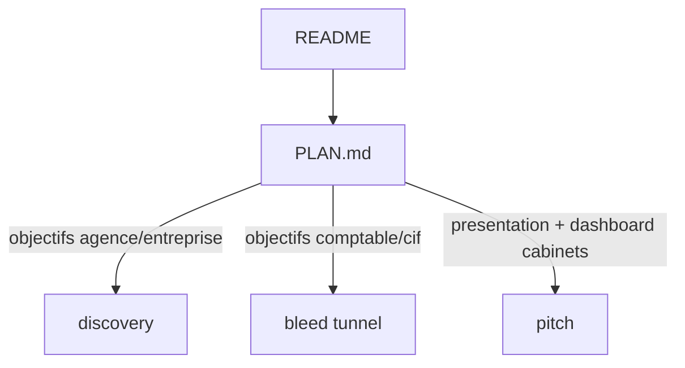

# Patch Sales — handoff agents

```
status: phase-9-done
audience: coding-agent
date: 2026-09-13
depends_on:
  - ../../tech-stack/00-decisions.md
  - ../../tech-stack/02-state-machines.md
  - ../../tech-stack/modules/cms-funnels.md
  - ../../tech-stack/modules/onboarding.md
  - ../../../components/internal/funnels/sales/README.md
do_not:
  - Implémenter sans lire PLAN.md et la phase en cours
  - Modifier des fichiers hors liste de la phase active
  - Marquer une phase done sans DoD + tests verts
  - Merger patch_sales_discovery.md et patch_sales_pitch.md en un seul fichier
  - Appliquer le framing Foundation (Hercule Core/Horizon) à agence ou entreprise
  - Toucher l’outreach Instantly / Calendly booking (hameçon amont)
  - Migrations Stripe, CGV juridiques, public/reservation*.html dans ce patch
  - Afficher quota 16–17 lettres / 30 RDV à l’écran (comptable/cif)
  - Mélanger labels Lite 998 / Starter 1 499 et Core 1 799 / Horizon 2 399 sur le même écran
  - Éditer le fichier plan Cursor (.cursor/plans/*) — le canon build est PLAN.md ici
```

## Start here

1. Lire ce README (règle de conflit + `do_not`).
2. Ouvrir [`PLAN.md`](./PLAN.md) — repérer la **première phase** en statut `todo`.
3. Lire l’**annexe copy** indiquée dans la phase :
   - mécanique bleed, agence, entreprise → [`patch_sales_discovery.md`](./patch_sales_discovery.md)
   - **tunnel Objectifs comptable/cif** → [`patch_sales_bleed.md`](./patch_sales_bleed.md)
   - copy / offre Foundation comptable + cif → [`patch_sales_pitch.md`](./patch_sales_pitch.md)
4. Lire les skills (ci-dessous) avant tout code UI.
5. Marquer la phase `in_progress` dans PLAN.md, implémenter **uniquement** cette phase, puis handoff.

**Une phase = un agent.** Ne pas entamer la phase suivante dans le même passage.

---

## Arborescence du dossier

| Fichier | Rôle |
|---------|------|
| [`README.md`](./README.md) | Protocole multi-agents (ce fichier) |
| [`PLAN.md`](./PLAN.md) | Plan de build unique — 9 phases, statuts, DoD |
| [`patch_sales_discovery.md`](./patch_sales_discovery.md) | Annexe — bleed track linéaire, agence + entreprise |
| [`patch_sales_bleed.md`](./patch_sales_bleed.md) | Annexe — **tunnel bleed** Objectifs (comptable + cif) |
| [`patch_sales_pitch.md`](./patch_sales_pitch.md) | Annexe — framing Moteur Hercule Foundation (comptable + cif) |



---

## Règle de conflit (obligatoire)

| Sujet | Canon |
|-------|--------|
| **Section Objectifs comptable/cif** (tunnel b1–b8, piège méthode × H × année) | **bleed** — [`patch_sales_bleed.md`](./patch_sales_bleed.md) |
| **Section Objectifs agence/entreprise** (o1–o6, `o3Duration`) | **discovery** §6.2 |
| Mécanique post-Objectifs (chips sticky, interpolation, coupe Historique, dashboard FAQ → intention → grille) | **discovery** + **pitch** selon audience |
| Offre à l’écran **comptable / cif** (Foundation, 60 j, Core/Horizon, 5 000 € / 90 j, inbound, calendrier 3 phases) | **pitch** — **gagne** sur discovery |
| **Agence / entreprise** | **discovery** seulement — pas de Foundation ni tunnel b* |
| Outreach Instantly | **hors plan** |

Si discovery mentionne leads, 998 €, 1 499 €, 10 RDV, 20–25 jours **pour comptable/cif**, suivre **pitch** (dashboard/présentation), pas discovery.

**Comptable/cif :** ids **`b1`–`b8`** (pas `o1`–`o6`). Les relabels pitch §6.2 sont **remplacés** par le tunnel bleed.

---

## Protocole de succession

### Avant de coder

1. Mettre à jour le statut de la phase : `todo` → `in_progress` dans [`PLAN.md`](./PLAN.md).
2. Vérifier que les phases **dépend de** sont `done`.
3. Ne toucher qu’aux fichiers listés sous **Fichiers** de la phase.

### Pendant

- UI React : MCP `plugin-shadcn-shadcn` + skill [`hercule-ui`](../../../.cursor/skills/hercule-ui/SKILL.md).
- Session live : route `/internal/funnels/{audience}/sales/funnel` — voir [`sales/README.md`](../../../components/internal/funnels/sales/README.md).
- Tokens admin : thème `.internal` — pas de `zinc-*` hardcodé.

### Après (handoff)

1. Tests listés dans la phase (minimum).
2. Si UI visible : vérifier en navigateur (session test sur étape Rendez-vous → bouton **Test**).
3. Mettre la phase à `done`.
4. Ajouter sous **Handoff** dans PLAN.md (5 lignes max) :

```text
Phase N — YYYY-MM-DD — [agent/id]
Fait : …
Pas fait / reporté : …
Piège : …
Suivant : phase N+1
```

---

## Skills et docs techniques

| Besoin | Lire |
|--------|------|
| Router Next.js | [`.cursor/skills/hercule-nextjs/SKILL.md`](../../../.cursor/skills/hercule-nextjs/SKILL.md) |
| Sales funnel | [`.cursor/skills/hercule-nextjs-sales-funnel/SKILL.md`](../../../.cursor/skills/hercule-nextjs-sales-funnel/SKILL.md) |
| Dashboard onboarding | [`.cursor/skills/hercule-nextjs-dashboard/SKILL.md`](../../../.cursor/skills/hercule-nextjs-dashboard/SKILL.md) |
| UI internal | [`.cursor/skills/hercule-ui/SKILL.md`](../../../.cursor/skills/hercule-ui/SKILL.md) |
| CMS funnels (canon) | [`doc/tech-stack/modules/cms-funnels.md`](../../tech-stack/modules/cms-funnels.md) |

---

## QA commun (surtout phase 9)

```bash
# Tests ciblés (adapter au diff de la phase)
pnpm test -- sales-qualification-schema sales-preset-scoring sales-bleed-track

# UI internal
pnpm doctor
```

Grep lexique **comptable/cif** (surfaces session + dashboard) :

```bash
rg -i 'lead(s)?|998|1.?499|10 (missions|RDV)|20.?25 jours|Starter|Lite' \
  components/internal/funnels/sales \
  components/dashboard \
  lib/admin/funnels/comptable-sales-copy.ts \
  lib/admin/funnels/cif-sales-copy.ts \
  lib/dashboard/onboarding-faq.ts
```

(Agence peut encore mentionner contrats / leads — hors grep cabinets.)

---

## Prompt à coller (nouvel agent)

```text
Tu implémentes le patch Sales Hercule.

Dossier : doc/patch/patch_sales/
1. Lis README.md (règle de conflit + do_not).
2. Ouvre PLAN.md — exécute UNIQUEMENT la phase [N] — [titre] (statut todo).
3. Lis l’annexe indiquée dans la phase (discovery, bleed tunnel, et/ou pitch).
4. Skills : hercule-nextjs-sales-funnel, hercule-ui ; shadcn MCP si UI.
5. Marque la phase in_progress, implémente, tests + browser si UI, marque done, handoff 5 lignes dans PLAN.md.
6. Ne commence PAS la phase suivante.
```

Remplacer `[N]` et `[titre]` par la phase à exécuter.

---

## Vue d’ensemble des 9 phases

| # | Titre | Audiences |
|---|--------|-----------|
| 1 | Moteur bleed ✅ | toutes |
| 2 | Coupe session + scoring ✅ | toutes |
| 3 | **Bleed tunnel cabinets** ✅ | comptable + cif |
| 4 | Objectifs agence / entreprise ✅ | agence + entreprise |
| 5 | Chrome bleed + qualif ✅ | toutes (copy split) |
| 6 | Présentation, règles, calendrier, ROI ✅ | split agence vs comptable/cif |
| 7 | Dashboard objections ✅ | split |
| 8 | Offre écran cabinets ✅ | comptable + cif |
| 9 | QA finale ✅ | toutes |

Détail : [`PLAN.md`](./PLAN.md).

**Note :** patch Sales terminé (phases 1–9). Prochaine étape : PR / déploiement. Reporté hors patch : migration Stripe (Horizon 2 399 € facturé), CGV garantie 5 000 €, labels checkout legacy Lite/Starter.
