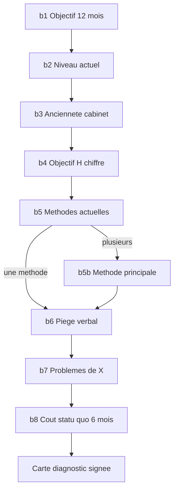

# Patch Sales — Bleed tunnel (comptable + cif)

> **Statut :** annexe historique — **superseded** par [`patch_sales_objectifs_wizard.md`](./patch_sales_objectifs_wizard.md) (wizard `w1`–`w17`)  
> **Build :** [`PLAN.md`](./PLAN.md) phase **3** · [`README.md`](./README.md)  
> **Périmètre :** section `objectifs` — **comptable + cif uniquement**  
> **Remplace :** les questions linéaires `o1`–`o6` et les relabels pitch §6.2 pour ces audiences  
> **Agence / entreprise :** [`patch_sales_discovery.md`](./patch_sales_discovery.md) §6.2 (inchangé)  
> **Après le tunnel :** [`patch_sales_pitch.md`](./patch_sales_pitch.md) (Foundation, présentation, dashboard)

---

## 1. Objectif

La phase **bleed** est le cœur du closing cabinets. Elle **résout les objections avant le prix** : le cabinet signe lui-même un diagnostic (objectif H, niveau actuel, ancienneté, méthode X) puis le piège se referme — « pourquoi X n’a pas produit H depuis {année} ? ».

**Principe Straight Line :**

1. **Q1–Q4** — faits neutres (objectif, présent, ancienneté, H chiffré). Pas d’accusation.
2. **Q5–Q6** — le piège se referme (méthode déclarée × objectif × année d’ouverture).
3. **Q7+** — la traque est ouverte : creuser la douleur par **branche** (tunnel), sujet = le canal / le cabinet, jamais « vous avez échoué ».



---

## 2. Décisions figées

| Sujet | Décision |
|-------|----------|
| Audiences | **comptable + cif** seulement |
| Section UI | `objectifs` (label sidebar peut rester « Objectifs ») |
| Ids questions | **`b1`–`b8`** + `b5b` — ne pas réutiliser `o1`–`o6` pour cabinets |
| Scoring presets | **Aucun** mapping `b*` → `scoreSerial` ; Serial reste **q3 + q20** |
| Carte diagnostic | Obligatoire ; `bleedDiagnosticAccepted` bloque la navigation |
| Lexique | Pas de `lead(s)` — voir pitch §5 |
| Ton B2B | Sujet = le cabinet / le canal / la zone — pas le dirigeant |
| Foundation | **Après** le tunnel (Présentation pitch §6.3), pas dans b1–b8 |

---

## 3. Tronc commun — questions

### 3.1 Cadre section (subtitle)

> Qualification courte : où va le cabinet, où il en est, et ce qui bloque depuis l’ouverture. On va droit au but.

**Script d’ouverture closer (oral, 15 s) :**

> [Prénom], on commence par cadrer l’objectif du cabinet sur 12 mois et où vous en êtes aujourd’hui. Pas de pitch pour l’instant — juste des chiffres et des faits. On est d’accord ?

---

### 3.2 `b1` — Objectif (Q1)

| | |
|--|--|
| **Type** | `single` |
| **Prompt comptable** | Sur les 12 prochains mois, quelle est la priorité du cabinet ? |
| **Options** | |

| Id | Label comptable |
|----|-----------------|
| `more_dossiers` | Plus de dossiers (volume) |
| `better_quality` | Des dossiers de meilleure qualité (honoraires / typologie) |
| `monthly_growth` | Croissance mensuelle du récurrent |

| Id | Label CIF |
|----|-----------|
| `more_dossiers` | Plus de mandats / études |
| `better_quality` | Des mandats de meilleure qualité (patrimoine / ticket) |
| `monthly_growth` | Croissance mensuelle du récurrent conseil |

**Coach cue (après sélection) :** « Noté — on chiffre tout à l’écran sur cette base. »

---

### 3.3 `b2` — Niveau actuel (Q2)

| | |
|--|--|
| **Type** | `slider` (unité **dépend de `b1`**) |
| **Prompt** | Le cabinet est à combien **aujourd’hui** ? |

| `b1` | Unité slider | Plage suggérée | Label axe |
|------|--------------|----------------|-----------|
| `more_dossiers` | dossiers / mois | 0–15 | nouveaux dossiers / mois |
| `better_quality` | € / an (honoraires moyens par lettre) | 2 400–6 000 | honoraires annuels moyens |
| `monthly_growth` | € / mois récurrent | 500–15 000 | récurrent mensuel |

CIF : « mandats / mois » ou « rémunération conseil » selon `b1`.

---

### 3.4 `b3` — Ancienneté (Q3)

| | |
|--|--|
| **Type** | `single` (chips) |
| **Prompt** | Le cabinet est en activité depuis… |

| Id | Label |
|----|-------|
| `y2015` | Avant 2017 |
| `y2017` | 2017 – 2019 |
| `y2020` | 2020 – 2021 |
| `y2022` | 2022 – 2023 |
| `y2024` | 2024 ou après |

**Champ schema :** `b3Year` — année représentative pour interpolation (`2015`, `2017`, `2020`, `2022`, `2024`).

**Coach cue :** « Ça nous servira pour le diagnostic — pas un jugement. »

---

### 3.5 `b4` — Objectif H chiffré (Q4)

| | |
|--|--|
| **Type** | `slider` |
| **Prompt** | Chiffrer l’objectif **H** à 12 mois — la cible que le cabinet vise. |
| **Unité** | **Même branche que `b2`** (dérivée de `b1`) |
| **Contrainte UI** | `b4` > `b2` si possible ; sinon alerte douce « objectif ≤ actuel » |

**Tokens bleed :** `{goal}` = label formaté de `b4`, `{current}` = `b2`, `{gap}` = delta affiché.

---

### 3.6 `b5` — Méthodes actuelles (Q5 entrée piège)

| | |
|--|--|
| **Type** | `multi`, max **2** |
| **Prompt** | Quelles méthodes le cabinet utilise **aujourd’hui** pour développer le portefeuille ? |
| **Description** | Jusqu’à 2 réponses. |

| Id | Label |
|----|-------|
| `word_of_mouth` | Bouche-à-oreille / réseau |
| `seo` | Référencement / site / contenu (agence SEO) |
| `ads` | Publicité (Google, Meta, annuaires payants) |
| `referrers` | Apporteurs / fichiers achetées |
| `direct` | Prospection directe (email, LinkedIn, appels) |
| `partnerships` | Partenariats (notaires, avocats, réseaux) |
| `nothing` | Rien de structuré |

**Lexique :** jamais « leads » dans les labels.

---

### 3.7 `b5b` — Méthode principale (si multi)

| | |
|--|--|
| **Type** | `single` |
| **Visible si** | `length(b5) > 1` |
| **Prompt** | Parmi ce que le cabinet a coché, quel levier **pèse le plus** sur les résultats actuels ? |

Options = sous-ensemble des labels `b5` cochés.

**`{method}`** = label de `b5b` ou de l’unique option `b5`.

---

### 3.8 `b6` — Fermeture du piège (Q6)

| | |
|--|--|
| **Type** | Affichage + **acknowledgment** (pas un QCM long) |
| **Comportement** | Bloc lecture + case « Le cabinet reconnaît ce constat » **ou** passage direct si closer lit à l’oral |

**Script à l’écran (interpolé) :**

> Depuis **{year}**, le cabinet vise **{goal}** (actuellement **{current}**). Le levier principal déclaré est **{method}**.  
> **Pourquoi {method} n’a pas permis d’atteindre {goal} sur cette période ?**

**Règles copy :**

- `{year}` = `b3Year`
- Ne pas dire « vous n’avez pas su » — dire « le levier {method} » / « le canal »
- Le closer **laisse 10–20 s** de silence après lecture

**Champ optionnel :** `b6Acknowledged: boolean` si distinct de la carte finale.

---

### 3.9 `b7` — Problèmes de X (Q7, branche)

| | |
|--|--|
| **Type** | `single` |
| **Prompt** | Qu’est-ce qui bride **{method}** pour le cabinet ? |
| **Options** | **Liste dépend de `{method}`** — voir §4 |

---

### 3.10 `b8` — Coût du statu quo (Q8)

| | |
|--|--|
| **Type** | `single` |
| **Prompt** | Si dans 6 mois l’écart entre **{goal}** et **{current}** est le même, qu’est-ce que ça fait à la marge et à l’occupation du cabinet ? |

| Id | Label |
|----|-------|
| `major_gap` | Écart majeur sur la marge et l’occupation |
| `significant_gap` | Écart significatif — équipe sous-utilisée |
| `moderate_gap` | Écart modéré mais récurrent qui freine la croissance |
| `near_target` | Proche de l’objectif — écart sur un levier précis |
| `at_capacity` | Déjà à la cible sur le volume (autre frein) |

Aligné scoring discovery `o6` pour compatibilité `{gap}` dans BleedTrack.

---

### 3.11 Carte diagnostic (sortie tunnel)

Affichée après `b8`. Bloque la navigation tant que non cochée.

**Miroir (1 ligne) :**

> Aujourd’hui : objectif **{goal}** · actuel **{current}** · depuis **{year}** · **{method}** bridé par **{b7_label}**. La suite déploie le système sur cet écart.

**Checkbox :**

> Le cabinet valide ce cadre pour la suite de l’audit de compatibilité.

**Champ :** `bleedDiagnosticAccepted: boolean` (required).

---

## 4. Branches `b7` — problèmes par méthode

Une seule liste affichée selon `{method}` (id `b5b` ou unique `b5`).

### 4.1 `seo`

| Id | Label |
|----|-------|
| `seo_delay` | Délai 6–12 mois sans preuve de retour |
| `seo_rent` | Visibilité locataire — arrêt du budget = zéro flux |
| `seo_keywords` | Confrères sur les mêmes mots-clés de zone |
| `seo_no_asset` | Pas d’actif propriétaire — tout repart de zéro chaque fois |

### 4.2 `ads`

| Id | Label |
|----|-------|
| `ads_cac` | Coût par demande trop élevé pour les honoraires visés |
| `ads_unqualified` | Demandes hors zone / hors typologie |
| `ads_stop` | Couper la campagne = flux à zéro immédiat |
| `ads_no_asset` | Aucun actif — uniquement de la location d’attention |

### 4.3 `word_of_mouth`

| Id | Label |
|----|-------|
| `wom_scale` | Non scalable — dépend des relations existantes |
| `wom_aging` | Portefeuille qui vieillit sans renouvellement prévisible |
| `wom_random` | Flux aléatoire — pas de prévisibilité sur 6 mois |
| `wom_zone` | Zone sous-exploitée — peu de bouche-à-oreille entrante |

### 4.4 `referrers`

| Id | Label |
|----|-------|
| `ref_stale` | Fiches périmées ou déjà contactées |
| `ref_shared` | Pas d’exclusivité — même fichier à plusieurs cabinets |
| `ref_commission` | Commission qui érode la marge |
| `ref_quality` | Peu de correspondance honoraires / typologie |

### 4.5 `direct`

| Id | Label |
|----|-------|
| `dir_bandwidth` | Bande passante associée insuffisante |
| `dir_image` | Image cabinet — prospection perçue comme intrusive |
| `dir_cadence` | Cadence trop faible pour combler l’écart |
| `dir_skills` | Pas de process commercial structuré |

### 4.6 `partnerships`

| Id | Label |
|----|-------|
| `part_inactive` | Partenaires peu actifs |
| `part_reciproque` | Pas de réciproque — le flux ne revient pas |
| `part_zone` | Hors zone ou hors cible |
| `part_dependency` | Dépendance à un seul partenaire |

### 4.7 `nothing`

| Id | Label |
|----|-------|
| `nothing_infra` | Jamais d’infrastructure d’acquisition |
| `nothing_network` | Dépendance totale au réseau personnel |
| `nothing_visibility` | Invisibilité au moment du besoin sur la zone |
| `nothing_time` | Pas de temps associé dédié au développement |

---

## 5. BleedTrack — dérivation cabinets

Extension de `buildBleedTrack` quand audience = comptable | cif :

```ts
type BleedTrackCabinet = {
  businessNoun: "cabinet";
  goal: string;           // label formaté b4
  current: string;        // label formaté b2
  openingYear: string;    // b3Year
  primaryMethod: string;  // label method
  methodBrake: string;    // label b7
  gap: string;            // label b8
  gapId: string;          // id b8
  goalType: string;       // id b1
  synthesis: string[];    // optionnel — tags pour chips sticky
};
```

**Interpolation tokens (sections suivantes) :**

| Token | Source |
|-------|--------|
| `{goal}` | b4 |
| `{current}` | b2 |
| `{year}` | b3Year |
| `{method}` | b5/b5b |
| `{gap}` | b8 label |
| `{cause}` | alias `{methodBrake}` ou b7 label |
| `{business}` | « le cabinet » |

**Chip sticky (phase 4 PLAN) :** max 3 tokens — ex. `{goal}` · `{method}` · `{gap}`.

---

## 6. Schema qualification (implémentation future)

### 6.1 Champs section `objectifs` — cabinets

Remplacer dans `SECTION_QUESTION_KEYS.objectifs` pour comptable/cif :

```ts
// comptable / cif
objectifs: ["b1", "b2", "b3", "b4", "b5", "b5b", "b7", "b8"]
// b5b conditionnel — ne pas exiger si length(b5) <= 1
// b6 = ack inline ou fusionné carte
```

Agence / entreprise **gardent** :

```ts
objectifs: ["o1", "o2", "o3", "o4", "o5", "o6"] // + o3Duration si discovery
```

### 6.2 Types Zod (esquisse)

```ts
b1: z.enum(["more_dossiers", "better_quality", "monthly_growth"])
b2: z.number()
b3: z.enum(["y2015", "y2017", "y2020", "y2022", "y2024"])
b3Year: z.number().int() // dérivé ou saisi
b4: z.number()
b5: z.array(z.string()).max(2)
b5b: z.string().optional()
b7: z.string().min(1)
b8: z.string().min(1)
bleedDiagnosticAccepted: z.literal(true) // pour compléter section
```

### 6.3 UI — `visibleWhen`

Le type `SalesQuestion` doit supporter (phase 3 PLAN) :

```ts
visibleWhen?: {
  field: string;
  op: "eq" | "gt" | "includes" | "lengthGt";
  value: string | number;
}
```

Cas :

- `b5b` : `lengthGt` sur `b5`, value `1`
- Sliders `b2`/`b4` : unité dynamique selon `b1`
- `b7` options : résolues via `getB7Options(primaryMethodId)`

---

## 7. Fichiers code (référence phase 3 PLAN)

| Fichier | Rôle |
|---------|------|
| `sales-questions-objectifs-comptable.ts` | Remplacer `COMPTABLE_OBJECTIFS_QUESTIONS` par tunnel `b1`–`b8` |
| `sales-questions-objectifs-cif.ts` | Transposition lexique CIF |
| `sales-question-fields.tsx` | Sliders dynamiques, `visibleWhen`, carte diagnostic |
| `sales-qualification-schema.ts` | Champs `b*` cabinets ; split par audience |
| `sales-bleed-track.ts` | `buildBleedTrack` branche cabinets |
| `sales-funnel-section-page.tsx` | Subtitle Objectifs bleed |
| `sales-questions-objectifs-comptable.test.ts` | Chemins b1→carte, branches b7 |

**Ne pas modifier** `sales-questions-objectifs-agence.ts` ni `entreprise.ts` dans cette phase.

---

## 8. Règles closer

1. **Ne pas pitcher Foundation** pendant b1–b8.
2. **Q6** : lire le script interpolé, silence, laisser le cabinet répondre à l’oral — l’écran pose le cadre.
3. **Pas de boucle infinie** après b7 : une question b8, puis carte.
4. **Objections qualité / prix** : renvoyer au diagnostic signé — « c’est pour traiter exactement {gap} sur {method} ».
5. **Sur-livraison** : si le cabinet dit « on a déjà du bouche-à-oreille », b5 capture — le piège reste « pourquoi pas H ».

---

## 9. Checklist QA (phase 3)

- [ ] Parcours comptable : b1 → carte sans dead-end
- [ ] `b5` une option : pas de `b5b`
- [ ] `b5` deux options : `b5b` obligatoire
- [ ] Chaque méthode `b5` a une liste `b7` distincte
- [ ] Q6 affiche `{year}`, `{goal}`, `{current}`, `{method}` corrects
- [ ] Carte bloque navigation
- [ ] CIF : mandats / études, pas « audit »
- [ ] Aucun `lead` dans les prompts cabinets
- [ ] Agence / entreprise : ancien flux o1–o6 intact
- [ ] Scoring Serial inchangé (q3, q20)

---

## 10. Relation aux autres annexes

| Annexe | Rôle par rapport au tunnel |
|--------|----------------------------|
| [discovery](./patch_sales_discovery.md) | BleedTrack générique, interpolation post-Objectifs, agence/entreprise |
| [pitch](./patch_sales_pitch.md) | Présentation Foundation **après** carte ; dashboard ; plus de relabel o3 pour cabinets |
| [PLAN](./PLAN.md) | Phase 3 = ce tunnel ; phase 4 = Objectifs agence/entreprise |

---

*Spec bleed tunnel — comptable + cif — sept. 2026.*
