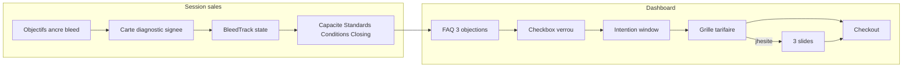

# Patch Sales — Discovery (bleed track)

> **Statut :** annexe copy — ne pas implémenter sans [`PLAN.md`](./PLAN.md)  
> **Build :** [`README.md`](./README.md) (handoff agents) · [`PLAN.md`](./PLAN.md) (phases 1–8)  
> **Complété par :** [`patch_sales_bleed.md`](./patch_sales_bleed.md) (Objectifs **comptable + cif**) · [`patch_sales_pitch.md`](./patch_sales_pitch.md) (Foundation)  
> **Périmètre Objectifs §6.2 :** **agence + entreprise** — les cabinets utilisent le tunnel bleed, pas ce §6.2 linéaire  
> **Périmètre global :** agence, entreprise, cif, comptable — session sales + dashboard onboarding  
> **Hors scope :** code, migrations Stripe, `public/reservation*.html`, compteur « places restantes » (option future)

---

## 1. Objectif

Transformer le funnel live de **collecte logistique froide** en **parcours de certitude** :

1. **Objectifs** ancre la douleur (émotion + chiffres) via le **bleed track**.
2. Chaque section suivante **réinjecte** cet ancrage (miroir + bénéfice) autour des questions techniques.
3. Le **dashboard** absorbe les objections (FAQ, verrou, intention, slides) — pas de looping vocal freestyle.

**Non-objectifs :**

- Pas de presenter view closer-only : tout est **écran partagé** avec le prospect.
- Pas de nouvelle interrogation « psy » après Objectifs.
- Pas de tarif Hercule affiché en session (prix = dashboard uniquement).
- Pas de section Historique (retards, clients perdus) — bleed accusatoire.

---

## 2. Diagnostic

| Avant | Après |
|-------|-------|
| QCM + sliders = interrogatoire administratif | Diagnostic business **signé**, puis logistique contextualisée |
| Certitude process (cases cochées) | Certitude émotionnelle + numérique (écart, cause, ROI) |
| Objection « confiance » en fin d’appel | Objections désamorcées **avant** le checkout (dashboard) |
| Douleur limitée aux 10 premières minutes | **Bleed track** : douleur + bénéfice sur tout l’appel |
| Looping vocal improvisé | Patches scriptés (FAQ + slides) |



---

## 3. Décisions figées

| Sujet | Décision |
|-------|----------|
| Audiences | Toutes (agence, entreprise, cif, comptable), copy adapté par niche |
| Écran | 100 % partagé avec le prospect |
| Capacité | q1 + q2 chips matching (20 s, zéro bleed) + q3 slider volume |
| Historique | **Section supprimée** (q6–q10) |
| q4, q5 | Supprimés |
| Conditions | Conservées, speed-run, bleed interpolé dans les descriptions |
| Scoring Serial | q4/q10 → q3 + q20 |
| Agence | **Ajouter q21** (différenciation) |
| ROI session | 2× : slider honoraires + rappel calendrier |
| Prix Hercule | Dashboard uniquement ; retirer 998 € / 1 499 € du sous-titre Conditions |
| Dashboard paiement | agence + comptable + cif ; entreprise = gratuit, pas de tunnel B |
| Intention | Les 3 boutons → **toujours** la grille tarifaire ; slides si « j’hésite » |

---

## 4. Mapping notes → ids code

Les notes de discussion numérotent les questions « script vente » (Q1–Q19). Le code utilise des ids stables différents.

| Notes (script oral) | Section | Id code | Fichier principal |
|---------------------|---------|---------|-------------------|
| Q1–Q6 Objectifs | `objectifs` | `o2`–`o6`, `o1` | `sales-questions-objectifs-{audience}.ts` |
| Q1–Q5 Capacité | `capacite` | `q1`–`q5` | `sales-questions.ts` / `sales-questions-comptable.ts` / `sales-questions-cif.ts` |
| Q6–Q10 Historique | `historique` | `q6`–`q10` | **Supprimé** |
| Q11 Différenciation | `standards` | `q21` (comptable/cif) | `sales-questions-comptable.ts`, `comptable-sales-copy.ts` |
| Q12–Q15 Standards | `standards` | `q11`–`q14` | idem |
| Q16–Q19 Conditions | `conditions` | `q15`–`q20` | idem |
| Étape 10 Récap | closing | `recap` | `sales-closing-sections.ts` |
| Étape 11 Règles | closing | `regles-traitement` | `sales-closing-panel.tsx` |
| Étape 13 Calendrier | closing | `calendrier` | `sales-calendrier-panel.tsx` |
| Étape 14 Dashboard | closing | `envoi-dashboard` | `sales-closing-panel.tsx` |
| Étape 15 Pricing | dashboard | wizard step 4–5 | `onboarding-*-wizard.tsx` |

**Nouveaux champs (bleed) :**

| Champ | Type | Source |
|-------|------|--------|
| `o3Duration` | `'<3m' \| '6m' \| '12m' \| '24m+'` | Chips après o3 |
| `bleedDiagnosticAccepted` | `boolean` | Carte fin Objectifs |
| `BleedTrack` | objet dérivé | `sales-bleed-track.ts` (à créer) |

---

## 5. Bleed track

### 5.1 Concept

Le **bleed track** persiste le diagnostic business déclaré en Objectifs et le **réinjecte** dans chaque section technique via la formule :

> **Miroir** (ce que le business a déclaré) → **Logistique** (question technique) → **Bénéfice** (ce que la réponse débloque pour l’écart)

Ce n’est **pas** une deuxième phase de douleur. Le prospect a **signé** le diagnostic ; les rappels ne sont plus des accusations.

### 5.2 Règles copy B2B

| Interdit | Autorisé |
|----------|----------|
| « Vous stagnez », « vous n’avez pas su » | « L’écart de capacité », « le flux du cabinet » |
| « Votre stress », « dormir », « ego » | « La marge », « l’occupation », « le portefeuille » |
| Retards, clients perdus, inspection | Écart vs cible, honoraires, bande passante |
| « Pourquoi vous n’avez rien fait » | Coût du statu quo, coût de l’inaction |

- **Sujet grammatical** = le cabinet / l’agence / l’activité / le portefeuille / la marge / l’écart.
- **Adresse orale** `[Prénom]` OK pour ouvrir une phrase ; le contenu parle de l’entité.
- **Lexique par audience :**
  - comptable / cif → `cabinet`, `portefeuille`, `dossiers`, `mandats`
  - agence → `agence`, `pipeline`, `projets`
  - entreprise → `activité`, `objectifs digitaux`, `budget` (jamais « vous n’êtes pas un bon dirigeant »)

### 5.3 Objet `BleedTrack`

Dérivé de `SalesQualificationValues` — pas de store parallèle.

```ts
type BleedTrack = {
  businessNoun: string;       // "cabinet" | "agence" | "activité"
  cause: string;              // label o3
  causeId: string;            // id o3
  primaryBrake: string;       // label o4[0]
  gap: string;                // label o6
  gapId: string;              // id o6
  duration: string;           // label o3Duration
  synthesis: string[];        // labels o1
  honorairesAnnual?: number;  // q13 (comptable/cif)
  roiAnnual?: number;         // calculé
  reservedCapacity?: number;  // q20
};
```

**Helper :** `lib/admin/funnels/sales-bleed-track.ts`  
**Fonctions :** `buildBleedTrack(values, audience)`, `interpolateBleed(template, bleed)`, `formatBleedStickyChips(bleed)`

### 5.4 UI bleed

| Composant | Emplacement | Comportement |
|-----------|-------------|--------------|
| **Carte diagnostic** | Fin section `objectifs` | 1 ligne miroir + checkbox obligatoire `bleedDiagnosticAccepted` |
| **Chip sticky** | `sales-funnel-sidebar.tsx` | 3 tokens max après Objectifs validés |
| **`bleedBenefit`** | `sales-question-fields.tsx` | Ligne sous le prompt, interpolée |
| **`coachCue`** | `sales-question-fields.tsx` | Alerte après sélection (o3, o4, o6) |
| **Section subtitle** | `sales-funnel-section-page.tsx` | `{cause}` / `{gap}` interpolés |
| **Widget ROI** | sous slider q13/q14 | Chiffre live + alimente chip sticky |
| **Calendrier recap** | `sales-calendrier-panel.tsx` | Rappel ROI #2 vs écart déclaré |

### 5.5 Où bleed / où ne pas bleed

| Section | Bleed |
|---------|-------|
| Objectifs | **Ancre** (cues + durée + carte diagnostic) |
| Présentation | Pitch collé à `{cause}` + pivot anti-confiance |
| Capacité q1/q2 | **Non** (matching froid, 20 s) |
| Capacité q3 | Oui (dimensionner pour `{gap}`) |
| Historique | **Supprimé** |
| q21 différenciation | **Oui** (pont Hercule ↔ atouts ↔ `{cause}`) |
| Honoraires + calendrier | **Oui** (ROI live × 2) |
| Conditions q20 | Oui (bande passante pour `{cause}`) |
| Règles 24h | Oui (conversion de l’écart) |
| Dashboard FAQ / slides | Oui (`{gap}`, `{cause}`, honoraires) |

---

## 6. Partie A — Session sales

### 6.1 Fichiers cibles

| Domaine | Fichiers |
|---------|----------|
| Questions objectifs | `components/internal/funnels/sales/sales-questions-objectifs-{agence,comptable,cif,entreprise}.ts` |
| Questions qualif | `sales-questions.ts`, `sales-questions-comptable.ts`, `sales-questions-cif.ts` |
| Bleed | `lib/admin/funnels/sales-bleed-track.ts` (nouveau) |
| Rendu | `sales-question-fields.tsx`, `sales-funnel-section-page.tsx`, `sales-funnel-sidebar.tsx` |
| Sections | `sales-funnel-sections.ts` |
| Intro / présentation | `sales-intro-script.ts`, `sales-company-presentation-panel.tsx`, `lib/admin/funnels/comptable-sales-copy.ts` |
| Closing | `sales-closing-sections.ts`, `sales-closing-panel.tsx`, `sales-calendrier-panel.tsx` |
| Schema | `lib/admin/funnels/sales-qualification-schema.ts`, `sales-preset-scoring.ts` |
| Shell | `sales-funnel-module.tsx`, `sales-qualification-form.tsx` |

### 6.2 Objectifs — ancre du bleed

> **Comptable / CIF :** cette section est **remplacée** par [`patch_sales_bleed.md`](./patch_sales_bleed.md) (tunnel b1–b8). Ne pas implémenter o1–o6 pour ces audiences.

**Ne pas** changer les options de scoring existantes (agence / entreprise).

#### Cadre (subtitle section)

> Qualification courte : capacité, écart, ce qui bloque le [business]. On va droit au but.

#### Table des cues

| Id | # | Action | Script B2B (à lire) |
|----|---|--------|---------------------|
| `o2` | 1 | Inchangé | — |
| `o3` | 2 | Cue + **4 chips durée** | « Le [business] coche [cause]. Depuis combien de temps cet écart de flux pèse sur le portefeuille ? » |
| `o3Duration` | — | Chips : `< 3 mois` / `6 mois` / `12 mois` / `24 mois+` | 10 s, pas de monologue |
| `o4` | 3 | Reformuler prompt | Prompt : « Parmi ces freins, lequel bride le plus la capacité du [business] sur les 6 prochains mois ? » |
| `o5` | 4 | Garder | Pas de cue extra |
| `o6` | 5 | Alerte si `major_gap` ou `significant_gap` | « Si dans 6 mois l’écart de capacité est le même : qu’est-ce que ça fait à la marge et à l’occupation du [business] ? » |
| `o1` | 6 | Garder (scoring) | — |
| Sortie | — | **Carte diagnostic** | Voir §6.2.1 |

#### 6.2.1 Carte diagnostic (obligatoire)

Affichée en fin de section `objectifs`. Bloque la navigation tant que non cochée.

**Miroir (1 ligne) :**

> Aujourd’hui : [cause] · [frein principal] · écart [gap] · depuis [durée]. La suite qualifie le [business] pour traiter cet écart.

**Checkbox :**

> Le [business] valide ce cadre pour la suite de l’audit de compatibilité.

**Champ schema :** `bleedDiagnosticAccepted: boolean` (required pour compléter `objectifs`).

#### Copy par audience — Objectifs

| Audience | `[business]` | Exemple cause |
|----------|--------------|---------------|
| comptable | — | *voir bleed annex* |
| cif | — | *voir bleed annex* |
| agence | l’agence | Flux de leads insuffisant |
| entreprise | l’activité | Pas assez de leads ou de demandes entrantes |

---

### 6.3 Capacité — chips matching + slider

**À l’écran :**

- `q1` + `q2` : chips compactes, 20 s, **sans bleed**
- `q3` : slider volume

**Supprimé :** `q4`, `q5`, section `historique` entière (`q6`–`q10`).

**Subtitle section (interpolé) :**

> Dimensionner la capacité du [business] pour combler l’écart [gap] déclaré.

**Description q3 :**

> Combien de nouveaux [dossiers|projets|mandats] le [business] peut absorber par mois pour traiter [cause] ?

---

### 6.4 Standards — différenciation + honoraires

#### q21 — Différenciation (comptable / cif / agence à ajouter)

**Cue après sélection (comptable) :**

> C’est cohérent : le cabinet mise sur [atout coché]. Les dirigeants TPE qu’Hercule qualifie en ce moment fuient les cabinets « boîte noire » et recherchent exactement ce profil. Le flux est aligné sur [cause] — chaque RDV peut faire mouche.

**Agence (q21 à créer) — modèle :**

> L’agence se distingue sur [atout]. Les PME qu’Hercule met en relation recherchent ce positionnement pour résoudre [cause] — le pipeline est calibré sur cet écart.

**Entreprise :** pas de pont « leads en stock ». Pont compatibilité agence / 5 critères / gratuité.

#### Widget ROI (sous slider honoraires)

**Formules** (source : `lib/commercial/constants.ts`) :

| Audience | Formule | Exemple |
|----------|---------|---------|
| comptable / cif | `missions × taux × honoraires_annuels` | 10 × 25 % × 3 600 € = **9 000 €/an** (conservateur) ; 10 × 30 % × 3 600 € = **10 800 €/an** |
| comptable garantie | MRR garanti Starter | **3 000 €** cumulés (`growthGuaranteeMrrCents`) |
| agence Growth | 10 × taux × ticket | 10 × 25 % × ticket mensuel déclaré |
| agence garantie | MRR garanti Growth | **1 500 €** (`starterGuaranteeMrrCents`) |

**Copy widget (comptable) :**

> [honoraires] €/an par lettre. Starter = 10 RDV. À 20–30 % de signature : [roi_min]–[roi_max] € de récurrent annuel pour le cabinet. **À garder en tête** pour la suite.

**Ne pas afficher** le tarif Hercule (998 € / 1 499 €) ici.

---

### 6.5 Conditions — speed-run + bleed interpolé

Questions conservées. Chaque `description` reçoit une ligne `{cause}` → bénéfice.

**Exemple q20 (comptable) :**

> Quelle bande passante le cabinet réserve à Hercule pour traiter [cause] ? Les créneaux provisionnés dimensionnent directement le calendrier de collaboration.

**Retirer du sous-titre Conditions** (`sales-funnel-sections.ts` lignes 144–145, 203–204) :

```diff
- formules Hercule (Lite 998 €/mois, Starter 1 499 €/mois, pack 3 598 €)
+ priorités de collaboration et capacité réservée
```

---

### 6.6 Présentation + closing session

#### Pivot anti-confiance (à lire pendant présentation)

> [Prénom], la plupart des [business plural] qui passent cet audit ont déjà testé des apporteurs ou des agences marketing avec des fiches périmées. Hercule est branché sur les flux légaux (Pappers, INSEE) — pas sur la pub Facebook. Le cabinet a déjà payé ce type de flux ; ici, c’est de la data chirurgicale pour traiter [cause].

#### Contexte niche (à lire avant règles — comptable)

> Le marché TPE a une particularité : la comptabilité est une obligation légale. L’enjeu du RDV n’est pas de vendre la compta — c’est de montrer que le cabinet est réactif. C’est la niche à la conversion la plus directe chez Hercule, alignée sur l’écart [gap] déclaré.

#### Règles de traitement (recadrage)

> Ces règles ne sont pas des contraintes unilatérales : elles garantissent que le dossier TPE est encore chaud quand le cabinet répond. Réponse sous 24 h = le [business] convertit l’écart [gap] plus vite. On fait équipe là-dessus.

#### Calendrier — ROI rappel #2

> Le calendrier est dimensionné pour [missions] RDV. Avec [honoraires] €/an et un taux de 20–30 %, le cabinet vise [roi] € de récurrent. C’est le potentiel vs l’écart [gap] validé tout à l’heure.

---

## 7. Partie B — Dashboard onboarding

### 7.1 Fichiers cibles

| Composant | Fichier |
|-----------|---------|
| FAQ + tie-down | `components/dashboard/steps/step-faq-tie-down.tsx` |
| Config FAQ | `lib/dashboard/onboarding-faq.ts` |
| Wizards | `onboarding-comptable-wizard.tsx`, `onboarding-preview-wizard.tsx` (+ CIF à créer ou réutiliser comptable) |
| Pricing | `step-pricing-card.tsx`, `step-pricing-card-comptable.tsx` |
| Checkout | `step-embedded-checkout.tsx`, `step-embedded-checkout-comptable.tsx` |
| Intention + slides | **nouveau** `step-intention-window.tsx`, `step-hesitation-slides.tsx` |

### 7.2 Flux dashboard (agence / comptable / cif)

```
Étapes existantes → FAQ enrichie → Checkbox fusionnée → Intention window → Grille tarifaire → [Slides si hésite] → Checkout
```

| Étape | Comportement |
|-------|--------------|
| FAQ | 3 objections **en tête** de l’accordion (avant les items CGV existants) |
| Checkbox | CGV + « paiement pendant cette session » fusionnés ; bloque « Suivant » |
| Intention | 3 boutons ; **tous** → grille tarifaire |
| Grille | Starter pré-sélectionné si « 100 % partant » |
| Slides | Overlay sur grille si « J’hésite encore » ; 3 slides puis CTA checkout |

**Entreprise :** pas de B2–B4 paiement. Objectifs bleed + FAQ confiance existante.

**CIF :** ajouter `CIF_FAQ` dans `FAQ_BY_AUDIENCE` (`lib/dashboard/onboarding-faq.ts` — actuellement manquant malgré le type `DashboardFaqAudience`).

### 7.3 FAQ — 3 objections préventives

#### 1. Paiement pendant la session

**Question :** Pourquoi l’activation et le paiement se font-ils pendant notre session d’audit ?

**Réponse comptable :**

> Chez Hercule, on ne fait pas de relance commerciale par email. Le flux de dirigeants TPE est capté en temps réel. Les places et créneaux exclusifs dans la zone du cabinet sont limités. Pour lancer les 10 premiers RDV sous 20 à 25 jours, l’onboarding Stripe doit être validé maintenant. Si on attend, les dossiers de la zone sont redistribués.

**Réponse agence :**

> Hercule attribue les contrats PME en exclusivité. Les créneaux et la zone sont provisionnés à la validation. Sans activation pendant la session, le pipeline ne démarre pas et la place peut être réattribuée.

#### 2. Associé

**Question :** Je dois en parler à mon associé avant de décider. Comment faire ?

**Réponse comptable :**

> Le cabinet a déclaré des honoraires à [honoraires] €/an et un écart [gap]. Hercule Starter est couvert par une garantie contractuelle de 3 000 € de revenus récurrents cumulés. Le risque financier du cabinet est mathématiquement limité. L’associé valide un ROI contractuel, pas un caprice. On active l’onboarding et le double du contrat est envoyé pour validation associé.

#### 3. Je dois réfléchir

**Question :** Est-ce que je peux prendre quelques jours pour réfléchir ?

**Réponse (interpolée `{gap}`, `{cause}`) :**

> La réflexion est légitime. Mais sur quoi ? Si le cabinet a besoin de traiter [cause] et que l’écart [gap] est réel, chaque jour de statu quo laisse les dossiers de la zone à un confrère. Le contrat garantit le résultat — le coût de l’attente, c’est l’écart inchangé.

### 7.4 Checkbox fusionnée

**Texte :**

> J’ai pris connaissance des [Conditions générales de vente](/cvg), je comprends que l’activation et le paiement (carte bancaire ou SEPA) se font **pendant cette session d’audit**, et je souhaite lancer le service — pas « pour voir ».

**Script closer :**

> [Prénom], avant d’ouvrir les formules, une validation obligatoire à l’écran. Chez Hercule, pas de relance email et pas de paiement « pour voir ». Si on coche cette case, c’est que le cabinet est prêt à activer immédiatement. Sinon, on libère la place pour un autre [business] de la zone. On coche et on regarde les formules ?

### 7.5 Fenêtre d’intention

| Bouton | Destination | Variante UI |
|--------|-------------|-------------|
| **Je suis 100 % partant** | Grille tarifaire | Starter pré-sélectionné, CTA checkout visible, ton direct |
| **Cela me plaît** | Grille tarifaire | Même grille, ton posé, pas de slides |
| **J’hésite encore** | Grille + overlay slides | Carousel 3 slides |

### 7.6 Slides d’hésitation (overlay sur grille)

| Slide | Pilier | Copy type (B2B) |
|-------|--------|-----------------|
| 1 | Produit | Le produit s’attaque à **[cause]** : data Pappers/INSEE, besoin légal avéré. Si le produit est bon, qu’est-ce qui retient le cabinet ? |
| 2 | Société | La vraie question n’est pas la personne — c’est le cadre. Hercule gère déjà des flux pour développeurs, designers, conseillers. Même rigueur pour le secteur comptable. Support France. |
| 3 | Risque | Investissement 1 499 €/mois. Garantie 3 000 € de récurrent. Maths vs écart [gap] et honoraires [honoraires] déclarés. L’associé valide un ROI contractuel. |

**Après slide 3 :** CTA « Activer [formule] » → embedded checkout.

---

## 8. Matrice audience × changements

| Changement | agence | comptable | cif | entreprise |
|------------|--------|-----------|-----|------------|
| Bleed track Objectifs | ✓ | ✓ | ✓ | ✓ |
| Chips durée o3 | ✓ | ✓ | ✓ | ✓ |
| Carte diagnostic | ✓ | ✓ | ✓ | ✓ |
| Chip sticky sidebar | ✓ | ✓ | ✓ | ✓ |
| Supprimer Historique | ✓ | ✓ | ✓ | ✓ |
| Supprimer q4, q5 | ✓ | ✓ | ✓ | ✓ |
| Capacité q1+q2 chips | ✓ | ✓ | ✓ | ✓ |
| q21 différenciation | **ajouter** | ✓ | ✓ | — |
| Widget ROI session | ✓ | ✓ | ✓ | — |
| Retirer prix session | ✓ | ✓ | ✓ | — |
| Dashboard FAQ objections | ✓ | ✓ | ✓ | — |
| Intention + slides | ✓ | ✓ | ✓ | — |
| Checkbox fusionnée | ✓ | ✓ | ✓ | — |
| Objectifs bleed seul | — | — | — | ✓ (+ FAQ confiance) |

---

## 9. Impacts technique (implémentation future)

### 9.1 Schema (`sales-qualification-schema.ts`)

- Ajouter : `o3Duration`, `bleedDiagnosticAccepted`
- Retirer de `SECTION_QUESTION_KEYS.historique` (section supprimée)
- Retirer `q4`, `q5` de `capacite` ; garder `q1`, `q2`, `q3`
- Mettre à jour `isFieldComplete` / defaults / merge
- Persister bleed vers dashboard via API qualif existante (`/api/admin/sales-session` ou PATCH lead)

### 9.2 Scoring (`sales-preset-scoring.ts`)

| Scorer | Avant | Après |
|--------|-------|-------|
| `scoreSerial` | q4, q10 | **q3**, **q20** |
| `scoreGrowth` | q1, q2 | inchangé (chips conservées) |
| `scoreArchitect` | q1, q2 | inchangé |
| Agence | pas de q21 | **nouveau signal q21** |

### 9.3 Tests à mettre à jour

- `sales-qualification-schema.test.ts`
- `sales-preset-scoring.test.ts`
- `sales-questions-objectifs-*.test.ts`
- `sales-questions-cif.test.ts`
- `compose-opportunity-cards.test.ts`
- `sales-test-session-preset.ts` (retirer q6–q10, ajouter bleed fields)
- `onboarding-comptable-wizard` (nouveaux steps intention/slides)

### 9.4 UI (`SalesQuestion` type extension)

```ts
type SalesQuestionBase = {
  // ...existing
  coachCue?: string;           // lu après sélection
  bleedBenefit?: string;       // ligne sous prompt, interpolée
  showCoachCueWhen?: string[]; // ids d'options déclencheuses
};
```

### 9.5 Sections funnel (`sales-funnel-sections.ts`)

- Retirer entrée `historique` des arrays `*_SALES_FUNNEL_SECTIONS`
- Mettre à jour subtitles (Objectifs, Capacité, Conditions)
- Sidebar : masquer étape Historique

---

## 10. Ordre d’implémentation recommandé

> **Canon build :** [`PLAN.md`](./PLAN.md) (8 phases + handoff agents). La liste ci-dessous est l’historique discovery — ne pas l’utiliser seule.

1. **BleedTrack helper** + champs schema (`o3Duration`, `bleedDiagnosticAccepted`)
2. **Objectifs** : cues, chips durée, carte diagnostic, copy B2B par audience
3. **UI bleed** : chip sticky, `bleedBenefit`, widget ROI
4. **Coupe fillers** : retirer Historique, q4, q5 ; ajuster sections sidebar
5. **q21 agence** + ponts différenciation
6. **Présentation / closing** : pivots, règles, calendrier ROI #2
7. **Scoring** : Serial q3+q20 ; tests
8. **Dashboard** : FAQ 3 objections, checkbox fusionnée, intention window, slides
9. **CIF FAQ** dashboard + persistance bleed → FAQ interpolée
10. **QA browser** : session complète par audience + parcours dashboard

---

## 11. Checklist QA (post-implémentation)

- [ ] Objectifs : carte diagnostic bloque la navigation
- [ ] Chip sticky affiche 3 tokens après validation Objectifs
- [ ] q1/q2 chips : pas de bleed visible
- [ ] q3, q21, q20 : descriptions interpolées
- [ ] ROI affiché sous honoraires + rappel calendrier
- [ ] Aucun tarif Hercule en session
- [ ] Section Historique absente de la sidebar
- [ ] Dashboard : 3 FAQ objections en tête
- [ ] Checkbox fusionnée bloque pricing
- [ ] 3 intentions → grille (pas de shortcut Stripe)
- [ ] « J’hésite » → 3 slides → checkout
- [ ] Entreprise : pas de tunnel paiement, bleed Objectifs OK
- [ ] Copy : aucune phrase accusatoire (audit grep « dormir », « faute », « retard »)

---

## 12. Annexes

### A. Tarifs dashboard (référence)

| Offre | Comptable/CIF | Agence |
|-------|---------------|--------|
| Lite / Starter 998 | 998 €/mois, 5 missions | 998 €, 5 contrats |
| Starter / Growth 1499 | 1 499 €/mois, 10 missions | 1 498 €, 10 contrats |
| Pack 3 mois | 3 598 € (−20 %) | — |
| Garantie MRR | 3 000 € (Starter) | 1 500 € (Growth) |

Source : `lib/commercial/constants.ts` — `COMMERCIAL`, `COMMERCIAL_COMPTABLE`.

### B. Mapping ids objectifs par audience

| # | comptable/cif id | agence id | entreprise id |
|---|------------------|-----------|---------------|
| 1 | `o2` | `o2` | `o1` |
| 2 | `o3` | `o3` | `o2` |
| 3 | `o4` | `o4` | `o3` |
| 4 | `o5` | `o5` | `o4` |
| 5 | `o6` | `o6` | `o5` |
| 6 | `o1` | `o1` | `o6` |

### C. Option future (hors scope)

- Compteur « Plus que X cabinets éligibles dans le [département] » sur slide 3 ou FAQ paiement — à valider avec données réelles.

---

*Annexe copy bleed linéaire (agence/entreprise). Plan : [`PLAN.md`](./PLAN.md). Tunnel cabinets : [`patch_sales_bleed.md`](./patch_sales_bleed.md). Foundation : [`patch_sales_pitch.md`](./patch_sales_pitch.md).*
