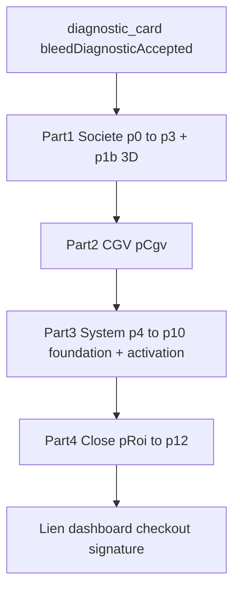
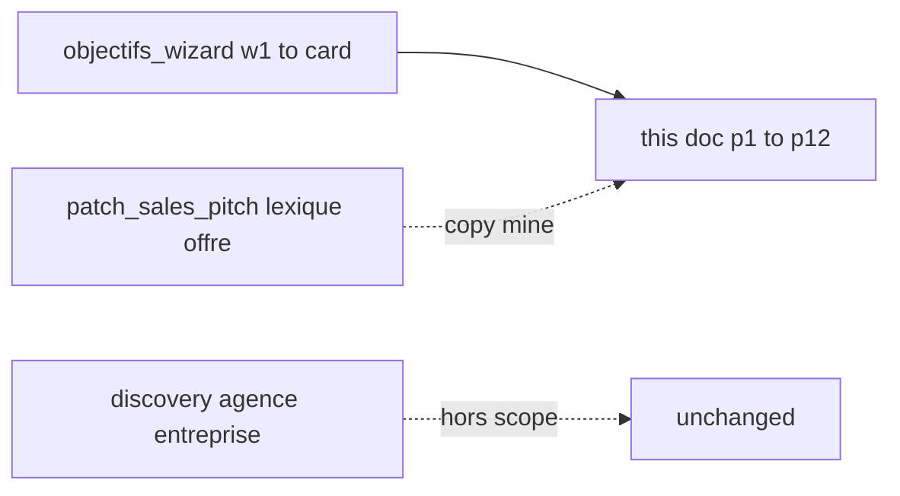

# Patch Sales — Wizard Pitch (post-Objectifs)

> **Statut :** annexe copy — remplace tout le parcours session **après Objectifs** pour cabinets  
> **Build :** [`PLAN.md`](./PLAN.md) phase **12** · [`README.md`](./README.md)  
> **Périmètre :** **comptable + cif** uniquement — session live `/internal/funnels/{audience}/sales/funnel`  
> **Précède :** [`patch_sales_objectifs_wizard.md`](./patch_sales_objectifs_wizard.md) (Objectifs `w1`–`diagnostic_card`)  
> **Lexique / offre :** [`patch_sales_pitch.md`](./patch_sales_pitch.md) (Foundation, Core/Horizon, garantie 90 j) — **mine de copy**, pas l’ordre des écrans  
> **Agence / entreprise :** inchangé — [`patch_sales_discovery.md`](./patch_sales_discovery.md)

```
do_not:
  - Merger ce fichier dans patch_sales_discovery.md ou patch_sales_pitch.md
  - Appliquer ce wizard à agence ou entreprise
  - Réécrire les CGV juridiques (doc/legal-documentation/*)
  - Migrations Stripe, saisie CB sur l’appel, public/reservation*.html
  - Afficher lead(s), Lite 998, Starter 1 499, 10 missions, 20–25 jours, quota 16–17 lettres
  - Toucher l’outreach Instantly / Calendly booking
```

---

## 1. Objectif

Après la carte diagnostic Objectifs, le closer enchaîne un **wizard pitch** en **4 parties** et **12 slides démo** (+ 1 écran CGV gate) :

1. **Présentation de la société** — qui est Hercule (pas encore l’offre)
2. **Conditions CGV** — cadre contractuel avant le système
3. **The Hercule System** — 3 piliers nommés « Hercule … » avec buy-in à chaque pilier
4. **Close** — FAQ + opt-in « pourquoi » + grille A/B Core vs Horizon

**Principe démo (Perfect Demo Presentation) :**

- Concis — ne pas sur-compliquer
- Buy-in obligatoire à la fin de chaque pilier (« Ça fait sens ? », « Vous me suivez ? », etc.)
- Pause après les prix — ne pas justifier
- Toujours demander **« pourquoi ? »** après un oui (temp check `p11`, choix plan `p12`)



**Remplace dans la session cabinets :**

| Avant (phases 1–11) | Après (ce doc) |
|---------------------|----------------|
| Présentation de la société (panneau unique) | Partie 1 + intégré dans le wizard |
| Capacité (`q1`–`q3`) | **Retiré** de la session — champs `q*` optionnels en Zod (sessions persistées) |
| Standards (`q11`–`q14`) | **Retiré** |
| Conditions (`q15`–`q20`) | **Retiré** |
| Closing (récap, règles, éligibles, calendrier, lien dashboard) | **Replacé** par `p11`–`p12` + envoi dashboard **sur l’appel** |
| FAQ / intention / grille dashboard | **Replacé** par `p11` (FAQ + why) + `p12` (A/B) **en session** |

Le dashboard client reste le canal **paiement / signature** — pas de CB dans l’app session (hors scope Stripe).

---

## 2. Décisions figées

| Sujet | Décision |
|-------|----------|
| Audiences | **comptable + cif** uniquement |
| Entrée | `bleedDiagnosticAccepted === true` (carte Objectifs validée) |
| Ids écrans | `p0`–`p12` + `p1b` + `pRoi` + `pCgv` + buy-in `p5BuyIn` / `p7FoundationBuyIn` / `p7BuyIn` / `p9BuyIn` |
| Umbrella slide | **The Hercule System** |
| Produit / offre | **Moteur Hercule Foundation** (inchangé) |
| SKUs écran | **Hercule Core** 1 799 €/mois · **Hercule Horizon** 2 399 €/mois (reco) |
| Pilier 1 | **Hercule Capture** — capture d’intention de zone (pas Meta Ads) |
| Pilier 2 | **Hercule Engine** — déploiement 60 j / 3 phases, vitesse & efficacité |
| Pilier 3 | **Hercule Partner** — account managers, calls, accountability, future-pace |
| CGV | Highlights + lien `/cvg` — **pas** le texte juridique intégral |
| Lexique | [`patch_sales_pitch.md`](./patch_sales_pitch.md) §5 — pas de `lead(s)` ; CIF = étude / RDV conseil, pas « audit » |
| Honoraires slide | `q13` si présent, sinon `w3` (CA / encours) |
| Scoring Serial | **Non** re-branché sur `p*` ; `q3`+`q20` restent optionnels |
| Agence / entreprise | Parcours discovery inchangé |

---

## 3. Naming & lexique

| Terme | Usage |
|-------|--------|
| The Hercule System | Titre umbrella slide `p4` |
| Moteur Hercule Foundation | Nom produit / offre déployée |
| Hercule Capture | Pilier 1 — « ads » = capture événements légaux de zone |
| Hercule Engine | Pilier 2 — moteur opérationnel, timeline 60 j |
| Hercule Partner | Pilier 3 — relation AM + SLA bilatéral |
| Hercule Core / Horizon | Plans tarifaires (`COMMERCIAL_COMPTABLE`) |

**CIF — swaps lexicaux (même structure, pas un second pitch) :**

| Comptable | CIF |
|-----------|-----|
| demande d’audit | demande de **RDV d’étude** |
| dossiers | mandats |
| TPE en besoin légal | dirigeant en besoin patrimonial / conseil |

---

## 4. Tokens interpolation

Réutiliser `buildBleedTrack()` + `formatObjectifsWizardInterpolation()` depuis Objectifs.

| Token | Source |
|-------|--------|
| `[Prénom]` | lead / session |
| `{cause}` | bleed track |
| `{gap}` | bleed track |
| `{goal6m}` | wizard objectifs |
| `{method}` | `w8` |
| `{inaction}` | `w18` |
| `{honoraires}` | `q13` formaté, sinon `w3` |
| `{department}` | zone cabinet (si connue) — slide urgence `p10` |
| `{yearOneValue}` | 60 000 € (`FOUNDATION_ROI_DISPLAY`) |
| `{investment90}` | 7 197 € |
| `{guaranteeMrr}` | 5 000 € |

Fonction cible (phase 12) : `formatPitchWizardInterpolation()` dans `lib/admin/funnels/sales-pitch-wizard.ts`.

---

## 5. UX wizard (implémentation phase 12)

| Règle | Valeur |
|-------|--------|
| Layout | 1 écran / slide, barre Progress, chevrons Typeform (session immersive cabinets) |
| Référence UI | [`sales-cabinet-live-track.tsx`](../../../components/internal/funnels/sales/sales-cabinet-live-track.tsx) + [`sales-immersive-session-shell.tsx`](../../../components/internal/funnels/sales/sales-immersive-session-shell.tsx) |
| Parcours | Objectifs (`w*`) + Pitch (`p*`) **sans remount** — transition fluide après `diagnostic_card` |
| Fin session | **`p12` (Core/Horizon) → `pDashboard` (copier le lien)** — checkout sur dashboard |
| Sidebar cabinets | Remplacer les étapes post-Objectifs par **Pitch** (sous-étapes : Société · CGV · Système · Offre) |
| Coach cues | Script closer en sidebar ou callout sous le titre |
| Buy-in pilier | Radio `clear` / `questions` — si `questions`, closer traite avant Suivant |

**Gates globaux :**

| Gate | Condition |
|------|-----------|
| Entrée pitch | `bleedDiagnosticAccepted === true` |
| Partie 2 | `pCgvAccepted === true` |
| Pilier 1 | `p5BuyIn === "clear"` |
| Pilier 2 fondations | `p7FoundationBuyIn === "clear"` |
| Pilier 2 activation | `p7BuyIn === "clear"` |
| ROI contractuel | `pRoiAcknowledged === true` |
| Pilier 3 | `p9BuyIn === "clear"` |
| Slide 11 | `p11Why` min 20 caractères |
| Slide 12 | `p12Plan` choisi + `p12Why` min 10 caractères |

---

## 6. Registre des écrans

### 6.0 Transition Objectifs → Pitch (`p0` — oral + 1 ligne écran)

**Script closer (obligatoire — pitch §6.2) :**

> [Prénom], le cabinet est venu pour développer le portefeuille — et c’est exactement ce qu’on va faire. Mais pour que ces dossiers soient de qualité et que le récurrent tienne, on n’utilise pas des méthodes de spammeurs. On déploie une infrastructure : le **Moteur Hercule Foundation**.

**Écran :** reprend le miroir diagnostic une ligne (`FOUNDATION_PRESENTATION_MIRROR_TEMPLATE` interpolé).

---

### Partie 1 — Présentation de la société

#### `p1` — Slide 1 · Logo & équipe

| | |
|--|--|
| **Type** | `content` |
| **Training** | Slide 1 — professionnel, logo |
| **Zod** | — (pas de champ requis) |

**Contenu écran :**

- `HerculeMark` + titre « Hercule » / « Hercule Comptable » / « Hercule CIF »
- **`TeamImageFrame` hero** (photo équipe — même placement que [`sales-company-presentation-panel.tsx`](../../../components/internal/funnels/sales/sales-company-presentation-panel.tsx))
- Équipe : Evan, Béatrice, Thomas (collapsibles sans photo dupliquée)
- Miroir bleed 1 ligne

**Coach cue :** « On pose le cadre : qui nous sommes, pas encore le détail du système. »

---

#### `p1b` — Slide 1b · Origine produit 2018 → 2026 (3D)

| | |
|--|--|
| **Type** | `product_origin` |
| **Training** | Montrer l'évolution tangible du système |
| **Zod** | — |

**Contenu écran :**

- Canvas `@react-three/fiber` + `@react-three/drei` — scène programmatic (2018 wireframe → 2026 Foundation)
- Fallback : [`CompanyOriginTimeline`](../../../components/internal/funnels/sales/company-origin-timeline.tsx) si WebGL indisponible
- Timeline texte sous le canvas

**Coach cue :** « Montrer l'évolution : outil interne rough en 2018, infrastructure tangible aujourd'hui. »

---

#### `p2` — Slide 2 · Support belief

| | |
|--|--|
| **Type** | `single` + `text` optionnel |
| **Training** | Slide 2 — « Is there anyone else that needs to see this today? » |
| **Zod** | `p2DecisionMakers: "all_present" \| "missing"` · `p2MissingNames?: string` |

**Prompt écran :**

> Y a-t-il quelqu’un d’autre qui devrait voir ça aujourd’hui ?

| Id | Label |
|----|-------|
| `all_present` | Toutes les personnes décisionnaires sont présentes |
| `missing` | Un associé / décideur manque |

Si `missing` : champ texte « Qui manque ? » (optionnel mais recommandé). **Ne pas bloquer** la suite — flag pour `p11` (objection associé).

**Coach cue :** « On coche la croyance support avant de pitcher. »

---

#### `p3` — Slide 3 · Différenciation courte

| | |
|--|--|
| **Type** | `acknowledgment` |
| **Training** | Slide 3 — parler brièvement de ce qui diffère des concurrents |
| **Zod** | `p3Acknowledged: boolean` (required `true`) |

**Copy écran (paragraphe 1 de `FOUNDATION_PRESENTATION_SCRIPT_PARAGRAPHS`) :**

> [Prénom], pendant que le cabinet dépend du bouche-à-oreille, les confrères les plus agressifs ont déjà acheté du SEO et de la pub — 6 à 12 mois, zéro garantie, et le jour où ils arrêtent de payer, la visibilité s’éteint. Ce n’est pas un actif. C’est une location.

**Buy-in (oral, puis case) :**

> On est d’accord que le SEO / la pub, ce n’est pas un actif ?

Checkbox : « Le cabinet valide ce constat. »

**Ne pas** afficher la grille comparative complète ici (réservée `p6`).

---

### Partie 2 — CGV / contrat

#### `pCgv` — Gate CGV (hors numérotation démo)

| | |
|--|--|
| **Type** | `checkbox` + highlights |
| **Zod** | `pCgvAccepted: boolean` (required `true`) |

**Highlights (puces, pas le texte CGV intégral) :**

| Point | Copy |
|-------|------|
| Exclusivité | **1 cabinet / zone** — verrou posé à l’activation |
| SLA | Toute demande inbound répondue **sous 24 h** — sinon garantie suspendue |
| Garantie | **5 000 €** de récurrent cumulé sur **90 jours** (Horizon) |
| Commission | **0 %** sur les honoraires |
| Session | Activation et paiement **pendant cette session d’audit** |

**Lien :** [Conditions générales de vente](/cvg) (comptable) · [CGV CIF](/cvg/conseil-financier)

**Checkbox (pitch §7.5 adapté) :**

> J’ai pris connaissance des [Conditions générales de vente](/cvg), je comprends que l’activation et le paiement se font **pendant cette session d’audit**, et je souhaite **déployer le Moteur Hercule Foundation sur la zone du cabinet**.

**Règles SLA (rappel — `FOUNDATION_INBOUND_SLA_RULE`) :**

> Ces règles ne sont pas une affiliation. Toute demande inbound qui arrive sur le cabinet est répondue sous 24 h. Sinon la capture de zone se vide vers un confrère, et la garantie se suspend. On fait équipe là-dessus.

---

### Partie 3 — The Hercule System

#### `p4` — Slide 4 · Vue d’ensemble des 3 piliers

| | |
|--|--|
| **Type** | `content` |
| **Training** | Slide 4 — pillar overview |
| **Zod** | — |

**Titre :** The Hercule System

**3 cartes (noms shiny uniquement — pas de deep dive) :**

| Pilier | Tagline écran |
|--------|----------------|
| **Hercule Capture** | Intercepter l’intention au moment du besoin légal |
| **Hercule Engine** | Déployer le système en 60 jours — live, mesurable |
| **Hercule Partner** | Pilotage, appels, responsabilité des deux côtés |

**Coach cue :** « Les trois piliers couvrent capture, exécution et relation. On détaille un par un. »

---

#### Template pilier (écrans `p5`–`p6`, `p7`–`p8`, `p9`–`p10`)

Chaque pilier = **2 écrans** + **buy-in** en fin de paire.

Structure bullets à l’écran :

1. **Nom** (shiny)
2. **Ce qu’on fait** (what)
3. **Comment** (how)
4. **Pourquoi différent** (vs concurrents)
5. **Bénéfice cabinet** (`{cause}` / `{gap}`)

**Buy-in (fin `p6`, `p8`, `p10`) — choix closer :**

| Id | Label |
|----|-------|
| `clear` | C’est clair — on continue |
| `questions` | Le cabinet a des questions (traiter avant Suivant) |

**Phrases buy-in (oral, au choix du closer) :**

- « Ça fait sens ? »
- « Vous me suivez là-dessus ? »
- « Je l’ai expliqué correctement ? »
- « Une question sur ce point ? »

---

#### `p5` — Slide 5 · Hercule Capture (1/2)

| | |
|--|--|
| **Type** | `content` |
| **Zod** | — |

**Ce qu’on fait :** Capture d’intention de zone au nom du cabinet — pas des « ads » Meta/Google.

**Comment (`FOUNDATION_SIGNALS_SUMMARY` + mécanisme) :**

> Hercule Foundation cartographie en continu les flux légaux de la zone (Pappers, INSEE Sirene, BODACC). Cinq signaux = un moment de besoin — et donc une demande possible **vers ce cabinet**, pas une fiche vendue à trois confrères.

**Schéma 4 blocs (`FOUNDATION_MECHANISM_BLOCKS`) :**

1. Flux légaux de zone  
2. Cartographie exclusive  
3. Capture au nom du cabinet  
4. Le dirigeant initie  

**Bénéfice :** Traite `{cause}` — le cabinet est visible quand la TPE entre dans le besoin, pas quand il chase.

---

#### `p6` — Slide 6 · Hercule Capture (2/2) + buy-in

| | |
|--|--|
| **Type** | `comparison_table` + buy-in |
| **Zod** | `p5BuyIn: "clear" \| "questions"` |

**Pourquoi différent — grille (`FOUNDATION_COMPARISON_ROWS`) :**

| Critère | SEO / pub | Foundation |
|---------|-----------|------------|
| Mécanisme | Google, enchères, contenu | Événement légal de zone |
| Délai | 6–12 mois, souvent sans preuve | 60 jours pour un système live |
| Actif | Locataire | Infrastructure exclusive cabinet |
| Qui contacte | Le cabinet chasse | Le dirigeant initie |
| Exclusivité | Mots-clés partagés | **1 cabinet / zone** |
| Garantie | Trafic ou rien | **5 000 €** récurrent (90 j) |

**Buy-in :** `p5BuyIn` requis `clear` pour continuer (ou questions traitées → passer à `clear`).

---

#### `p7` — Slide 7 · Les 2 premiers mois — vos fondations + buy-in

| | |
|--|--|
| **Type** | `foundation_buyin` |
| **Zod** | `p7FoundationBuyIn: "clear" \| "questions"` |

**Ce qu’on fait :** Installer le **département marketing** du cabinet — pas encore de volume promis.

**Comment — mois 1 & 2 (`FOUNDATION_FOUNDATION_BLOCKS`) :**

| Mois | Titre | Artefacts |
|------|-------|-----------|
| Mois 1 | Verrouillage & cartographie | Verrou zone · cartographie flux · filtres · capture brandée |
| Mois 2 | Capture & calibrage | Tests friction · montée ciblage · rapport hebdo |

**Copy :** `FOUNDATION_MARKETING_DEPT_HEADLINE` + `FOUNDATION_MARKETING_DEPT_BODY` + `FOUNDATION_FOUNDATION_CLOSER_COPY` (interpolé `{cause}` / `{gap}`).

**Buy-in :** `p7FoundationBuyIn`.

---

#### `p8` — Slide 8 · Mois 3 — système live + buy-in

| | |
|--|--|
| **Type** | `activation_buyin` |
| **Zod** | `p7BuyIn: "clear" \| "questions"` |

**Ce qu’on fait :** Phase 3 (J+46 → J+60) — capture allumée, demandes routées vers le cabinet.

**Deux horloges (`FOUNDATION_ACTIVATION_CLOCKS`) :**

| Horloge | Durée | Message |
|---------|-------|---------|
| Déploiement | 60 jours | Système live à J+60 |
| Garantie | 90 jours | Checkpoint MRR dès l’activation |

**Rapports hebdo + closer :** `FOUNDATION_DEPLOYMENT_WEEKLY_REPORT_LINES` + `FOUNDATION_CALENDRIER_CLOSER_COPY`.

**Buy-in :** `p7BuyIn` (nom conservé pour compat presets).

---

#### `p9` — Slide 9 · Hercule Partner (1/2)

| | |
|--|--|
| **Type** | `content` |
| **Zod** | — |

**Ce qu’on fait :** Account management — appels de pilotage, rapports, alignement cabinet ↔ Hercule.

**Comment :**

| Rôle | Hercule | Cabinet |
|------|---------|---------|
| Capture live | Maintient l’infrastructure, rapports hebdo | — |
| Traitement inbound | — | Réponse **< 24 h** sur chaque demande |
| Appels | Points réguliers (cadence onboarding + suivi) | Présence décideur / associé |
| Escalade | Ajustement ciblage si friction | Feedback terrain sur qualité des demandes |

**Bénéfice :** Les deux parties sont responsables — pas un fournisseur de fiches qui disparaît après la vente.

---

#### `p10` — Slide 10 · Hercule Partner (2/2) + future-pace + buy-in

| | |
|--|--|
| **Type** | `content` + alert zone + buy-in |
| **Zod** | `p9BuyIn: "clear" \| "questions"` |

**Future-pace (oral + écran) :**

> [Prénom], imaginez dans 12 mois : la zone est verrouillée, le système tourne, `{goal6m}` n’est plus un slide — c’est le rythme du cabinet. Sans infrastructure, `{inaction}` continue de coûter `{gap}`.

**Alerte zone (pitch §7.6.1) :**

> Statut de la zone **{department}** : en cours d’attribution — **1 seule licence** disponible.

**Script urgence (extrait) :**

> Le moteur consomme une bande passante réelle sur les flux légaux. **Un seul cabinet par zone.** Onboarding aujourd’hui = verrou **12 mois**. Réfléchir est une option ; laisser un confrère verrouiller le marché en est une autre.

**Buy-in :** `p9BuyIn`.

---

### Partie 4 — Close

#### `pRoi` — Slide ROI · ROI contractuel

| | |
|--|--|
| **Type** | `roi_contract` |
| **Zod** | `pRoiAcknowledged: boolean` (required `true`) |

**Contenu écran (`FOUNDATION_ROI_DISPLAY` + `formatFoundationRoiScript`) :**

| Ligne | Valeur |
|-------|--------|
| Investissement 90 jours | 7 197 € |
| Garantie | 5 000 € MRR cumulé |
| Valeur année 1 | 60 000 € |

**Checkbox :** `FOUNDATION_ROI_ACK_LABEL` — « Le cabinet valide la maths ROI contractuelle. »

**Position :** après Partner (`p10`), **avant** FAQ (`p11`). `p12` ne fait qu'un rappel une ligne.

---

#### `p11` — Slide 11 · Questions + temp check + opt-in why

| | |
|--|--|
| **Type** | `faq` + `text` + `single` |
| **Training** | Slide 11 — Questions, temp check, why if yes |
| **Zod** | `p11TempCheck: "yes" \| "hesitant"` · `p11Why: string` (min 20) |

**Titre écran :** Questions ?

**FAQ accordion (3 objections — pitch §7.4) :**

**1. Paiement pendant la session**

> Foundation consomme une bande passante réelle sur les flux légaux de l’État. Pour préserver l’exclusivité, **un seul cabinet** est connecté par zone. Sans activation pendant la session, la zone redevient disponible. D’autres cabinets ont un audit sur ce secteur cette semaine. Si l’un active avant, la file se ferme **12 mois**.

**2. Associé**

> Le cabinet a déclaré {honoraires} et un écart {gap}. Horizon est couvert par **5 000 €** de récurrent cumulé sur **90 jours**. L’associé valide un ROI contractuel sur un actif de zone, pas un achat de fiches.

**3. Je dois réfléchir**

> La réflexion est légitime. Si le cabinet doit traiter {cause} et que l’écart {gap} est réel, chaque jour sans verrou laisse la zone à un confrère — ou à une agence SEO sans garantie.

**Temp check (oral + écran) :**

> D’après ce qu’on a couvert, est-ce que vous sentez que c’est la bonne solution pour atteindre **{goal6m}** et traiter **{gap}** ?

| Id | Label |
|----|-------|
| `yes` | Oui — c’est la bonne solution |
| `hesitant` | J’ai encore des doutes |

- Si `hesitant` : rester sur FAQ, traiter les doutes — **ne pas** ouvrir `p12` tant que `p11Why` vide  
- Si `yes` : demander **« Pourquoi ? »** (obligatoire écrit)

**Champ `p11Why` (opt-in) :**

> En une phrase : pourquoi vous voulez continuer avec Hercule ?

Placeholder : « Parce que… »

**Interdit :** « tester », « pour voir », « recevoir des demandes ».

---

#### `p12` — Slide 12 · A/B pricing + why

| | |
|--|--|
| **Type** | `pricing_ab` + `text` |
| **Training** | Slide 12 — A/B close, pause, why after pick |
| **Zod** | `p12Plan: "core" \| "horizon"` · `p12Why: string` (min 10) |

**Titre :** Choix d’infrastructure

**Deux cartes uniquement (`FOUNDATION_PRICING_PLANS` / `COMMERCIAL_COMPTABLE`) :**

| Plan | Prix | Position A/B | Tagline |
|------|------|--------------|---------|
| **Hercule Core** | 1 799 €/mois | Option « moins attractive » — bases | `coreTagline` |
| **Hercule Horizon** | 2 399 €/mois | **Recommandé** — capture max | `horizonTagline` |

**ROI sous les cartes (`FOUNDATION_ROI_DISPLAY`) :**

| Ligne | Valeur |
|-------|--------|
| Investissement 90 jours | 7 197 € |
| Garantie | 5 000 € MRR cumulé |
| Valeur année 1 | 60 000 € |

**Script ROI (`formatFoundationRoiScript`) :**

> Honoraires déclarés : {honoraires}. Sur 90 jours le cabinet investit 7 197 €. Le contrat garantit 5 000 € de récurrent — 60 000 € de valeur dès l’année 1.

**Règles closer :**

1. Afficher les deux options → **pause** — ne pas justifier les prix  
2. Prospect choisit → « **Pourquoi** ce plan ? » → `p12Why`  
3. Si prêt : envoyer lien dashboard + contrat **avant de raccrocher**  
4. Pendant signature : **booker l’appel onboarding** et annoncer les prochaines étapes  
5. **Ne pas** envoyer la facture / le lien et quitter l’appel  
6. Objections : renvoyer vers `p11` — pas de nouveau module ici  

**Post-`p12` :** écran ou action « Envoyer le lien dashboard » (existant `envoi-dashboard`) — checkout Stripe **hors** session.

---

## 7. Champs schema (cible phase 12)

```ts
// lib/admin/funnels/sales-qualification-schema.ts (extrait)
p2DecisionMakers: z.enum(["all_present", "missing"]).optional()
p2MissingNames: z.string().optional()
p3Acknowledged: z.boolean()
pCgvAccepted: z.boolean()
p5BuyIn: z.enum(["clear", "questions"]).optional()
p7FoundationBuyIn: z.enum(["clear", "questions"]).optional()
p7BuyIn: z.enum(["clear", "questions"]).optional()
p9BuyIn: z.enum(["clear", "questions"]).optional()
pRoiAcknowledged: z.boolean()
p11TempCheck: z.enum(["yes", "hesitant"]).optional()
p11Why: z.string().min(20)
p12Plan: z.enum(["core", "horizon"])
p12Why: z.string().min(10)
pitchWizardCompleted: z.boolean() // true quand p12 validé
```

**Section funnel :** remplacer `presentation-societe`, `capacite`, `standards`, `conditions` par une section `pitch` (cabinets) dont la complétion = `pitchWizardCompleted`.

**Déprécier pour cabinets (optionnel Zod, comme `b*`) :** `presentationConfirmed`, `q1`–`q21` en gate session — conservés pour sessions persistées.

---

## 8. Fichiers cibles (phase 12 — implémentation)

| Fichier | Action |
|---------|--------|
| `doc/patch/patch_sales/patch_sales_new_pitch.md` | **Ce fichier** — canon copy |
| `lib/admin/funnels/sales-pitch-wizard.ts` | **Créer** — steps, visibilité, interpolation |
| `lib/admin/funnels/sales-pitch-wizard-preset.ts` | **Créer** — preset test |
| `lib/admin/funnels/sales-pitch-wizard.test.ts` | **Créer** |
| `components/internal/funnels/sales/sales-pitch-wizard.tsx` | **Créer** — shell wizard |
| `components/internal/funnels/sales/sales-pitch-wizard-slides.ts` | **Créer** — définitions écrans |
| `lib/admin/funnels/sales-qualification-schema.ts` | Champs `p*` + section `pitch` |
| `components/internal/funnels/sales/sales-funnel-sections.ts` | Sidebar cabinets : Pitch seul post-Objectifs |
| `components/internal/funnels/sales/sales-funnel-section-page.tsx` | Branche wizard pitch cabinets |
| `lib/admin/funnels/comptable-sales-copy.ts` | Exports réutilisés (pas de duplication copy) |
| `lib/admin/funnels/cif-sales-copy.ts` | Transposition CIF |
| `lib/admin/funnels/sales-test-session-preset.ts` | Preset `p*` |

**Ne pas toucher (cabinets) en phase 12 :** `sales-company-presentation-panel.tsx` (legacy jusqu’à bascule), dashboard wizards (FAQ reste en fallback si lien envoyé sans `p11`).

---

## 9. Relation avec les autres annexes



| Sujet | Canon |
|-------|--------|
| Ordre écrans post-Objectifs cabinets | **ce doc** |
| Lexique Foundation, prix, garantie | **patch_sales_pitch** |
| Objectifs cabinets | **patch_sales_objectifs_wizard** |
| Agence / entreprise post-Objectifs | **patch_sales_discovery** |
| Dashboard si prospect ouvre le lien sans session complète | **patch_sales_pitch** §7 (fallback) |

---

## 10. Tests (phase 12)

```bash
pnpm test -- sales-pitch-wizard sales-qualification-schema sales-pitch-wizard.test
```

**Parcours manuel :**

1. `/internal/funnels/comptable/sales/funnel` → Test → Objectifs → carte → Pitch  
2. Vérifier gates : CGV, buy-in ×3, `p11Why`, `p12Plan`+`p12Why`  
3. Répéter CIF — swap étude / mandats  
4. Agence : **pas** d’étape Pitch wizard  

**Grep lexique cabinets :**

```bash
rg -i 'lead(s)?|998|1.?499|10 (missions|RDV)|20.?25 jours|Starter|Lite' \
  components/internal/funnels/sales/sales-pitch-wizard*
```

---

## 11. Subtitle section Pitch (sidebar)

> Présentation Hercule, cadre contractuel, le système en 3 piliers, puis validation de l’infrastructure — on conclut sur l’appel.

**Script d’ouverture Partie 1 (après transition `p0`) :**

> [Prénom], on va vous présenter Hercule, le cadre du partenariat, puis le système en trois volets. À la fin, on répond à vos questions et on choisit l’infrastructure adaptée à la zone. On y va ?
