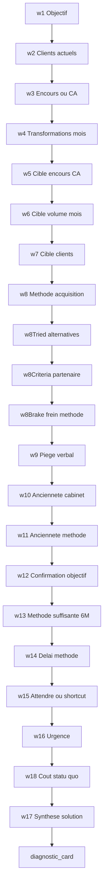

# Patch Sales — Wizard Objectifs (comptable + cif)

> **Statut :** annexe copy — remplace le tunnel bleed `b1`–`b8` pour cabinets  
> **Build :** [`PLAN.md`](./PLAN.md) phase **10** · [`README.md`](./README.md)  
> **Périmètre :** section `objectifs` — **comptable + cif uniquement**  
> **Supersède :** [`patch_sales_bleed.md`](./patch_sales_bleed.md) pour l’UI cabinets (référence historique conservée)  
> **Agence / entreprise :** inchangé — [`patch_sales_discovery.md`](./patch_sales_discovery.md) §6.2

---

## 1. Objectif

Remplacer le tunnel linéaire `b1`–`b8` par un **wizard** : **1 question par écran**, barre de progression, Précédent / Suivant. Le closer mène le cabinet du constat chiffré au piège méthode × objectif 6 mois, puis à la signature du diagnostic.

**Principe Straight Line (4 phases) :**

1. **Faits** — objectif, clients, encours/CA, transformations/mois.
2. **Cible 6 mois** — encours/CA, volume, clients visés.
3. **Méthode** — canal déclaré + piège verbal.
4. **Pression** — ancienneté, délai méthode, urgence, synthèse solution, carte diagnostic.



---

## 2. Décisions figées

| Sujet | Décision |
|-------|----------|
| Audiences | **comptable + cif** |
| Remplace | tunnel `b1`–`b8`, `b5b` en UI |
| Ids champs | **`w1`–`w17`** + champs auxiliaires + `bleedDiagnosticAccepted` |
| Champs `b*` | **dépréciés** — optionnels en Zod pour sessions persistées |
| Scoring Serial | inchangé (**q3 + q20**) |
| UX | 1 écran / question ; navigation locale au wizard |
| Lexique | pas de `lead(s)` ; sujet = cabinet / canal |
| Méthode | **single** (`w8`) — pas de multi comme `b5` |

---

## 3. Registre des champs

### 3.1 Phase 1 — Faits

#### `w1` — Objectif

| | |
|--|--|
| **Type** | `single` (2 options) |
| **Zod** | `w1: "more_volume" \| "better_quality"` |
| **Prompt** | Quel est votre objectif ? |

| Id | Label CIF | Label comptable |
|----|-----------|-----------------|
| `more_volume` | Plus de mandats / études | Plus de dossiers (volume) |
| `better_quality` | Des mandats de meilleure qualité (patrimoine / ticket) | Des dossiers de meilleure qualité (honoraires / typologie) |

**Coach cue :** « Noté — on chiffre tout à l'écran sur cette base. »

#### `w2` — Clients actuels

| | |
|--|--|
| **Type** | `slider` |
| **Zod** | `w2: number` |
| **Prompt** | Le cabinet est à combien de **clients** aujourd'hui ? |
| **Plage** | 0 – 500, step 1, unit `count` |
| **Default** | 50 |

#### `w3` — Encours / CA

| | |
|--|--|
| **Type** | `slider` |
| **Zod** | `w3: number` |
| **Prompt CIF** | Quelle est **l'encours** ? |
| **Prompt comptable** | Quel est le **chiffre d'affaires annuel** ? |
| **Plage CIF** | 1 M€ – 500 M€, step 1 M€, unit `eur` |
| **Plage comptable** | 50 k€ – 5 M€, step 10 k€, unit `eur` |
| **Default CIF** | 10 M€ |
| **Default comptable** | 300 k€ |

#### `w4` — Transformations / mois

| | |
|--|--|
| **Type** | `slider` |
| **Zod** | `w4: number` |
| **Plage** | 0 – 20, step 1, unit `count` |
| **Default** | 2 |

| Audience | Prompt (unique, indépendant de `w1`) |
|----------|--------------------------------------|
| CIF | Quel est le nombre de **transformations qui vous conviennent** par mois ? |
| Comptable | Quel est le nombre de **dossiers qui vous conviennent** par mois ? |

---

### 3.2 Phase 2 — Cible 6 mois

#### `w5` — Encours / CA cible

| | |
|--|--|
| **Type** | `slider` |
| **Zod** | `w5: number` |
| **Prompt CIF** | Vous souhaiteriez dans **6 mois** être à quelle **encours** ? |
| **Prompt comptable** | Vous souhaiteriez dans **6 mois** être à quel **chiffre d'affaires annuel** ? |
| **Plage** | Même que `w3` |
| **Alerte** | `w5 <= w3` → alerte douce « objectif ≤ actuel » |

#### `w6` — Volume mensuel cible

| | |
|--|--|
| **Type** | `slider` |
| **Zod** | `w6: number` |
| **Prompt CIF** | Vous souhaiteriez effectuer combien de **transformations qui vous conviennent** par mois ? |
| **Prompt comptable** | Vous souhaiteriez effectuer combien de **dossiers qui vous conviennent** par mois ? |
| **Plage** | 0 – 20, step 1 |

#### `w7` — Clients cible

| | |
|--|--|
| **Type** | `slider` |
| **Zod** | `w7: number` |
| **Prompt** | Vous souhaiteriez être à combien de **clients dans 6 mois** ? |
| **Plage** | 0 – 500, step 1 |

---

### 3.3 Phase 3 — Méthode

#### `w8` — Méthode d'acquisition

| | |
|--|--|
| **Type** | `single` |
| **Zod** | `w8: B5MethodId` |
| **Prompt** | Quelle est votre **méthode actuelle** d'acquisition ? |
| **Options** | [`B5_METHOD_OPTIONS`](../../../lib/admin/funnels/sales-bleed-tunnel.ts) |

#### `w9` — Piège verbal

| | |
|--|--|
| **Type** | `acknowledgment` |
| **Zod** | `w9Acknowledged: boolean` |
| **Champ form** | lié à `w9Acknowledged` |

**Script interpolé :**

> Le cabinet vise **{goal6m}** (actuellement **{currentSnapshot}**). Le levier principal déclaré est **{method}**.  
> **Pourquoi {method} n'a pas permis d'atteindre {goal6m} ?**

Le closer laisse 10–20 s de silence. Case : « Le cabinet reconnaît ce constat ».

---

### 3.4 Phase 4 — Pression

#### `w10` — Ancienneté cabinet

| | |
|--|--|
| **Type** | `single` (chips) |
| **Zod** | `w10` + `w10Year: number` |
| **Prompt** | Votre cabinet est en exercice **depuis quand** ? |

| Id | Label |
|----|-------|
| `y2015` | Avant 2017 |
| `y2017` | 2017 – 2019 |
| `y2020` | 2020 – 2021 |
| `y2022` | 2022 – 2023 |
| `y2024` | 2024 ou après |

`w10Year` dérivé via `B3_YEAR_MAP` (réutilisé).

#### `w11` — Ancienneté méthode

| | |
|--|--|
| **Type** | `single` |
| **Zod** | `w11: "<1y" \| "1-3y" \| "3-5y" \| "5y+"` |
| **Prompt** | Depuis quand utilisez-vous **{method}** ? |

| Id | Label |
|----|-------|
| `<1y` | Moins d'un an |
| `1-3y` | 1 à 3 ans |
| `3-5y` | 3 à 5 ans |
| `5y+` | Plus de 5 ans |

#### `w12` — Confirmation objectif 6 mois

| | |
|--|--|
| **Type** | `confirmation_mirror` |
| **Zod** | `w12Confirmed: boolean` (required `true`) |
| **Prompt** | Confirmez que votre objectif à 6 mois est : |
| **Miroir** | **{goalSummary}** |

#### `w13` — Méthode suffisante en 6 mois ?

| | |
|--|--|
| **Type** | `single` |
| **Zod** | `w13: "yes" \| "no"` |
| **Prompt** | Est-ce que vous considérez que **{method}** va vous permettre d'atteindre cet objectif en **6 mois** ? |

#### `w13Why` — Pourquoi ?

| | |
|--|--|
| **Type** | `text` |
| **Zod** | `w13Why?: string` |
| **Prompt** | Pourquoi ? |
| **Requis si** | `w13 === "no"` (min 10 caractères) |
| **Visible si** | toujours après `w13` renseigné |

#### `w14` — Délai méthode

| | |
|--|--|
| **Type** | `single` |
| **Zod** | `w14: "12m" \| "24m" \| "36m"` |
| **Prompt** | En combien de temps pensez-vous que **{method}** y arriverait ? |

| Id | Label |
|----|-------|
| `12m` | 12 mois |
| `24m` | 24 mois |
| `36m` | 36 mois |

#### `w15` — Attendre ?

| | |
|--|--|
| **Type** | `single` |
| **Zod** | `w15: "wait" \| "shortcut"` |
| **Prompt** | Souhaitez-vous attendre ? |

| Id | Label |
|----|-------|
| `wait` | Oui, je peux attendre |
| `shortcut` | Je suis justement sur cet appel pour trouver un **shortcut** |

#### `w16` — Urgence

| | |
|--|--|
| **Type** | `single` |
| **Zod** | `w16?: "strategic" \| "resale" \| "other"` |
| **Visible si** | `w15 === "shortcut"` **OU** `w14 !== "12m"` |
| **Prompt** | Pourquoi ne pouvez-vous pas attendre ? |

| Id | Label |
|----|-------|
| `strategic` | Objectif stratégique (croissance, recrutement, associé) |
| `resale` | Projet de revente / valorisation du cabinet |
| `other` | Autre urgence |

#### `w16Detail` — Précision (optionnel)

| | |
|--|--|
| **Type** | `text` |
| **Zod** | `w16Detail?: string` |
| **Visible si** | `w16 === "other"` |

#### `w17` — Synthèse solution

| | |
|--|--|
| **Type** | `acknowledgment` |
| **Zod** | `w17Acknowledged: boolean` (required `true`) |

**Script interpolé :**

> Donc vous recherchez une solution qui, en **6 mois**, permet d'atteindre **{goal6m}** car :
> - **{reason1}**
> - **{reason2}**
> - **{reason3}**
>
> Confirmez-vous ?

| Token | Source |
|-------|--------|
| `{reason1}` | Écart volume `w6` vs `w4` |
| `{reason2}` | Écart clients `w7` vs `w2` |
| `{reason3}` | `{method}` bridé — constat `w9` / urgence `w16` |

#### `diagnostic_card` — Sortie wizard

| | |
|--|--|
| **Type** | `diagnostic_card` |
| **Zod** | `bleedDiagnosticAccepted: boolean` |
| **Miroir** | Aujourd'hui : objectif **{goal6m}** · **{method}** · urgence **{urgencyLabel}**. Passez à l'étape suivante pour construire votre système Hercule sur mesure. |
| **Checkbox** | Le cabinet valide ce cadre pour la suite de l'audit de compatibilité. |

---

## 4. Tokens interpolation

| Token | Source |
|-------|--------|
| `{method}` | label `w8` |
| `{goal6m}` | synthèse `w5` + `w6` + `w7` |
| `{goalSummary}` | phrase lisible pour `w12` |
| `{currentSnapshot}` | `w2` clients · `w3` encours/CA · `w4` volume |
| `{year}` | `w10Year` |
| `{volumeUnit}` | mandats / dossiers |
| `{metricLabel}` | encours / CA annuel |
| `{urgencyLabel}` | label `w16` ou « délai {w14} » |
| `{brake}` | label `w8Brake` (liste `b7` par méthode) |
| `{inaction}` | label `w18` (ex-`b8`) |
| `{criteria}` | labels `w8Criteria` (1–3) |

Fonction : `formatObjectifsWizardInterpolation()` dans `lib/admin/funnels/sales-objectifs-wizard.ts`.

---

## 5. Branches et visibilité

| Règle | Détail |
|-------|--------|
| `w4` prompt | unique par audience (plus de branche `w1`) |
| `w13_why` step | id question `w13Why` ; visible si `w13` renseigné |
| `w16` | visible si `w15 === "shortcut"` ou `w14 !== "12m"` |
| `w16Detail` | visible si `w16 === "other"` |
| `w8TriedWho` | visible si `w8Tried !== "none"` |
| `w8Brake` options | dynamiques via `getB7Options(w8)` |
| Sliders dynamiques | `getWizardSliderConfig(questionId, audience)` |

Ordre des ids wizard (incl. steps conditionnels) :

`w1, w2, w3, w4, w5, w6, w7, w8, w8Tried, w8TriedWho, w8Criteria, w8Brake, w9, w10, w11, w12, w13, w13Why, w14, w15, w16, w16Detail, w18, w17, diagnostic_card`

---

## 6. Schema Zod (extrait)

```ts
w1: z.enum(["more_volume", "better_quality"]).optional(),
w2: z.number().optional(),
w3: z.number().optional(),
w4: z.number().optional(),
w5: z.number().optional(),
w6: z.number().optional(),
w7: z.number().optional(),
w8: z.enum(B5_METHOD_IDS).optional(),
w8Tried: z.enum(["none", "looked", "tried"]).optional(),
w8TriedWho: z.string().optional(),
w8Criteria: z.array(z.string()).max(3).optional(),
w8Brake: z.string().optional(),
w9Acknowledged: z.boolean().optional(),
w10: z.enum(B3_YEAR_IDS).optional(),
w10Year: z.number().int().optional(),
w11: z.enum(["<1y", "1-3y", "3-5y", "5y+"]).optional(),
w12Confirmed: z.boolean().optional(),
w13: z.enum(["yes", "no"]).optional(),
w13Why: z.string().optional(),
w14: z.enum(["12m", "24m", "36m"]).optional(),
w15: z.enum(["wait", "shortcut"]).optional(),
w16: z.enum(["strategic", "resale", "other"]).optional(),
w16Detail: z.string().optional(),
w18: z.enum(B8_GAP_IDS).optional(),
w17Acknowledged: z.boolean().optional(),
```

---

## 7. Complétion section

`CABINET_OBJECTIFS_KEYS` :

`w1, w2, w3, w4, w5, w6, w7, w8, w8Tried, w8Criteria, w8Brake, w10, w11, w12Confirmed, w13, w14, w15, w18, w17Acknowledged, bleedDiagnosticAccepted`

Règles additionnelles dans `isSalesSectionComplete` :

- `w9Acknowledged === true`
- `w13Why` si `w13 === "no"`
- `w16` si step visible
- `w16Detail` si `w16 === "other"`
- `w8TriedWho` si `w8Tried !== "none"`
- `w8Criteria` : 1–3 chips

---

## 8. BleedTrack

`buildCabinetBleedTrack` lit `w*` en priorité si `w1` présent :

```ts
goal: formatGoal6m(values, audience)
current: formatCurrentSnapshot(values, audience)
primaryMethod: resolveW8MethodLabel(values)
methodBrake: label w8Brake || w13Why || w16Detail || urgence
gap: formatGoalGap + label w18 (coût statu quo)
openingYear: w10Year
```

Chips sticky : `{goal6m}` · `{method}` · `{gap}` (max 3).

---

## 9. Subtitle section

> Qualification courte : où va le cabinet, où il en est, et ce qui bloque la méthode actuelle. On va droit au but.

**Script d'ouverture closer (15 s) :**

> [Prénom], on commence par cadrer l'objectif du cabinet à 6 mois et où vous en êtes aujourd'hui. Pas de pitch — juste des chiffres et des faits. On est d'accord ?

---

## 10. Tests

```bash
pnpm test -- sales-objectifs-wizard sales-questions-objectifs-cif sales-questions-objectifs-comptable sales-qualification-schema sales-bleed-track
```

Parcours manuel : `/internal/funnels/cif/sales/funnel` → Objectifs → 24+ étapes, graphique écart live, piège interpolé, carte bloquante.

---

## 11. Graphique live (écart actuel vs 6 / 12 mois)

Composant : `sales-objectifs-wizard-chart.tsx` · modèle : `buildWizardChartModel()`.

- **Toggle** : Encours/CA · Volume · Clients
- **Axe X** : Aujourd'hui → Dans 6 mois → Dans 12 mois
- **Courbes** : statu quo (plat) vs trajectoire cible — le trou = bleed
- **12 mois** : extrapolation linéaire (`goal12m = current + 2 × (goal6m − current)`)
- **Révélation** : sliders w2–w7 remplissent le graphe après interaction (pas de default injecté au form) ; sync auto de la métrique avec la question active ; `w8Brake` / `w18` enrichissent les annotations
- **Layout** : graphe au-dessus (immersif / mobile) ou sticky à droite (desktop)
