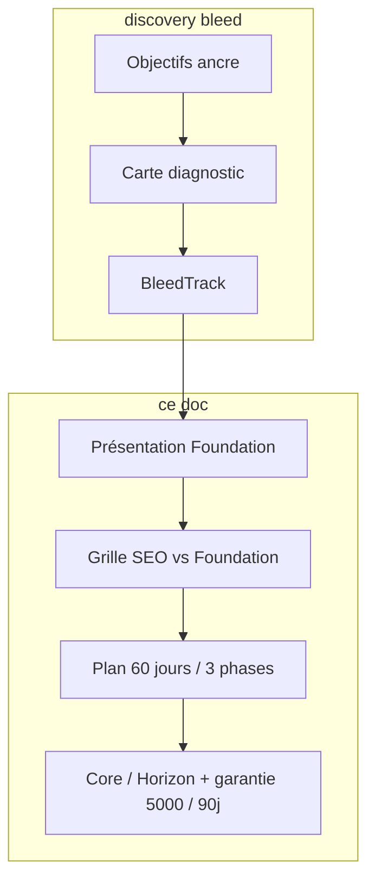
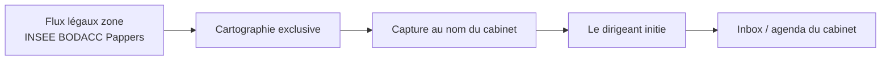

# Patch Sales — Framing système (Hercule Foundation)

> **Statut :** annexe copy (framing Foundation) — ne pas implémenter sans [`PLAN.md`](./PLAN.md)  
> **Build :** [`README.md`](./README.md) (handoff agents) · [`PLAN.md`](./PLAN.md) (phases 1–9)  
> **Objectifs cabinets :** [`patch_sales_bleed.md`](./patch_sales_bleed.md) (tunnel b1–b8) — **remplace** §6.2 ci-dessous  
> **Complète :** [`patch_sales_discovery.md`](./patch_sales_discovery.md) (agence / entreprise)  
> **Périmètre :** **comptable + cif** — session sales + dashboard onboarding  
> **Hors scope :** agence, entreprise, code Stripe/migrations, CGV juridiques détaillées, `public/reservation*.html`

---

## 1. Objectif

Changer l’**offre** montrée à l’écran : le cabinet n’achète plus des leads / missions / contrats. Il **déploie le Moteur Hercule Foundation** sur son activité.

| Avant (SKU leads) | Après (système) |
|-------------------|-----------------|
| Hercule livre des RDV / missions TPE | Hercule installe un **actif d’acquisition** exclusif de zone |
| Preuve = 10 RDV sous 20–25 jours | Preuve = **système live à 60 jours** (aucun quota à l’écran) |
| Premier contact = Hercule introduit | Premier contact = **la TPE / le dirigeant contacte le cabinet** |
| Prix Lite 998 / Starter 1 499 + garantie 3 000 € | **Core 1 799 €** / **Horizon 2 399 €** (reco) + garantie **5 000 €** MRR sur **90 jours** |
| Urgence = « lancer les leads maintenant » | Urgence = **1 cabinet / zone**, FOMO confrères, **SEO nommé ennemi** |

**Non-objectifs :**

- Pas de quota « 5 / 10 missions » comme SKU.
- Pas de date de premier RDV à l’écran (sur-livraison **orale** seulement).
- Pas de calendrier qui **insère** des rendez-vous dans l’agenda du cabinet.
- Pas de fuite de ce framing vers agence / entreprise.

---

## 2. Relation avec la discovery

Les deux patches s’**empilent**. Le bleed est une **mécanique d’appel**. Ce doc est un **changement d’offre**.

| Reste (`patch_sales_discovery.md`) | Change (ce doc) |
|--------------------------|-----------------|
| Mécanisme bleed : carte diagnostic, chips sticky, interpolation | Lexique interpolé : **actif / zone / visibilité / écart** — plus `lead`, `mission`, `10 RDV` |
| Objectifs agence/entreprise = ancre linéaire | **Tunnel b1–b8** ([`patch_sales_bleed.md`](./patch_sales_bleed.md)) pour cabinets |
| Écran 100 % partagé ; prix Hercule au dashboard seulement | Prix dashboard = Core / Horizon |
| FAQ → checkbox → intention → grille → slides → checkout | Copy FAQ / slides / checkbox : **zone**, plus « lancer 10 RDV » |
| Capacité q1/q2 chips froides, 20 s, zéro bleed | `q3` = capacité à **absorber l’inbound**, pas une commande de volume |
| Historique / q4 / q5 supprimés | Inchangé |

**Règle de conflit :** si une phrase de `patch_sales_discovery.md` parle de leads, missions, 998 €, 1 499 €, 10 RDV, 20–25 jours ou insertion agenda — **ce doc gagne** pour comptable / cif.

---

## 3. Décisions figées

| Sujet | Décision |
|-------|----------|
| Offre | Système déployé sur l’activité. Output inbound = **effet**, pas le SKU |
| Audiences | **comptable + cif** uniquement |
| Mécanisme | Flux légaux de zone → cartographie exclusive → capture **au nom du cabinet** au moment du besoin → le dirigeant **initie** |
| Contact | **Marque cabinet**. Hercule n’apparaît pas comme apporteur / expéditeur |
| Promesse temps | **60 jours** pour stabiliser. **Aucune** date de 1er RDV à l’écran |
| Phase 1 | Artefacts visuels, **zéro** RDV / zéro audit promis |
| Naming | **Moteur Hercule Foundation** (pas de ™ partout, pas de « Nexus ») |
| Prix | Core **1 799 €/mois** · Horizon **2 399 €/mois** (recommandé) |
| Garantie écran | **5 000 €** de récurrent cumulé. Horizon **90 jours** (pas 6 mois). Trigger = MRR signé. Compensation = Foundation **à nos frais** jusqu’à l’objectif |
| Diff Core / Horizon | Profondeur de zone + intensité de capture + exclusivité. **Aucun** 5 vs 10 missions |
| FOMO | Confrères + portefeuille qui vieillit. **SEO nommé ennemi** (lent, cher, sans garantie) |
| CIF inbound | Le dirigeant **prend RDV pour une étude** (pas le mot « audit ») |
| Règles 24 h | SLA **inbound** : toute demande (audit / RDV conseil) répondue sous 24 h, sinon garantie suspendue |
| `q20` | Capacité agenda cabinet à traiter l’inbound — plus « bande passante réservée à Hercule » |
| Outreach | **Ne pas toucher.** Instantly / Calendly acquisition restent. Le framing système = **session + dashboard** seulement |
| Ops écran | Premier contact **brandé cabinet** sur les surfaces client post-vente. L’outreach amont (hameçon RDV) ne change pas dans ce patch |

`patch_pricings.md` (1 499–1 899, RDV à 20 jours) est **non-canon** pour ce patch.

---

## 4. Mécanisme (1 schéma, 1 phrase)

Le différenciateur vs SEO n’est **pas** « on ranke plus vite ». C’est l’**événement légal**.

> Au moment où une TPE de la zone entre dans un besoin légal (création, régime, dirigeant, embauche, statuts…), Foundation rend **ce cabinet** visible. Le dirigeant demande l’audit (comptable) ou booke l’étude (CIF). Hercule n’introduit pas.

**Interdit à l’écran :** pixel magique, « scripts injectés » sans artefact, SEO déguisé (« visibilité Google »), « on vous passe un lead ».

**Autorisé :** cartographie des flux légaux, verrou de zone, filtres cabinet, capture d’intention **brandée cabinet**, routage inbound.

Les cinq signaux métier existants (`COMPTABLE_SIGNALS` dans `comptable-sales-copy.ts`) **restent la vérité produit**. On change le **rôle** : ils alimentent la capture de zone, ils ne justifient plus « 10 missions attribuées ».

---

## 5. Lexique

| Interdit | Remplace par |
|----------|----------------|
| lead(s), prospect livré, fiche, apporteur | demande inbound, visibilité de zone, capture |
| mission(s) Hercule, 5/10 dossiers livrés | niveau d’infrastructure (Core / Horizon) |
| « on vous insère le RDV » | le dirigeant prend contact / booke |
| premier RDV sous 20–25 jours | système live à 60 jours |
| Lite / Starter 998 / 1 499 | Core / Horizon |
| garantie 3 000 € | garantie 5 000 € (**90 jours**) |
| Pappers = prospection directe | Pappers / INSEE / BODACC = **cartographie des flux légaux** |

**Interpolation bleed** (`{cause}`, `{gap}`, `{business}`) :

- comptable : `cabinet`, `zone`, `visibilité`, `actif`, `portefeuille`, `marge`, `demande d’audit`
- cif : `cabinet`, `zone`, `visibilité`, `actif`, `portefeuille`, `étude`, `RDV conseil`

**Sujet grammatical** (hérité bleed) : le cabinet / la zone / le portefeuille. L’adresse `[Prénom]` ouvre ; le contenu parle de l’entité.

**FOMO confrères + SEO ennemi** = section **Présentation** (et slides dashboard). **Pas** la carte diagnostic signée.

---

## 6. Partie A — Session sales

### 6.1 Fichiers cibles

| Domaine | Fichiers |
|---------|----------|
| Objectifs copy | `sales-questions-objectifs-comptable.ts`, `sales-questions-objectifs-cif.ts` |
| Bleed interpolation | `lib/admin/funnels/sales-bleed-track.ts` (créé par patch bleed) |
| Présentation | `sales-company-presentation-panel.tsx`, `comptable-sales-copy.ts`, `cif-sales-copy.ts` |
| Intro / sections | `sales-intro-script.ts`, `sales-funnel-sections.ts` |
| Capacité / conditions | `sales-questions-comptable.ts`, `sales-questions-cif.ts` |
| Règles | `sales-closing-panel.tsx`, `sales-closing-sections.ts` |
| Calendrier | `sales-calendrier-panel.tsx` (+ dates/reveal si le reveal « meetings » est retiré) |
| ROI session | widget honoraires sous q13/q14 — **formule changée** (§6.6) |
| Schema commercial | `lib/commercial/constants.ts` (`COMMERCIAL_COMPTABLE`) — **implémentation pricing**, pas seulement copy |

### 6.2 Objectifs — ~~douleur réécrite~~ → tunnel bleed

> **Remplacé pour comptable/cif** par [`patch_sales_bleed.md`](./patch_sales_bleed.md) (PLAN phase 3). Le contenu ci-dessous est **historique** — ne pas implémenter les relabels `o1`–`o6` pour cabinets.  
> **Conserver** : script transition Objectifs → Présentation (§6.2 fin) — à lire **après** la carte diagnostic du tunnel.

Archive — relabels o* (non canon)

**Ne pas** changer les **ids** d’options (scoring). **Relabel** tout ce qui dit prospects / leads / prospection livrée.

#### Cadre (subtitle)

> Qualification courte : capacité du cabinet, visibilité de zone, écart si aucune infrastructure n’est bâtie. On va droit au but.

#### Script d’ouverture (à lire, pas un monologue long)

> [Prénom], implanter une infrastructure d’acquisition exclusive pour un cabinet, ça ne se fait pas en claquant des doigts. On part sur **60 jours** pour stabiliser le Moteur Hercule Foundation. Si le cabinet cherche un coup de pub Facebook qui dure 3 jours, on n’est pas la bonne boîte. On bâtit un actif — on est d’accord ?

#### Labels à corriger (comptable — même logique CIF)

| Id | Label actuel | Label framing |
|----|--------------|---------------|
| `o3` `insufficient_prospects` | Flux de prospects insuffisant | Pas d’infrastructure d’acquisition propriétaire |
| `o3` `unqualified_prospects` | Prospects non qualifiés… | Les demandes qui arrivent ne matchent pas la zone / les honoraires |
| `o4` `no_local_prospecting` | Pas assez de prospection locale | Pas de capture d’intention sur la zone |
| `o4` `weak_channels` | Canaux d’acquisition peu performants | Canaux locataires (pub, annuaires) — pas d’actif |
| `o4` `low_visibility` | Manque de visibilité (site, avis, réseaux) | Invisibilité au moment du besoin légal |
| `o4` `no_acquisition_resource` | Pas de ressource dédiée à l’acquisition | Pas de système — dépendance bouche-à-oreille |
| `o1` `qualified_dossiers` | Manque de nouveaux dossiers qualifiés | Les TPE en besoin ne trouvent pas le cabinet |

`o5` (déjà essayé) : **garder** pub Google/Meta, SEO implicite via « Publicité locale (Google, Meta) ». Sert le pont Présentation « le SEO / la pub, vous avez déjà payé ».

#### Cues bleed (overlay `patch_sales_discovery.md`)

| Id | Cue / prompt |
|----|----------------|
| `o3` | « Le cabinet coche [cause]. Depuis combien de temps cette invisibilité de zone pèse sur le portefeuille ? » |
| `o4` | « Parmi ces freins, lequel bride le plus la capacité du cabinet sur les 6 prochains mois ? » |
| `o6` | Si `major_gap` / `significant_gap` : « Si dans 6 mois aucune infrastructure n’est en place : qu’est-ce que ça fait à la marge et à l’occupation du cabinet ? » |

#### Carte diagnostic (1 ligne)

> Aujourd’hui : [cause] · [frein] · écart [gap] · depuis [durée]. La suite dimensionne le **Moteur Hercule Foundation** pour cette zone — pas un stock de dossiers.

**Checkbox :**

> Le cabinet valide ce cadre pour la suite de l’audit de compatibilité.

#### Transition Objectifs → Présentation (à lire)

Le prospect a booké pour **des clients**. On ne le contredit pas — on **élève** la demande. (Voir aussi [`README.md`](./README.md) — outreach inchangé.)

> [Prénom], le cabinet est venu pour développer le portefeuille — et c’est exactement ce qu’on va faire. Mais pour que ces dossiers soient de qualité et que le récurrent tienne, on n’utilise pas des méthodes de spammeurs. On déploie une infrastructure : le **Moteur Hercule Foundation**.

Sans cette phrase, le choc « je voulais des leads, vous me parlez d’ingénierie » casse l’appel.

### 6.3 Présentation — Foundation après la douleur

**Ordre à l’écran :**

1. Miroir bleed (1 ligne, `{cause}` / `{gap}`).
2. **Script Foundation + FOMO** (ci-dessous).
3. Schéma mécanisme (4 blocs, §4).
4. **Grille comparative SEO vs Foundation**.
5. Highlights modèle (garantie 5 000 €, 4 M+ unités, 0 % commission).
6. Tie-down présentation existant.

**Retirer** de `COMPTABLE_PRESENTATION_PARAGRAPHS` / highlights :

- « attribuons jusqu’à 10 missions TPE par mois »
- « provisionnons Calendly Pro et Zoom Pro pour vos RDV » comme preuve produit (le Calendly du **cabinet** peut rester en Phase 3 routage, pas en pitch d’apporteur)
- « 3 000 € … après 10 missions »

**Remplacer par :**

> Hercule Foundation cartographie en continu les flux légaux de la zone (Pappers, INSEE Sirene, BODACC). Cinq signaux = un moment de besoin — et donc une demande d’audit possible **vers ce cabinet**, pas une fiche vendue à trois confrères.

**Highlights :**

| Titre | Description |
|-------|-------------|
| 5 000 € | de récurrent cumulé garanti sur **90 jours** — lettres signées, pas un volume de sollicitations |
| 4 M+ | d’unités légales suivies — cartographie de zone, pas une liste achetée |
| 0 % | de commission sur les honoraires |

#### Script Présentation (à afficher + lire)

> [Prénom], voici pourquoi on déploie le **Moteur Hercule Foundation** sur 60 jours. Pendant que le cabinet dépend du bouche-à-oreille, les confrères les plus agressifs ont déjà acheté du SEO et de la pub — 6 à 12 mois, zéro garantie, et le jour où ils arrêtent de payer, la visibilité s’éteint. Ce n’est pas un actif. C’est une location.
>
> Foundation n’est pas une agence SEO. Le SEO indexe des pages. Nous interceptons des **événements légaux** sur la zone exclusive du cabinet : création, changement de régime, dirigeant, embauche. Au moment du besoin, la TPE voit **ce** cabinet et **prend contact**.
>
> Si on ne pose pas cette infrastructure maintenant, dans 6 mois le portefeuille est au même point — et la zone peut être verrouillée par un confrère. Le premier mois est du déploiement : verrou, cartographie, filtres, capture. C’est le prix d’un actif. Le contrat porte une **garantie 5 000 € de récurrent cumulé sur 90 jours**. Le risque est sur notre bilan, pas sur celui du cabinet. On lance la configuration ?

#### Grille comparative (artefact obligatoire)

Colonnes : **Agence SEO / pub** vs **Moteur Hercule Foundation**.

| Critère | SEO / pub | Foundation |
|---------|-----------|------------|
| Mécanisme | Google, enchères, contenu | Événement légal de zone |
| Délai | 6–12 mois, souvent sans preuve | 60 jours pour un système live |
| Actif | Locataire : ça s’arrête avec la facture | Infrastructure exclusive, au nom du cabinet |
| Qui contacte | Le cabinet chasse | Le dirigeant initie |
| Exclusivité | N’importe quel confrère achète les mêmes mots-clés | **1 cabinet / zone** |
| Garantie | Trafic, parfois rien | **5 000 €** de récurrent signé (**90 jours**) |

Ne **pas** réduire la grille à « on est un SEO plus court ».

### 6.4 Capacité — `q3` inbound

**Subtitle (interpolé) :**

> Dimensionner ce que le cabinet peut absorber quand Foundation capte la zone — pour l’écart [gap] déclaré.

**`q3` description :**

> Combien de **demandes inbound** (audits / nouvelles tenues) le cabinet peut traiter par mois sans dégrader la qualité — une fois la zone live ?

CIF : « demandes de **RDV d’étude** / nouveaux mandats », pas « audits ».

q1/q2 : inchangés (chips froides, zéro bleed) — overlay `patch_sales_discovery.md`.

### 6.5 Standards, conditions, règles

**q21 différenciation** — pont `{atout}` ↔ Foundation ↔ `{cause}` (plus « les TPE qu’Hercule qualifie et vous passe »).

> Le cabinet se distingue sur [atout]. Foundation aligne la capture de zone sur ce positionnement pour traiter [cause] — les dirigeants qui initient arrivent déjà sur ce profil.

**q20 :**

> Quelle capacité agenda le cabinet réserve aux **demandes inbound** Foundation pour traiter [cause] ? Ces créneaux sont ceux du cabinet, pas une file d’apporteur.

**Retirer** des subtitles Conditions (`sales-funnel-sections.ts`) Lite 998 / Starter 1 499 / pack 3 598.

**Règles de traitement (recadrage) :**

> Ces règles ne sont pas une affiliation. Toute demande inbound (audit / RDV conseil) qui arrive sur le cabinet est répondue **sous 24 h**. Sinon la capture de zone se vide vers un confrère, et la garantie se suspend. On fait équipe là-dessus.

### 6.6 ROI session — plus de `10 × taux`

L’ancien widget (`10 RDV × 20–30 % × honoraires`) **contredit** Core/Horizon sans quota.

**À l’écran, sous le slider honoraires :**

**À l’écran, sous le slider honoraires et au dashboard (Étape 15) :**

| Ligne | Chiffre |
|-------|---------|
| Ticket Horizon | 2 399 €/mois |
| Investissement 90 jours | **7 197 €** (2 399 × 3) |
| Garantie | **5 000 €** de MRR cumulé |
| Valeur année 1 | **60 000 €** (5 000 × 12) |
| Durée de vie TPE (oral) | 5–7 ans dans un cabinet |

> Honoraires déclarés : [honoraires] €/an. Sur 90 jours le cabinet investit 7 197 €. Le contrat garantit **5 000 €** de récurrent — **60 000 €** de valeur dès l’année 1. Ne pas signer, c’est laisser [cause] ouvert et la zone disponible.

Rappel calendrier (ROI #2) = **la même maths**, collée à `{gap}` — pas un second calcul en nombre de RDV.

**Interne closer (jamais à l’écran) :** ~300 €/mois par lettre à 3 600 €/an → 5 000 € MRR ≈ 16–17 signatures. Un quota à l’écran recasse le framing.

### 6.7 Calendrier — plan 60 jours, 3 phases

**Remplacer** le reveal « meetings posés dans le calendrier » (logique apporteur) par une **timeline de déploiement**.

| Phase | Fenêtre | Titre écran | Artefacts visibles |
|-------|---------|-------------|--------------------|
| 1 | J+1 → J+20 | **Verrouillage & cartographie** | Verrou 1 cabinet / zone (carte) · cartographie des flux légaux · filtres cabinet · capture brandée cabinet (identité / landing / tracking) |
| 2 | J+21 → J+45 | **Capture & calibrage** | Tests de friction · montée en charge du ciblage · rapport hebdo « ce qui a été raccordé » (pas de volume promis) |
| 3 | J+46 → J+60 | **Activation — système live** | Capture allumée · demandes qui **routent** vers inbox / agenda **du cabinet** |

**Pas** : « premiers rendez-vous stratégiques incrustés dans l’agenda ».

**Copy closer :**

> Le calendrier n’est pas une file de leads. C’est le déploiement Foundation sur la zone du cabinet. À J+60 le système est live. Si une demande arrive plus tôt, c’est du bonus — on ne le promet pas à l’écran.

Mini-rapport Phase 1–2 (optionnel UI) : une ligne / semaine, **ce qui a été raccordé**, pour ne pas laisser un mois visuellement vide.

---

## 7. Partie B — Dashboard onboarding

### 7.1 Fichiers cibles

Même liste que [discovery §7.1](./patch_sales_discovery.md#71-fichiers-cibles), plus :

- `lib/commercial/constants.ts` (`COMMERCIAL_COMPTABLE`)
- `step-pricing-card-comptable.tsx`
- `lib/dashboard/onboarding-faq.ts` (CIF manquant + 3 objections reframées)
- CGV / offre types : **hors ce patch copy** si Stripe n’est pas prêt — l’écran peut afficher Core / Horizon dès que les constants existent

### 7.2 Offre écran

| Offre | Prix | Promesse (sans quota) |
|-------|------|------------------------|
| **Hercule Core** | 1 799 €/mois | Bases du système + zone standard |
| **Hercule Horizon** (recommandé) | 2 399 €/mois | Capture max + exclusivité totale + profondeur de zone |

Pack 3 mois : **hors copy de ce patch** tant que le prix pack n’est pas recalculé sur 2 399 €. Ne pas laisser 3 598 € (ancien Starter) à l’écran.

**Intention window :** labels §7.7 — « Je sécurise la zone » pré-sélectionne Horizon.

### 7.3 Garantie — Horizon 90 jours

**Pas 6 mois.** 6 mois = léthargie (« on verra au printemps »). 90 jours = trimestre cabinet, urgence d’exécution, et on coupe plus vite un profil qui brise le SLA 24 h.

**Deux horloges, ne pas les fusionner :**

| Horloge | Durée | Rôle à l’écran |
|---------|-------|----------------|
| Déploiement | **60 jours** | Calendrier session — système live, aucun 1er RDV promis |
| Garantie | **90 jours** d’activation | Dashboard / slides — checkpoint MRR |

**Copy dashboard (Étape 15) :**

> **Garantie contractuelle Horizon 90 jours.** Déploiement complet du Moteur Hercule Foundation. Si au bout des 90 premiers jours d’activation le cabinet n’a pas sécurisé **5 000 €** de revenus récurrents cumulés (lettres / mandats signés), Hercule **maintient l’infrastructure à ses frais** jusqu’à l’atteinte de l’objectif. Le risque financier est sur notre bilan.

**Script closer (même slide) :**

> [Prénom], comme des gestionnaires : 7 197 € investis sur 90 jours. Le contrat injecte 5 000 € de récurrent, soit 60 000 € de valeur dès cette année. Si le palier n’est pas là à 90 jours, Foundation continue **gratuitement** jusqu’à l’objectif. 7 000 € pour 60 000 € garantis. On valide l’onboarding ?

**Canon produit (détail juridique = patch contrat) :**

- Fenêtre **90 jours**, pas 6 mois.
- Trigger = **MRR signé**, pas un volume de sollicitations.
- Compensation écran = **on continue à nos frais** (pas un remboursement mis en avant).
- Devoirs cabinet = SLA inbound 24 h ; sinon garantie suspendue / zone réattribuée.

### 7.4 FAQ — 3 objections (tête d’accordion)

Remplace les réponses « 10 RDV sous 20–25 jours » de `patch_sales_discovery.md` §7.3.

#### 1. Paiement pendant la session

**Q :** Pourquoi l’activation et le paiement se font-ils pendant notre session d’audit ?

**R (comptable / cif) :**

> Foundation consomme une bande passante réelle sur les flux légaux de l’État. Pour préserver l’exclusivité, **un seul cabinet** est connecté par zone. La zone est ouverte maintenant. À la validation, le verrou est posé. Sans activation pendant la session, la zone redevient disponible. D’autres cabinets ont un audit sur ce secteur cette semaine. Si l’un d’eux active avant, la file se ferme pour les **12 mois** suivants. Chez Hercule, pas de relance commerciale par email.

*(Ne pas reprendre « scripts injectés » ni « flux d’outreach » — copy épurée ci-dessus ; slide zone complète : §7.6.1.)*

#### 2. Associé

> Le cabinet a déclaré [honoraires] €/an et un écart [gap]. Horizon est couvert par **5 000 €** de récurrent cumulé sur **90 jours**. L’associé valide un ROI contractuel sur un actif de zone, pas un achat de fiches. On active l’onboarding ; le double du contrat part pour validation associé.

#### 3. Je dois réfléchir

> La réflexion est légitime. Mais sur quoi ? Si le cabinet doit traiter [cause] et que l’écart [gap] est réel, chaque jour sans verrou laisse la zone à un confrère — ou à une agence SEO qui facturera 12 mois sans garantie. Le contrat garantit 5 000 € de MRR sur **90 jours**. Le coût de l’attente, c’est [cause] inchangé **et** une zone qui peut se fermer.

**« Je veux que ça aille vite »** (oral, pas une FAQ) :

> Un travail de cette densité prend 60 jours. Si le cabinet veut un résultat en 3 jours, ce n’est pas ici — c’est de la pub, pas un actif.

### 7.5 Checkbox fusionnée

> J’ai pris connaissance des [Conditions générales de vente](/cvg), je comprends que l’activation et le paiement se font **pendant cette session d’audit**, et je souhaite **déployer Hercule Foundation sur la zone du cabinet** — pas « pour voir ».

**Script closer :** même structure `patch_sales_discovery.md` §7.4, remplacer « lancer le service / 10 RDV » par **verrou de zone**.

### 7.6 Slides d’hésitation

| Slide | Pilier | Copy |
|-------|--------|------|
| 1 | Produit | Foundation s’attaque à **[cause]** : événement légal, capture au nom du cabinet, le dirigeant initie. Ce n’est pas du SEO. Si le produit est le bon, qu’est-ce qui retient le cabinet ? |
| 2 | Société | Le cadre, pas la personne. Même exigence d’ingénierie que sur les autres verticales Hercule. Support France. |
| 3 | Risque | Horizon 2 399 €/mois. Garantie **5 000 €** sur **90 jours** (7 197 € investis → 60 000 € année 1). Maths vs écart [gap] et honoraires [honoraires]. L’associé valide un ROI d’actif, pas une campagne. |
| 4 | **Urgence zone** | File d’attente exclusive — script §7.6.1. Overlay si « J’hésite encore » |

#### 7.6.1 Slide urgence — file d’attente de zone

Alerte visuelle (toujours, pas seulement à l’oral) :

> Statut de la zone **[département]** : en cours d’attribution — **1 seule licence** disponible.

**Script (FAQ « réfléchir » + overlay hésitation) :**

> [Prénom], vous avez le droit de réfléchir — c’est même sain à ce ticket. Voici comment l’allocation Foundation fonctionne.
>
> Le moteur consomme une bande passante réelle sur les flux légaux de l’État. Pour ne pas saturer le marché, **un seul cabinet par zone économique**.
>
> Là, la zone est ouverte. Onboarding aujourd’hui = verrou. Si on attend, la zone redevient disponible. D’autres cabinets ont un audit sur ce secteur cette semaine. Le premier qui active ferme la file **12 mois**.
>
> Réfléchir est une option. Laisser un confrère verrouiller le marché TPE du cabinet en est une autre. On sécurise l’infrastructure pendant qu’elle est disponible ?

Urgence = **contrainte technique** (licence de zone), pas « l’offre expire à minuit ».

### 7.7 Intention window — micro-copy

Tous les boutons mènent à la grille (`patch_sales_discovery.md`). Copy **système**, pas « je veux mes leads ».

| Bouton | Label écran | Variante |
|--------|-------------|----------|
| Fort | **Je sécurise la zone** | Horizon pré-sélectionné, CTA checkout |
| Moyen | **Le déploiement me convient** | Même grille, ton posé |
| Hésite | **Je veux voir le détail avant de verrouiller** | Grille + overlay slides (dont slide zone) |

Ne pas utiliser « tester », « pour voir », « recevoir des demandes ».

---

## 8. Matrice audience × changements

| Changement | comptable | cif | agence | entreprise |
|------------|-----------|-----|--------|------------|
| Moteur Hercule Foundation | ✓ | ✓ | — | — |
| Objectifs relabel invisibilité / infra | ✓ | ✓ | — | — |
| Grille SEO vs Foundation | ✓ | ✓ | — | — |
| Calendrier 3 phases / 60 j | ✓ | ✓ | — | — |
| Core 1 799 / Horizon 2 399 | ✓ | ✓ | — | — |
| Garantie 5 000 € / 90 jours | ✓ | ✓ | — | — |
| Inbound = audit | ✓ | — | — | — |
| Inbound = RDV d’étude | — | ✓ | — | — |
| Bleed mécanique | ✓ (via patch bleed) | ✓ | hors ce doc | hors ce doc |

CIF = **transposition lexicale** en fin d’implémentation, pas un second pitch. Canon = comptable.

---

## 9. Impacts technique (implémentation future)

### 9.1 Constants (`COMMERCIAL_COMPTABLE`)

Aujourd’hui : Lite 998 / 5 missions, Starter 1 499 / 10 missions, garantie 3 000 €, `firstRdvDaysMin/Max` 20–25.

Cible écran :

| Champ | Après |
|-------|--------|
| Core | 179_900 cents / mois |
| Horizon | 239_900 cents / mois (recommandé) |
| Garantie | 500_000 cents cumulés, **fenêtre 90 jours** d’activation |
| Missions / mois | **ne plus exposer** comme SKU |
| `firstRdvDays*` | **ne plus afficher** ; SLA public = 60 jours système live |

Offer types Stripe (`starter_999_5`, `monthly_1499`, `pack_3x1499`) : **patch paiement séparé**. Tant qu’ils existent, ne pas laisser les **labels** Lite/Starter/10 missions à l’écran comptable/cif.

### 9.2 Calendrier UI

`sales-calendrier-panel.tsx` compose aujourd’hui des **cartes de meetings**. Pour ce framing : timeline 3 phases (Stepper / verticale), éventuellement garder le composant Calendar en **fond de verrou de zone**, plus comme grille d’insertion de RDV.

### 9.3 Présentation UI

Nouveau block **grille comparative** (table shadcn) + schéma 4 étapes. Retirer / remplacer les 3 paragraphes Pappers → « 10 missions ».

### 9.4 Tests à étendre (en plus du patch bleed)

- `comptable-sales-copy` / `cif-sales-copy`
- `sales-questions-objectifs-comptable|cif`
- `onboarding-faq` (3 objections zone)
- `constants.test.ts` quand les prix bougent
- `compose-opportunity-cards` si les cards session citent encore 10 missions / 20 jours
- `sales-calendrier-dates.test.ts` si le reveal meetings est retiré

### 9.5 Outreach vs framing

**Ne pas modifier l’outreach** (Instantly, listes, Calendly booking). Il capte l’urgence portefeuille et **remplit l’agenda sales**. Ce patch ne change que la **session + le dashboard**.

| Couche | Rôle |
|--------|------|
| Outreach | Hameçon : développer le cabinet → booker l’audit |
| Session | Choc : pas un vendeur de fiches → Moteur Foundation, zone, 60 j, 1 799 / 2 399 € |
| Post-vente | Capture brandée cabinet (landing / agenda) — chantier ops **séparé** |

Le closer **ne promet plus** « leads en 4 jours » à l’écran. La sur-livraison (une demande tôt) reste orale. Si un jour l’outreach TPE (post-signature) doit matcher `cabinet_brand`, ce n’est **pas** ce patch.

---

## 10. Ordre d’implémentation recommandé

1. Lexique + relabels Objectifs (ids stables) + carte diagnostic
2. Présentation : script Foundation, schéma, grille SEO, highlights 5 000 €
3. `q3` / `q20` / q21 / règles 24 h inbound
4. Widget ROI (garantie vs ticket, plus 10×)
5. Calendrier : timeline 3 phases, retirer insertion RDV
6. Dashboard : Core/Horizon, FAQ zone, checkbox, slides + badge licence, intention « Je sécurise la zone »
7. Constants + offer types (patch paiement) + QA copy grep
8. Transposition CIF (étude / RDV conseil)
9. QA browser comptable puis cif — **ne pas** ouvrir agence/entreprise avec ce copy

Le patch bleed (helper, chips, schema `o3Duration`) peut précéder ou suivre le point 1 ; **pas** de Présentation Foundation tant que Objectifs dit encore « flux de prospects insuffisant ».

---

## 11. Checklist QA (post-implémentation)

- [ ] Aucun mot `lead(s)` sur session + dashboard comptable/cif (grep)
- [ ] Aucun « 10 missions », « 998 », « 1 499 », « 3 000 € », « 20 à 25 jours » sur ces surfaces
- [ ] Objectifs : labels infra/visibilité ; carte diagnostic parle de Foundation / zone
- [ ] Présentation : schéma 4 blocs + grille SEO vs Foundation + script FOMO
- [ ] Calendrier : 3 phases nommées ; **pas** de pastilles RDV livrés
- [ ] `q3` = inbound absorbable ; `q20` = agenda cabinet
- [ ] Règles : SLA 24 h inbound, pas « traiter le lead Hercule »
- [ ] ROI = 7 197 € / 5 000 € MRR / 60 000 € année 1 — pas 10 × taux
- [ ] Garantie : **90 jours**, jamais 6 mois ; compensation = à nos frais
- [ ] Dashboard : Core / Horizon ; « Je sécurise la zone » → Horizon
- [ ] FAQ + slide hésitation : verrou 12 mois + badge « 1 licence / [département] »
- [ ] Intention : aucun bouton « tester » / « pour voir »
- [ ] CIF : « étude » / « RDV conseil », pas « audit »
- [ ] Agence / entreprise : copy **inchangé** (leads/contrats)
- [ ] Outreach Instantly / Calendly booking : **non modifié**
- [ ] Sur-livraison pré-J+60 : **nulle part** à l’écran

---

## 12. Annexes

### A. Pourquoi 60 jours / ticket haut / garantie (rappel closer)

1. **60 jours** tue le soupçon « machine à fiches ». Un EC lit : ingénierie, pas bricolage. Une demande qui arrive plus tôt = bonus oral.
2. **1 799 / 2 399** se comparent à un SEO annuel ou un outil cabinet, pas à un apporteur 500 €.
3. **5 000 € / 90 j** vs 7 197 € investis → 60 000 € année 1 : ne pas signer = erreur de gestion.
4. **Outreach inchangé** : le Calendly se remplit sur l’urgence court terme ; l’appel revend l’autorité long terme.

### B. Objection qualité / « vendu à d’autres »

Ces objections mouraient déjà si la douleur est signée (`patch_sales_discovery.md`). Ici elles meurent **aussi** parce que le SKU n’est plus une fiche : exclusivité de zone + le dirigeant initie vers **ce** cabinet. Si le closer re-parle « qualité des leads », il recasse le framing.

### C. Phase 1 — nom écran

Canon : **Verrouillage & cartographie**.  
Pas : « Raccordement API » (vaporware) ni « Ingénierie » seul (vide).

### D. Pack / Stripe / CGV

Hors scope funnel copy. Tant que `monthly_1499` existe en prod, **ne pas** mixer anciens labels et nouveaux prix sur le même écran.

### E. Pourquoi le framing « système » (Straight Line)

| | Ancien : demandes rapides | Nouveau : infrastructure |
|--|---------------------------|---------------------------|
| Produit | Prestataire de fiches | Éditeur / partenaire techno |
| Prix | « 998 € pour des numéros ? » | « 1 799 € pour un système branché sur l’État » |
| Comportement | Chipote, veut tester | Écoute, veut verrouiller la zone |
| Objections | Looping vocal | FAQ + slides **avant** le prix |

Un EC gère du risque. « Leads sous 4 jours » = instable. Foundation = process, récurrence, actif. Le ticket haut + 30–60 j d’ingénierie **inverse** la preuve : c’est le cabinet qui doit mériter la zone.

**Protocole live (5 prochains appels) :** douleur Objectifs → transition §6.2 → Foundation → checkbox → Core 1 799 / Horizon 2 399. Mesurer : parlent-ils encore « qualité des leads » ou « déploiement / zone » ?

### F. Ce que le SEO dit pendant 6 mois (pour la grille)

Ne pas recopier leur calendrier — **contrer** avec nos artefacts.

| Mois SEO | Leur script | Foundation à l’écran |
|----------|-------------|----------------------|
| Pitch | « Google est un paquebot, 6 mois c’est la loi » | 60 jours, événement légal, garantie écrite |
| 1–2 | Audit / nettoyage, « vous ne verrez rien » | Phase 1 **visible** : verrou, carte, filtres, capture |
| 3–4 | Contenu + coûts irrécupérables | Phase 2 calibrage, rapport « ce qui est raccordé » |
| 5–6 | Courbe J, impressions GSC, renouveler | Phase 3 système live — pas un graphique d’impressions |

Le SEO facture ~12 000 € / 6 mois pour des lignes. Hercule vend le **même prestige process**, plus court, avec **5 000 €** de MRR et des artefacts. La vitesse interne ne redevient pas un argument discount.

**Hors funnel (post-vente, option) :** bilans mois 1 « validation infra » / mois 2 « capture allumée » — pour que l’équipe ne re-parle pas « leads en retard ».

### G. Grille comparative — placement

À l’Étape Présentation **et** rappel visuel juste avant la grille tarifaire (dashboard), pas seulement dans un aside closer.

---

*Annexe copy framing Foundation. Plan : [`PLAN.md`](./PLAN.md). Tunnel Objectifs : [`patch_sales_bleed.md`](./patch_sales_bleed.md). Discovery agence/entreprise : [`patch_sales_discovery.md`](./patch_sales_discovery.md).*
