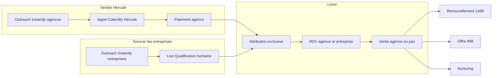

# 22 — Intention métier

**Propriétaire :** produit pour les questions `BIZ-*`.  
**À remplir en premier**, avant [01-foundations-validation.md](./01-foundations-validation.md). L’ingénierie traduira ensuite ces réponses en architecture. Les `FND-*` / `SUR-*` / `FUN-*` restent : ce fichier est **en amont** et indique lesquelles deviennent inférables.

Ce n’est **pas** un questionnaire landing/ICP : ne pas dupliquer [sop-validation-commercial.md](../sop/sop-validation-commercial.md).  
Ce n’est **pas** une spec technique : pas de base, API, framework, webhook, Stripe, Streamlit vs Next, ni organisation du code. Le **moment** du paiement et **qui confirme une vente** sont du métier ; le **processeur** de paiement ne l’est pas.

Rôle de ce document : « **Que veut réellement le business que le produit et l’opération fassent ?** »

---

## PARTIE 0 — Modèle reconstruit (ce que l’audit décrit)

Hercule est un **matching B2B à deux faces**, opéré aujourd’hui comme un **service concierge / done-for-you**, avec une **spec en forme de SaaS** qui n’est pas live.

### Qui paie, qui bénéficie

- **Client payant :** l’agence web.  
- **Bénéficiaire gratuit :** l’entreprise (PME/TPE). Aucun upsell entreprise — [cvg_master.md](../tech-stack/cvg_master.md) § 4, [cvg_entreprise.md](../tech-stack/cvg_entreprise.md).  
- **Hercule :** **0 % de commission** sur les contrats signés agence ↔ entreprise.

### Ce qui est vendu (sur le contrat)

Accès à des **demandes clients qualifiées**, pas des signatures garanties. Obligation de **moyens**, pas de résultat commercial.

**Formules CGV :**

| Formule | Prix | Contenu |
|---------|------|---------|
| Hercule Starter | **1 489 €** forfait | **5 Attributions** |
| Hercule (récurrent) | **2 500 € / mois** | jusqu’à **4 Attributions / mois** |
| Renouvellement cycle | **1 489 €** | **5 Attributions** (après survey agence) |
| Offre 898 € | **898 €** | **3 Attributions** — page survey uniquement |

Le modèle historique **250 € / mois + 149 € / RDV honoré** n’est plus commercialisé. La note isolée **750 € / mois « full closing »** ([pricing.md](../sop/pricing.md)) n’est dans aucune CGV.

### Chaîne de livraison (CGV)

Capture → **Live Qualification** humaine → **Attribution exclusive** → RDV planifié dans l’agenda de l’agence.

- Une Attribution est **consommée** lorsque le RDV est **planifié**.  
- No-show entreprise (relance H-24, signalement client sous 48 h) : recrédit + remplacement sous **14 jours ouvrés**.  
- RDV **honoré** : décideur présent en visio **≥ 15 min**.  
- Rétractation commerciale : **4 jours calendaires**.  
- Anti-contournement : 12 mois après la dernière Attribution.  
- Onboarding client : **48 h** après paiement.

### Ce qui est live vs ce qui est spec

| Couche | Réalité |
|--------|---------|
| **Go-to-market (code)** | Instantly → slug → `reservation.html` → Calendly **appel de vente Hercule** → séquence Resend. C’est **vendre Hercule**, pas livrer un match agence ↔ entreprise. |
| **Produit visé (spec, non built)** | Onboarding → délivrance → matching → survey post-RDV → `SOLD` / 898 / nurturing + page de suivi client. |
| **Ops** | EI (Nanguy Evan Gbeho) : qualification et matching humains ; confirmation de paiement admin. Le logiciel actuel est un **CRM d’exploitation**, pas un SaaS client. |

### Hypothèses retenues (pas de question)

Sauf contradiction explicite de votre part dans les notes :

- Marché **France**, B2B, droit français, EUR TTC (franchise en base).  
- ICP agence : web / digital.  
- Sourcing entreprises : PME + verticales déjà présentes dans `doc/email_outreach_copy/` (formation, comptable, conseil financier, nettoyage, rénovation, transport) et besoins digitaux (site, refonte, SEO).  
- Preuve d’une garantie MRR : email + **jugement admin** (voir BIZ-09), pas un portail de pièces justificatives.

---

## PARTIE 1 — Déjà clair vs ambigu

### Aligné — à préserver, pas à reposer

1. L’agence paie ; l’entreprise ne paie rien ; 0 % de commission.  
2. Cadre légal CGV : rétractation 4 j, no-show 14 j ouvrés, anti-contournement 12 mois, onboarding 48 h.  
3. Liste des SKU et **prix catalogue** CGV (les montants eux-mêmes).  
4. Promesses capacity C-01–C-06 : déjà rédigées ; seule confirmation [CAP-01](./17-capacity-sla-validation.md).  
5. Live Qualification = étape **humaine** (définition CGV).  
6. Hercule **n’est pas**, dans le contrat, une agence de vente à résultats garantis (CGV § 4).

### Contradictoire ou incomplet — bloque une architecture honnête

| Sujet | Source A | Source B | Pourquoi ça bloque |
|-------|----------|----------|--------------------|
| Hercule close-t-il ? | CGV : l’agence négocie et signe | Pricing 2500 : « qualification et signature internes », « 4 clients signés » ; SOP 4.4 non coché | Produit meetings vs produit closing |
| Unité livrée | CGV : Attribution consommée au **planifié** | Landing : « pas de signature → attribution renouvelée » ; capacity compte des **RDV honorés** | Compteurs, garanties, 898, fin de pack |
| Distribution | CGV : attribution exclusive par Hercule | CGV § 4.1 + carousel `agence_demandes` : demandes **visibles** à dates | Catalogue vs assignation |
| Quand on paie | CGV : commande ferme après paiement | `sequence_client_not_paid` : dashboard `NOT_PAID` + Activer ; CGV § 4.2 : match **avant** souscription (~6 j) | Self-serve unpaid vs prepaid vs audit-then-buy |
| Rôle du logiciel | Live : CRM ops | Spec : portails agence / entreprise | Concierge-only vs SaaS client |
| Fin de cycle | Tech-stack : `SOLD` = vente survey | CGV : pack jusqu’à 5 Attributions ; `documentations_2` : `MEETING_10` | Compte agence ≠ épisode de match |
| 898 € | Existe en CGV | Moment (après 1 échec ? pack vide ?) et unité (3 cycles vs 3 Calendly) non tranchés | Crédits vs upsell |
| 2500 € | Commercialisé landing + CGV | Hors parcours produit ; copy « on signe pour vous » | SKU volume vs SKU closing |

---

## PARTIE 2 — Manques pour un SaaS cohérent

Écarts **métier**, pas d’ingénierie. Priorité = ce sans quoi on ne peut pas concevoir le produit définitif.

### CRITICAL — le business ne peut pas être opéré de façon fiable sans trancher

- Nature de l’offre : meetings DFY (l’agence close) vs closing DFY vs marketplace self-serve vs hybride par formule.  
- Unité de valeur, et si une **absence de vente** consomme l’Attribution.  
- Comment une demande est donnée à une agence (assignation vs catalogue).  
- Paiement vs démarrage de la livraison (y compris non-payé / audit-then-pay).  
- À qui le logiciel est **destiné** (ops seulement vs agence payante vs les deux faces).  
- Cycle de vie du pack : matches séquentiels vs parallèles ; crédits restants après une **vente** ; quand l’898 apparaît ; ce que l’898 achète.

### HIGH — nécessaire pour un système commercial complet

- Starter vs 2500 : formules parallèles, ladder, ou métiers différents.  
- CGV § 4.2 (mise en relation avant souscription) : parcours réel ou récit de vente.  
- Droits entreprise (refuser, rematcher, autre agence) vs lead-asset uniquement.  
- Quels actes restent **humainement obligatoires** (qualifier, matcher, confirmer le paiement, no-show, confirmer la vente, garantie).

### MEDIUM — complétude, optimisation, ops futures

- Crédits non utilisés si l’agence résilie un Starter en cours de pack.  
- Preuve des garanties MRR : **par défaut** email + jugement admin (BIZ-09) — pas de question dédiée.  
- Périmètre sourcing (France, PME, verticales outreach) : **hypothèses Partie 0**, pas de question sauf contradiction en notes.  
- SKU morts : 750 € « full closing » absorbé par BIZ-01 ; 998 € × 3 mois déjà [CPY-04](./09-copywriting-validation.md).

---

## PARTIE 3 — Questionnaire (intention métier uniquement)

Une seule case par question. L’option **A (recommandé)** = lecture **CGV + ops live**, pas la spec la plus ambitieuse.

Ne pas cocher une `FND-*` plus tard d’une façon qui **contredit** ces réponses. En cas de conflit, **stop** — une question ciblée, pas d’implémentation.

---

### CRITICAL

#### [BIZ-01] Hercule vend-il des rendez-vous qualifiés que l’agence close, un closing fait par Hercule, un accès self-serve à un catalogue, ou un hybride par formule ?

La CGV dit que l’agence négocie et signe. [`content/pricing/agence.json`](../../content/pricing/agence.json) dit que le 2 500 € inclut « qualification et signature internes » et « 4 clients signés ». Le SOP commercial § 4.4 n’est pas tranché. C’est l’identité de l’entreprise : meetings, closing, ou marketplace.

- [ ] **A (recommandé)** — Toujours **meetings-only** : l’agence close. Le 2 500 € = plus de **volume**, pas du closing Hercule. Le copy 2500 « on signe pour vous » doit être corrigé.
- [ ] **B** — **Hybride** : Starter = meetings (l’agence close) ; 2 500 € = Hercule qualifie **et** close.
- [ ] **C** — Hercule close **toujours** (y compris Starter). La CGV doit être alignée.
- [ ] **D** — **Marketplace self-serve** : l’agence choisit et booke seule. Hercule n’assigne pas.

**Impact si l’architecture change :** High  
**Domaines affectés :** Offre, CGV, landing, matching, post-RDV, SAL-02  
**Lié :** FND-01, FND-06, BIZ-07

---

#### [BIZ-02] Qu’est-ce qui consomme une Attribution, et un RDV honoré sans contrat est-il consommé ou recrédité ?

La landing dit « en l’absence de signature, l’attribution est renouvelée ». La CGV consomme au **planifié** (sauf no-show entreprise). La capacity compte des **RDV honorés** (U4). Compteurs, garantie MRR, 898 et fin de pack dépendent de cette unité.

- [ ] **A (recommandé)** — Consommée au RDV **planifié**. No-show entreprise = recrédit (CGV). **Pas de vente ≠ recrédit** (sauf garantie MRR **après le pack entier**).
- [ ] **B** — Consommée seulement si le RDV est **honoré**. No-show ou absence de vente = recrédit.
- [ ] **C** — Consommée seulement si un **contrat est signé**. Tout le reste est recrédité.

**Impact si l’architecture change :** High  
**Domaines affectés :** CGV, compteurs, garanties, 898, matching, FND-13  
**Lié :** FND-06, FUN-02, SOT-01, CAP-01  
**Ancien ID :** D-10, D-11 (unité)

---

#### [BIZ-03] Comment une demande est-elle attribuée à une agence ?

« Attribution exclusive » (CGV) n’est pas la même chose qu’un catalogue public de demandes datées (CGV § 4.1, carousel `agence_demandes`). L’un est de l’assignation Hercule ; l’autre est un marché où l’agence choisit.

- [ ] **A (recommandé)** — Hercule **assigne exclusivement**. Le carousel du site est **marketing / preuve**, pas un catalogue d’achat.
- [ ] **B** — L’agence **choisit** dans un catalogue de demandes visibles (après paiement ou pendant l’audit).
- [ ] **C** — **Mix** : catalogue pour la démo / l’audit ; assignation exclusive une fois payé.

**Impact si l’architecture change :** High  
**Domaines affectés :** Matching, landing, `agence_demandes`, SUR-01  
**Lié :** FND-05

---

#### [BIZ-04] À quel moment l’agence paie par rapport au début de la livraison ?

Trois parcours documentés ne peuvent pas partager le même cycle de vie : Starter prépayé (CGV), match **avant** souscription (~6 j, CGV § 4.2), dashboard `NOT_PAID` + CTA Activer (`sequence_client_not_paid`). Ici : **quand** l’argent conditionne le service — pas comment on encaisse.

- [ ] **A (recommandé)** — Paiement (ou facture acceptée) **avant** toute Attribution de **service actif**. L’appel de vente Hercule peut montrer des exemples ; ce n’est **pas** une Attribution contractuelle. CGV § 4.2 = récit de vente, pas un parcours livré.
- [ ] **B** — **Audit réel** : 1 mise en relation **avant** souscription (CGV § 4.2 est un vrai parcours).
- [ ] **C** — Onboarding / dashboard possibles **sans** paiement (`NOT_PAID`) ; activation plus tard.
- [ ] **D** — **Self-checkout** sans appel de vente Hercule.

**Impact si l’architecture change :** High  
**Domaines affectés :** Onboarding, délivrance, sequence_not_paid, FND-16  
**Lié :** FND-03, FND-04, INT-01 (timing seulement)

---

#### [BIZ-05] Que doit pouvoir faire l’agence payante dans le produit, sans vous appeler ?

C’est la frontière **SaaS vs concierge**. Les surfaces, l’auth et les écritures client en découlent — on ne demande pas quelles pages ni quel login.

- [ ] **A (recommandé)** — **Suivi** de livraison + **déclarer un no-show** + **survey** post-RDV. Pas de choix de demandes, pas de self-checkout.
- [ ] **B** — **Rien** dans une app : Calendly + email seulement. Le logiciel reste l’outil **ops Hercule**.
- [ ] **C** — **Self-serve large** : onboarding, paiement, choix de demandes, suivi, survey.

**Impact si l’architecture change :** High  
**Domaines affectés :** Surfaces client, FND-03, ADM  
**Lié :** SUR-01

---

#### [BIZ-06] Cycle de vie d’un pack payé : matches en parallèle, crédits après une vente, moment et contenu de l’offre 898 € ?

`SOLD` sur **un** match n’est pas « pack vide ». Proposer 898 € à chaque RDV sans vente, alors qu’il reste des crédits Starter, empile deux offres. [FUN-02](./07-funnels-validation.md) est cette question déguisée (3 cycles vs 3 Calendly).

- [ ] **A (recommandé)** — **Un match à la fois**. Une vente **n’éteint pas** les Attributions restantes (le pack continue). L’898 seulement si le pack est **épuisé sans vente** (ou après refus de continuer). L’898 = **3 Attributions** au **même sens** que BIZ-02. Le CTA 1 489 € = **nouveau pack de 5**, pas un recrédit.
- [ ] **B** — Une vente **termine** le pack ; 1 489 € = recommencer. L’898 = secours **dès le premier** RDV sans vente, même s’il reste des crédits Starter.
- [ ] **C** — Plusieurs Attributions **en parallèle**. **Pas d’offre 898** ; seulement renouvellement 1 489 € / 2 500 €.

**Impact si l’architecture change :** High  
**Domaines affectés :** Matching, survey, 898, renouvellement, compteurs  
**Lié :** FND-09, FND-10, FUN-02, FND-12  
**Ancien ID :** D-11, V-34, V-35

---

### HIGH

#### [BIZ-07] Quel est le rapport commercial entre Starter 1 489 € et Hercule 2 500 € / mois ?

[FND-11](./01-foundations-validation.md) demande seulement si le 2500 est dans le MVP **technique**. Ici : ladder, formules parallèles, ou autre métier. Doit rester cohérent avec BIZ-01.

- [ ] **A (recommandé)** — Deux formules **parallèles**. Le 2 500 € = volume mensuel (jusqu’à 4 attr.), **même** logique meetings-only que BIZ-01 A.
- [ ] **B** — Starter = **entrée** ; 2 500 € = formule **cible** après une première réussite.
- [ ] **C** — Le 2 500 € est un **autre métier** (closing Hercule) — cohérent **seulement** si BIZ-01 = B.
- [ ] **D** — Le 2 500 € est du **copy** : on ne le vend pas encore (retirer, ou garder en vitrine).

**Impact si l’architecture change :** High si C/D ; Medium si B  
**Domaines affectés :** CGV, landing, FND-11, post-RDV  
**Lié :** BIZ-01, FND-11

---

#### [BIZ-08] L’entreprise est-elle un utilisateur du service (droits) ou un lead sourcé ? Après échec ou refus, peut-elle aller vers une autre agence ?

L’exclusivité « pendant l’Attribution » n’a pas la même durée qu’« une entreprise = une agence Hercule pour toujours ». [FND-08](./01-foundations-validation.md) pose un **statut** ; ici c’est le **droit commercial**.

- [ ] **A (recommandé)** — **Lead sourcé** : email + Calendly ; pas de portail obligatoire. **Oui**, Hercule peut la réattribuer à une autre agence si le match échoue (exclusivité = **Attribution en cours** seulement).
- [ ] **B** — **Utilisateur** : elle peut refuser / demander une autre agence via un parcours dédié. Réattribution = oui.
- [ ] **C** — Exclusivité **forte** : une entreprise = une seule agence Hercule, même après échec (sauf remplacement no-show **avec la même** agence).

**Impact si l’architecture change :** High  
**Domaines affectés :** Matching, SUR-01 entreprise, FND-08  
**Lié :** FND-08, SUR-01

---

#### [BIZ-09] Quels actes commerciaux restent humainement obligatoires (Hercule), quoi qu’il arrive ?

Ce que le logiciel **n’a jamais le droit de décider tout seul**. Pas « quel bouton dans quelle app ».

- [ ] **A (recommandé)** — Toujours humain : **qualifier** l’entreprise, **décider le match**, **confirmer le paiement reçu**, **juger** no-show / RDV honoré en cas de doute, **valider** une garantie MRR. Le survey « vente faite ? » peut rester **déclaré par l’agence**.
- [ ] **B** — Le moins possible : match et paiement **pourront** devenir self-serve plus tard ; la qualification humaine **reste**.
- [ ] **C** — Tout A, **plus** la confirmation de vente (l’agence **ne** self-declare **pas** `SOLD`).

**Impact si l’architecture change :** High  
**Domaines affectés :** Matching, paiement, no-show, survey, garanties  
**Lié :** FND-04, FND-07, ORCH-01

---

### MEDIUM

#### [BIZ-10] Si l’agence résilie un Starter déjà payé avant d’avoir consommé les 5 Attributions (après les 4 jours de rétractation), que deviennent les crédits restants ?

La CGV § 13.1 dit « jusqu’à consommation des 5 Attributions **ou** résiliation », sans dire ce qu’il advient des unités prépayées non utilisées. Le récurrent § 13.2 dit que la période en cours reste due. Sans cette règle, ni facturation ni geste admin ne sont cohérents.

- [ ] **A (recommandé)** — Après J+4 : **pas de remboursement**. Les Attributions non utilisées sont **forcloses** à la résiliation (sauf celles **déjà** matchées / planifiées, à honorer).
- [ ] **B** — Les Attributions restantes restent **dues jusqu’à épuisement**, même après résiliation « commerciale ».
- [ ] **C** — Remboursement ou avoir **au prorata** (geste **produit**, pas seulement exception admin).

**Impact si l’architecture change :** Medium  
**Domaines affectés :** CGV § 13, admin, FND-13  
**Lié :** FND-13

---

## Hors questionnaire (volontairement)

| Sujet | Pourquoi ce n’est pas ici |
|-------|--------------------------|
| 0 % commission, entreprise gratuite, no-show 14 j, rétractation 4 j, ICP agence web, droit français | Déjà dans la CGV |
| Stripe vs virement, Streamlit vs Next, tables, webhooks | Ingénierie / [INT-01](./11-integrations-validation.md) |
| 1 489 € vs ~1 500 € (copy) | [CPY-01](./09-copywriting-validation.md) |
| Offre 998 € × 3 mois | [CPY-04](./09-copywriting-validation.md) |
| Nurturing 60 j | [EML-02](./08-email-sequences-validation.md) |
| Capacity C-01–C-06 | [CAP-01](./17-capacity-sla-validation.md) |
| Preuve garantie MRR (portail vs email) | Défaut : email + jugement admin (BIZ-09) |
| Géographie / verticales | Hypothèses Partie 0 |

---

## Mapping BIZ → questions existantes

Après remplissage, une réponse `FND-*` / `SUR-*` / `FUN-*` **ne doit pas** contredire le `BIZ-*` correspondant. Si contradiction : stop.

| BIZ | Contraint |
|-----|-----------|
| BIZ-01 | FND-01, FND-06, SAL-02, copy 2500 |
| BIZ-02 | FND-06, FND-13, FUN-02, SOT-01, compteurs CAP |
| BIZ-03 | FND-05, SUR-01, carousel `agence_demandes` |
| BIZ-04 | FND-03, FND-04, FND-16, INT-01 (timing seulement), `sequence_client_not_paid` |
| BIZ-05 | SUR-01, FND-03, ADM-* |
| BIZ-06 | FND-09, FND-10, FUN-02, FND-12 |
| BIZ-07 | FND-11 |
| BIZ-08 | FND-08, SUR-01 entreprise |
| BIZ-09 | FND-04, ORCH-01, FND-07 |
| BIZ-10 | CGV § 13, résiliation admin |

---

## Réponses

| ID | Choix | Notes |
|----|-------|-------|
| BIZ-01 | | |
| BIZ-02 | | |
| BIZ-03 | | |
| BIZ-04 | | |
| BIZ-05 | | |
| BIZ-06 | | |
| BIZ-07 | | |
| BIZ-08 | | |
| BIZ-09 | | |
| BIZ-10 | | |
