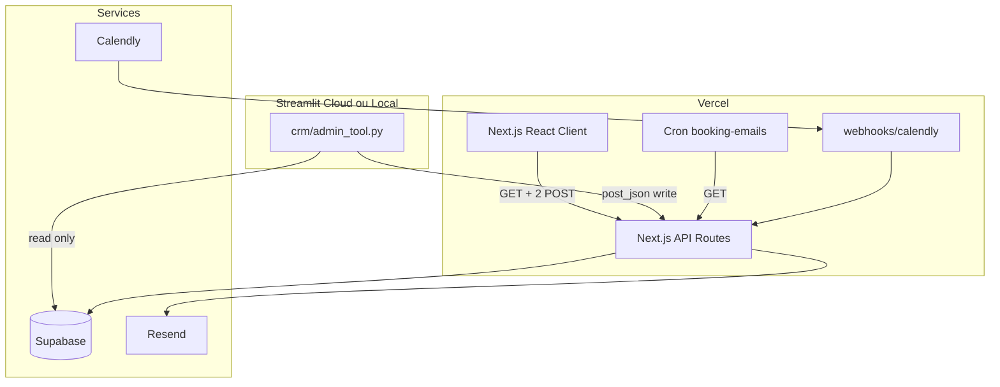
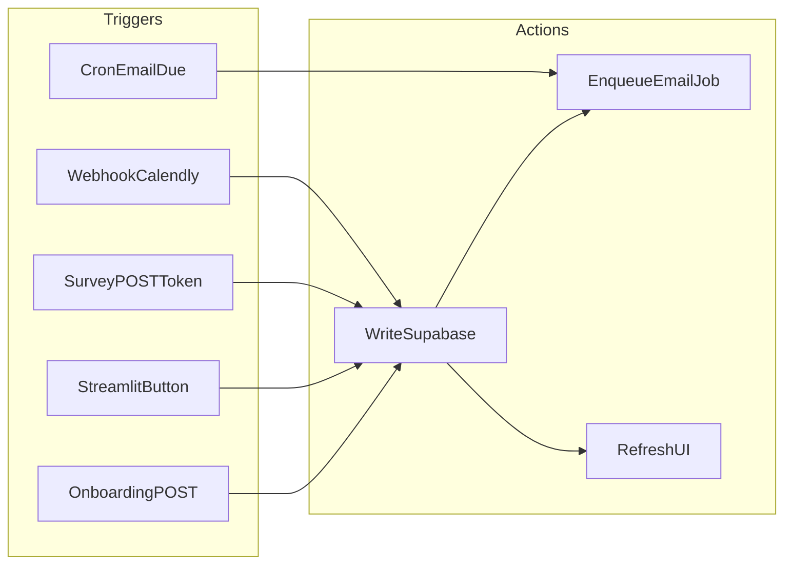

# Modèle des 4 lignes — Trigger & Action

> Voir aussi : [Vue d'ensemble](./00-overview.md) · [Modèle de données](./02-data-model.md) · [Profile JSON](./02-profile-json.md)  
> Modules : [Onboarding](./onboarding/README.md) · [Deliverance](./deliverance/README.md) · [Matching](./matching/README.md) · [Post-RDV](./post-rdv/README.md)

---

## 1. Intro (langage simple)

Imagine **4 fils** branchés sur la même prise (Supabase) :

1. **DB** — la prise. Vérité unique.
2. **Front client** — ce que voit agence/entreprise (**lecture seule**, sauf 2 cas).
3. **Front interne** — ton Streamlit (**seul à agir** sur le service).
4. **Communication** — emails auto (Resend via jobs).

**Qui peut écrire en base ?**

- **Toi (admin)** : toujours, via boutons Streamlit → API.
- **Client agence/entreprise** : seulement à l'inscription (onboarding) et au survey post-RDV (lien secret). **Pas de boutons** qui changent statut ou déclenchent match.

---

## 2. Architecture développée (pour IA de coding)

### Diagramme production



### Client : autorisé / interdit

| Action client | Autorisé | Route |
|---------------|----------|-------|
| Créer fiche onboarding | Oui | `POST /api/onboarding/[category]` |
| Lire timeline suivi | Oui | `GET /api/deliverance/...` |
| Répondre survey post-RDV | Oui | `POST /api/post-rdv/survey` + token |
| Changer statut, match, envoyer mail | **Non** | — |
| Boutons admin sur suivi | **Non** | — |

Pages suivi = **SSR ou fetch GET**. Zéro mutation React hors exceptions.

### Tableau trigger / action par ligne

| Ligne | Triggers | Actions |
|-------|----------|---------|
| **DB** | INSERT onboarding, PATCH admin, webhook Calendly | Row + statut + profile |
| **Front client** | Page load GET | Affiche reflet DB (profile.display) |
| **Front interne** | Bouton admin Streamlit | POST API → DB + enqueue email |
| **Communication** | Job due, post-write API | Resend send ; vars depuis profile |

### Triggers Calendly (existants à réutiliser)

| Event | Action |
|-------|--------|
| `invitee.created` | Entreprise `MEETING_BOOKED` ; agence `profile.match.active_rdv=true` |
| Fin RDV / event ended | `POST_RDV_SURVEY` + enqueue survey emails |
| `invitee.cancelled` | Annulation jobs + statut rollback selon règle |

Réutiliser [`lib/link-tracking/book-lead.ts`](../../lib/link-tracking/book-lead.ts) et [`app/api/webhooks/calendly`](../../app/api/webhooks/calendly).

### Flux trigger/action



### Règles interdites

| Interdit | À la place |
|----------|------------|
| Streamlit → Resend direct | Streamlit → API → jobs → Resend |
| Client boutons changement statut | Admin Streamlit uniquement |
| Table communications séparée | profile JSON + booking_email_jobs |
| Dates hardcodées React | profile.communication.delays + API |
| Logique email Python | orchestrator TypeScript |
| Streamlit sur Vercel | Streamlit Cloud ou local |

### Pattern job email

1. `insertJob({ leadId, emailType, scheduledFor })` — date depuis `profile.communication.delays`
2. Cron `/api/cron/booking-emails` → `listDueJobs()` → send
3. Render template avec variables `profile.form.*`

Référence : [`lib/booking-communication/orchestrator.ts`](../../lib/booking-communication/orchestrator.ts)

---

## 3. Prompt d'action IA

```
Implémenter une feature Hercule selon doc/tech-stack/01-four-lines-model.md.

Checklist :
1. Migration DB + profile JSON si besoin
2. API Next.js : seul point d'écriture (admin Bearer ou token survey)
3. Client React : GET only sauf onboarding POST et survey POST
4. Streamlit : boutons → crm_api.post_json, jamais Resend direct
5. Emails : booking_email_jobs, variables depuis profile

Contraintes :
- Admin = seul acteur service (match, promote, SOLD)
- Calendly webhooks pour MEETING_BOOKED et POST_RDV_SURVEY
- Idempotency sur jobs

Références :
- lib/booking-communication/orchestrator.ts
- lib/link-tracking/book-lead.ts
- crm/crm_api.py
- crm/admin_tool.py
```
