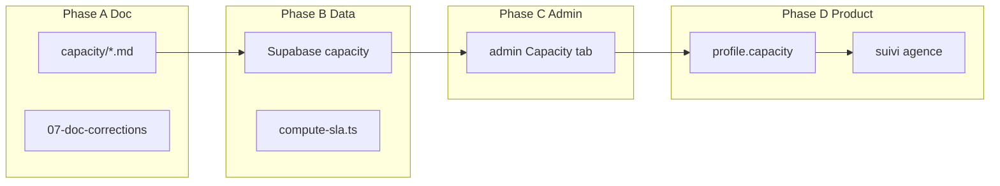

# Capacity — Roadmap implémentation

> Module : [Capacity](./README.md) · Phase A (doc) → Phase D (produit)

---

## Phase A — Doc (fait)

- [x] Créer `doc/tech-stack/capacity/` (10 fichiers)
- [x] Appliquer [07-doc-corrections.md](./07-doc-corrections.md)
- [x] Coefficients baseline dans [02-funnel-math.md](./02-funnel-math.md)

---

## Phase B — Data minimum

1. **Migration Supabase**
   - Enum `capacity_status` sur `agence`
   - Colonnes `inbox_allocation`, `queue_position`, `estimated_activation_at`
   - Table `inbox_pool` (60 rows seed manuelles)

2. **TypeScript** — `lib/capacity/compute-sla.ts` (nouveau)
   - `computeClientSla(agence)`
   - `computeDeliveranceMilestones(allocation, activationAt, phase)`
   - `predictedU4Monthly(inboxes)`
   - Réutiliser pattern [`lib/booking-communication/schedule.ts`](../../../lib/booking-communication/schedule.ts)

3. **Tests smoke** — jalons U4 #1 / #5 / #10 @ 30 et @ 15 inbox

---

## Phase C — Visibilité admin

4. Onglet **Capacity** dans [`crm/admin_tool.py`](../../../crm/admin_tool.py) :
   - Pool total / agence (10) / livraison / warmup / libre
   - Clients actifs : allocation, statut, queue_position
   - Jalons `estimated_*_at` par client
   - Override manuel 15 ↔ 30 inbox
   - Alertes [04-sla-internal.md](./04-sla-internal.md)

5. Seed `inbox_pool` depuis config (60 actives + 60 warmup si batch commandé)

---

## Phase D — Branchement produit

6. `buildDefaultProfile()` — injecte `profile.capacity` à l'onboarding POST
7. `POST /api/deliverance/promote` — recalc milestones + `estimated_completion_at`
8. Page `/suivi/agence/[slug]` — timeline + compteur U4 + dates capacity
9. Template email waitlist + condition `deliverance_search_started`
10. Copy signature / onboarding avec dates depuis API

---

## Diagramme dépendances



---

## Ordre vs [steps](../steps)

| Step | Contenu |
|------|---------|
| **0** | Capacity : migrations Supabase + panel Streamlit Capacity |
| 1 | Autres migrations Supabase + visibilité |
| 2 | Migrations Resend comm + visibilité emails |
| 3 | Front client (suivi — lit `profile.capacity`) |
| 4 | Front admin (panels onboarding/délivrance/match) |

---

## Prompt d'action IA

```
Implémenter capacity phase B–D (doc/tech-stack/capacity/08-implementation-roadmap.md).

Phase B first : migration + computeDeliveranceMilestones
Phase C : Streamlit tab before suivi page
Phase D : promote hook + suivi GET

Références : capacity/06-profile-integration.md, crm/admin_tool.py
```
