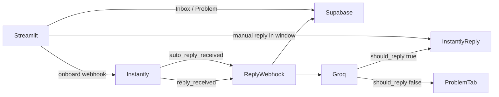
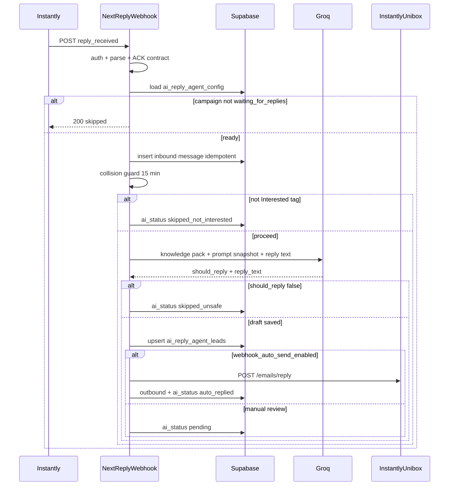

# AI Reply Agent — Technical Specification

> Tool : Streamlit AI Sales Agent · Source notes : [my_raw_notes.md](./streamlit_reply_agent/my_raw_notes.md)  
> Related : [Instantly bypass / Subsequence](../../../app/streamlit_subsequence/) · [CVG master](../cvg_master.md) · [Overview](../00-overview.md)  
> Status : **implemented** — see `app/streamlit_reply_agent/`, `lib/ai-reply-agent/`, migration `20260920120000_ai_reply_agent.sql`. Config also stores `ooo_webhook_id` and frozen `niche_metadata`.

---

## 1. Intro (plain language)

When a prospect replies to a cold email in Instantly (1st, 2nd, or 3rd touch), Hercule should store that reply, ask Grok (xAI) to draft a short sales answer grounded in our legal/commercial knowledge, and send it immediately — signed **Béatrice Meyer**.

If Grok is not sure because the answer is not in the knowledge pack, **it must not send**. The thread lands in the **Problem** tab for a human.

Operators configure the agent per Instantly campaign in Streamlit: pick campaign → pick niche → pick Buyer vs Seller → read the pre-registered prompt → initiate webhook → send to prod. After refresh, the campaign reads **Inbox: waiting for replies**.

This is **not** the existing Interested bypass. That webhook fires when a lead is marked Interested and sends template E1/E2/E3. This tool fires on **actual email replies**.

---

## 2. Scope and non-goals

### Multi-tenant rules

Same scripts, same `GROK_API_KEY`, same knowledge pack, for every campaign.

What changes per campaign (stored in Supabase):

| Field | Meaning |
|-------|---------|
| Instantly `campaign_id` | Which sequence receives replies |
| `niche_preset_id` | Who we are talking to (`comptables`, `btp_reno`, …) |
| `target_type` | `buyer` or `seller` |
| `prompt_snapshot` | Frozen copy of the validated prompt at activation time |

### Buyer vs Seller (locked vocabulary)

| UI label | Product category | Who they are |
|----------|------------------|--------------|
| **Buyer** | `agence` | Agencies applying for demandes / leads |
| **Seller** | `entreprise` | Enterprises looking for an agency |

Tooltip copy (exact): *Buyer = agencies applying for leads. Seller = enterprises looking for an agency.*

### In scope

- Instantly `reply_received` webhook → store → Groq → send or escalate
- Instantly `auto_reply_received` (OOO) → store → **Problem** only, never auto-reply
- Streamlit onboarding + Inbox + Problem
- Pre-registered niche × target prompts, scaffolded when a new scraper niche is created
- Manual Problem replies that respect the Paris send window

### Non-goals

- Creating Instantly campaigns or lead lists (that is Streamlit Scraper)
- Scraping, email cleaning, CRM Unibox import
- Generating onboarding copy or E1/E2/E3 templates with an LLM
- Replacing Streamlit Subsequence (`lead_interested` → E1/E2/E3)
- Hosting the webhook on Streamlit (Streamlit is not a public HTTPS target)

---

## 3. Architecture (for a coding agent)

### 3.1 System map



| Piece | Where | Role |
|-------|-------|------|
| Webhook | Next.js `POST /api/webhooks/instantly/reply` | Public HTTPS receiver on `https://www.hercule.dev` |
| Control panel | Streamlit `app/streamlit_reply_agent/app.py` | Onboarding + Inbox + Problem |
| LLM | Groq API | Structured JSON: reply or abstain |
| Send | Instantly `POST /emails/reply` | In-thread Unibox reply |
| Truth | Supabase tables below | Config, messages, queued manual jobs |

**Do not reuse** [`app/api/webhooks/instantly/route.ts`](../../../app/api/webhooks/instantly/route.ts). That route handles `lead_interested` only and returns `{ ok: true, ignored: <event> }` for everything else.

### 3.2 Production webhook URL

| Constant | Value |
|----------|-------|
| Production host | `https://www.hercule.dev` |
| Path | `/api/webhooks/instantly/reply` |
| Full URL | `https://www.hercule.dev/api/webhooks/instantly/reply` |

Same production gate as Subsequence ([`app/streamlit_subsequence/config.py`](../../../app/streamlit_subsequence/config.py)): reject `localhost` and any host that is not `www.hercule.dev`. Instantly webhooks must point at prod.

Auth: reuse [`lib/instantly-bypass/webhook-auth.ts`](../../../lib/instantly-bypass/webhook-auth.ts) (`INSTANTLY_BYPASS_WEBHOOK_SECRET` or `CRON_SECRET`, `Authorization: Bearer <secret>`). Instantly disables a webhook after repeated non-2xx — always ACK business skips with HTTP 200.

### 3.3 Instantly events

Subscribe via existing [`shared/instantly_client.py`](../../../shared/instantly_client.py) `create_webhook(event_type=..., campaign=..., target_hook_url=..., headers=...)`.

| Subscribe `event_type` | Handler | Auto-send? |
|------------------------|---------|------------|
| `reply_received` | Groq path | Yes if `webhook_auto_send_enabled` and `should_reply`; else draft only (`pending`) |
| `auto_reply_received` | Store only | Never — `ai_status = skipped_ooo` |

Payload fields (Instantly webhook guide):

| Field | Use |
|-------|-----|
| `timestamp` | Event time |
| `event_type` | Branch |
| `campaign_id` / `campaign_name` | Config lookup |
| `lead_email` | Thread key |
| `email_account` | `eaccount` for `/emails/reply` |
| `email_id` | `reply_to_uuid` for `/emails/reply` |
| `reply_subject` / `reply_text` / `reply_html` | Inbound body |
| `reply_text_snippet` | Preview fallback |
| `unibox_url` | Inbox deep link |
| `step` / `variant` / `is_first` | Analytics only |

### 3.4 Reply send path

Reuse Instantly Unibox reply, already implemented:

- Python: `InstantlyClient.reply_to_email(eaccount, reply_to_uuid, subject, html)`
- TypeScript: `lib/instantly-bypass/client.ts` `replyToEmail()`

AI output is **plain text**. Wrap it in a minimal HTML body for the Instantly API (`<p>…</p>` + line breaks). Do not add a second signature — the model already signs **Béatrice Meyer**.

Subject: `Re: {reply_subject}` (or original subject if missing).

Thread resolution fallback if `email_id` is absent: reuse [`lib/instantly-bypass/thread-resolver.ts`](../../../lib/instantly-bypass/thread-resolver.ts) / [`app/streamlit_subsequence/send_queue.py`](../../../app/streamlit_subsequence/send_queue.py) `resolve_thread()`.

### 3.5 Interested tag gate (auto-agent only)

The Groq auto-reply path runs **only** when the lead has Instantly `lt_interest_status === 1` (Interested).

| `lt_interest_status` | Label | Auto-reply? |
|----------------------|-------|-------------|
| `1` | Interested | Yes (if Groq `should_reply`) |
| `-1` | Not interested | No — `ai_status = skipped_not_interested` |
| `-4` | No show | No — `ai_status = skipped_not_interested` |
| `null` / other | Lead | No — `ai_status = skipped_not_interested` |

The inbound reply is **always stored**. Operators can still answer manually from Pending Unibox regardless of tag.

Lookup: `findLeadByEmailInCampaign()` in [`lib/instantly-bypass/client.ts`](../../../lib/instantly-bypass/client.ts).

### 3.6 Send window

| Sender | Window |
|--------|--------|
| Groq auto-reply | Immediate, 24/7 — no timezone check |
| Manual Problem reply | Paris **Mon–Fri 08:00–17:00** (`Europe/Paris`). Outside window → insert `ai_reply_agent_jobs` with `scheduled_for = nextSendSlot()` |

Reuse the exact helpers in [`app/streamlit_subsequence/send_window.py`](../../../app/streamlit_subsequence/send_window.py) and [`lib/instantly-bypass/send-window.ts`](../../../lib/instantly-bypass/send-window.ts) (`isWithinSendWindow`, `nextSendSlot`). Cron: new `GET/POST /api/cron/ai-reply-agent-jobs` (same `CRON_SECRET` pattern as `/api/cron/instantly-bypass-jobs`).

### 3.7 Collision with Streamlit Subsequence

A lead can fire **both** `lead_interested` (Subsequence E1) and `reply_received` (this agent).

**Rule:** skip Groq auto-send if Hercule already sent an in-thread Unibox message in the last **15 minutes** (check Instantly `GET /emails` sent fingerprints, or `instantly_bypass_events` for that `campaign_id` + `lead_email`). Still **store** the inbound reply. Set `ai_status = skipped_collision` and show the thread in Inbox (not Problem) so the operator sees the conversation.

Do not write to `instantly_bypass_pipeline`. The two tools stay independent; they only share Instantly and the collision guard.

### 3.8 Event flow (happy path)



---

## 4. Knowledge pack (CVG correction)

`~/dev/hercule.dev/app/cvg` is **not** a markdown knowledge file. It is the Next.js route [`app/cvg/page.tsx`](../../../app/cvg/page.tsx), which reads [`doc/tech-stack/cvg_master.md`](../cvg_master.md) via [`lib/site/cvg-content.ts`](../../../lib/site/cvg-content.ts).

`cvg_master.md` is **agence / Buyer** legal-commercial content (pricing, SLA, no-show, rétractation). Entreprise / Seller answers are **not** in that file.

### Pack loaded at reply time

| Layer | Path | Used for |
|-------|------|----------|
| 1. CGV | [`doc/tech-stack/cvg_master.md`](../cvg_master.md) | Buyer pricing, SLA, guarantees, no-show 14 jours ouvrés, 4-day rétractation |
| 2. Entreprise FAQ | [`doc/tech-stack/deliverance/front-client.md`](../deliverance/front-client.md) §4 E1–E7 | Seller: free service, no commission, Calendly via email, continue search |
| 3. Product rules | [`doc/tech-stack/00-overview.md`](../00-overview.md) | Agence pays · entreprise never pays · no entreprise upsell |
| 4. Niche metadata | `NICHE_METADATA` from the selected scraper preset | Angle, target size, who we are talking to |
| 5. Prompt snapshot | Frozen at activation from the registry file | Tone and niche-specific framing |

If Groq cannot ground the answer in layers 1–4, `should_reply = false`. No invented prices, SLAs, or product claims.

Public URL of the same CGV (do not scrape it at runtime): `https://www.hercule.dev/cvg`.

---

## 5. Supabase schema

Service-role only. Enable RLS on every table, no anon policies (same as Instantly bypass).

### 5.1 Global auto-send mode

```sql
CREATE TABLE IF NOT EXISTS public.ai_reply_agent_settings (
    id INTEGER PRIMARY KEY DEFAULT 1 CHECK (id = 1),
    webhook_auto_send_enabled BOOLEAN NOT NULL DEFAULT TRUE,
    updated_at TIMESTAMPTZ NOT NULL DEFAULT NOW()
);

INSERT INTO public.ai_reply_agent_settings (id, webhook_auto_send_enabled)
VALUES (1, TRUE)
ON CONFLICT (id) DO NOTHING;

ALTER TABLE public.ai_reply_agent_settings ENABLE ROW LEVEL SECURITY;

COMMENT ON TABLE public.ai_reply_agent_settings IS
  'Global auto-send mode for AI Reply Agent webhooks. FALSE = Grok drafts only (manual send from Streamlit). TRUE = auto-send after Grok. Pause a campaign via ai_reply_agent_config.status = paused.';
```

### 5.2 Per-campaign config

```sql
CREATE TABLE IF NOT EXISTS public.ai_reply_agent_config (
    id UUID PRIMARY KEY DEFAULT gen_random_uuid(),
    campaign_id TEXT NOT NULL UNIQUE,
    campaign_name TEXT,
    niche_preset_id TEXT NOT NULL,
    niche_metadata JSONB NOT NULL DEFAULT '{}'::jsonb,
    target_type TEXT NOT NULL CHECK (target_type IN ('buyer', 'seller')),
    prompt_key TEXT NOT NULL,
    prompt_snapshot TEXT NOT NULL,
    webhook_id TEXT,
    ooo_webhook_id TEXT,
    status TEXT NOT NULL DEFAULT 'not_initialized' CHECK (
        status IN ('not_initialized', 'waiting_for_replies', 'paused')
    ),
    initialized_at TIMESTAMPTZ,
    updated_at TIMESTAMPTZ NOT NULL DEFAULT NOW()
);

ALTER TABLE public.ai_reply_agent_config ENABLE ROW LEVEL SECURITY;

COMMENT ON TABLE public.ai_reply_agent_config IS
  'Per-Instantly-campaign AI Reply Agent setup. prompt_snapshot is frozen at Send to Prod.';
```

`prompt_key` format: `{niche_preset_id}_{target_type}` (example: `comptables_buyer`).

### 5.3 Messages (Inbox + Problem)

```sql
CREATE TABLE IF NOT EXISTS public.ai_reply_agent_messages (
    id UUID PRIMARY KEY DEFAULT gen_random_uuid(),
    campaign_id TEXT NOT NULL,
    lead_email TEXT NOT NULL,
    direction TEXT NOT NULL CHECK (direction IN ('inbound', 'outbound')),
    event_type TEXT,
    instantly_email_id TEXT,
    subject TEXT,
    body_text TEXT NOT NULL DEFAULT '',
    email_account TEXT,
    unibox_url TEXT,
    ai_status TEXT NOT NULL CHECK (
        ai_status IN (
            'pending',
            'auto_replied',
            'skipped_unsafe',
            'skipped_ooo',
            'skipped_collision',
            'skipped_not_interested',
            'manual_replied',
            'manual_queued',
            'failed'
        )
    ),
    ai_reason TEXT,
    groq_model TEXT,
    thread_json JSONB NOT NULL DEFAULT '[]'::jsonb,
    reply_to_uuid TEXT,
    created_at TIMESTAMPTZ NOT NULL DEFAULT NOW()
);

CREATE UNIQUE INDEX IF NOT EXISTS ai_reply_agent_messages_idempotency_idx
    ON public.ai_reply_agent_messages (campaign_id, lead_email, instantly_email_id)
    WHERE instantly_email_id IS NOT NULL;

CREATE INDEX IF NOT EXISTS ai_reply_agent_messages_inbox_idx
    ON public.ai_reply_agent_messages (campaign_id, created_at DESC);

CREATE INDEX IF NOT EXISTS ai_reply_agent_messages_problem_idx
    ON public.ai_reply_agent_messages (campaign_id, ai_status, created_at DESC)
    WHERE ai_status IN ('skipped_unsafe', 'skipped_ooo');

ALTER TABLE public.ai_reply_agent_messages ENABLE ROW LEVEL SECURITY;

COMMENT ON TABLE public.ai_reply_agent_messages IS
  'Inbound Instantly replies and outbound AI/manual answers. Problem tab = skipped_unsafe + skipped_ooo.';
```

Inbox = all rows for the campaign (group by `lead_email` for conversation).  
Problem = inbound rows where `ai_status IN ('skipped_unsafe', 'skipped_ooo')` that are not yet `manual_replied`.

### 5.4 Manual send queue

```sql
CREATE TABLE IF NOT EXISTS public.ai_reply_agent_jobs (
    id UUID PRIMARY KEY DEFAULT gen_random_uuid(),
    idempotency_key TEXT UNIQUE NOT NULL,
    campaign_id TEXT NOT NULL,
    lead_email TEXT NOT NULL,
    message_id UUID REFERENCES public.ai_reply_agent_messages (id),
    scheduled_for TIMESTAMPTZ NOT NULL,
    status TEXT NOT NULL DEFAULT 'pending' CHECK (
        status IN ('pending', 'sent', 'cancelled', 'failed')
    ),
    payload JSONB NOT NULL DEFAULT '{}'::jsonb,
    sent_at TIMESTAMPTZ,
    cancelled_at TIMESTAMPTZ,
    error_message TEXT,
    created_at TIMESTAMPTZ NOT NULL DEFAULT NOW()
);

CREATE INDEX IF NOT EXISTS ai_reply_agent_jobs_due_idx
    ON public.ai_reply_agent_jobs (scheduled_for)
    WHERE status = 'pending';

ALTER TABLE public.ai_reply_agent_jobs ENABLE ROW LEVEL SECURITY;

COMMENT ON TABLE public.ai_reply_agent_jobs IS
  'Queued manual Problem-tab replies outside Paris Mon-Fri 08:00-17:00.';
```

`payload` must include `eaccount`, `reply_to_uuid`, `subject`, `html`.

### 5.5 Blocklist (dismissed pending leads)

```sql
CREATE TABLE IF NOT EXISTS public.ai_reply_agent_blocklist (
    id UUID PRIMARY KEY DEFAULT gen_random_uuid(),
    campaign_id TEXT NOT NULL,
    lead_email TEXT NOT NULL,
    blocked_at TIMESTAMPTZ NOT NULL DEFAULT NOW(),
    reason TEXT,
    UNIQUE (campaign_id, lead_email)
);

ALTER TABLE public.ai_reply_agent_blocklist ENABLE ROW LEVEL SECURITY;
```

Pending Unibox **Delete** upserts a row here. The next fetch excludes blocked emails. The conversation stays in Instantly.

### 5.6 Per-lead AI reply draft

```sql
CREATE TABLE IF NOT EXISTS public.ai_reply_agent_leads (
    id UUID PRIMARY KEY DEFAULT gen_random_uuid(),
    campaign_id TEXT NOT NULL,
    lead_email TEXT NOT NULL,
    ai_reply_agent_1 TEXT,
    updated_at TIMESTAMPTZ NOT NULL DEFAULT NOW(),
    UNIQUE (campaign_id, lead_email)
);

CREATE INDEX IF NOT EXISTS ai_reply_agent_leads_campaign_idx
    ON public.ai_reply_agent_leads (campaign_id);

ALTER TABLE public.ai_reply_agent_leads ENABLE ROW LEVEL SECURITY;
```

`ai_reply_agent_1` holds the **current** AI-generated draft for a lead. Each regeneration (webhook or Streamlit **Try agent**) **overwrites** the previous value. The Pending Unibox **AI agent reply** column reads from this table. `ai_reply_agent_messages` remains the audit log.

---

## 6. xAI Grok prompt system

### 6.1 Models and env

| Variable | Role |
|----------|------|
| `GROK_API_KEY` | Shared across all campaigns (xAI console.x.ai; alias `XAI_API_KEY`) |
| `GROK_PRIMARY_MODEL` | Optional override (default `grok-4-1-fast-reasoning`) |
| `GROK_FALLBACK_MODEL` | Optional override (default `grok-build-0.1`) |
| `BULK_TRY_AGENT_CONCURRENCY` | Streamlit bulk Try agent only (default `5`, max `16`) |
| Model (primary) | `grok-4-1-fast-reasoning` |
| Model (fallback) | `grok-build-0.1` |

API: `POST https://api.x.ai/v1/chat/completions` (OpenAI-compatible).

Use JSON mode (`response_format: json_object`). Temperature `0.2`. Max tokens `400` (2–3 sentences).

**CTA links:** at generation time, `{reservation_agence_link}` / `{reservation_entreprise_link}` in `prompt_snapshot` are replaced with the lead’s URL from Supabase (`agence` / `entreprise` tables, lookup by email). Fallback: untracked landing (`/reservation.html` or `/reservation-entreprise.html`).

**Bulk Try agent concurrency:** up to 5 parallel Grok calls (one `InstantlyClient` per worker). Webhook prod stays sequential (1 event = 1 call).

**Cost ballpark:** ~$0.28 for 30 replies (~7k input + 250 output tokens each). New xAI accounts receive promotional credits.

See [xAI models & pricing](https://docs.x.ai/docs/models).

### 6.2 Structured output (locked)

```json
{
  "should_reply": true,
  "reply_text": "…\n\nBéatrice Meyer",
  "reason": "Answer grounded in CVG §5 pricing."
}
```

| `should_reply` | Action |
|----------------|--------|
| `true` + non-empty `reply_text` | Send immediately via Instantly |
| `false` or empty `reply_text` | No send. `ai_status = skipped_unsafe`. `ai_reason = reason` |

Never send if the model admits uncertainty, missing CVG coverage, or invents a number/SLA not in the pack.

### 6.3 Global system rules (every campaign)

Plain-text output only (inside `reply_text`).

1. **Length:** 2 to 3 sentences maximum.
2. **Structure:** Acknowledge → Address the question → Redirect (CTA).
3. **Opening:** Natural flow — no prescribed opening phrase.
4. **Closing:** Always sign off as **Béatrice Meyer**. Add urgency to the CTA (invite them to book a call now / this week).
5. **Safety:** If the information is not in the knowledge pack, set `should_reply` to false. Do not guess.

CTA variables (existing slug links from [`crm/slug.py`](../../../crm/slug.py)):

| `target_type` | Placeholder | Resolves to |
|---------------|-------------|-------------|
| `buyer` | `{{reservation_agence_link}}` | `https://www.hercule.dev/reservation.html/{slug}` |
| `seller` | `{{reservation_entreprise_link}}` | `https://www.hercule.dev/reservation-entreprise.html/{slug}` |

If the lead has no slug yet, use the untracked landing (`/reservation.html` or `/reservation-entreprise.html`) — never invent a Calendly URL.

### 6.4 Prompt registry (files, not invented in the UI)

Path: `app/streamlit_reply_agent/prompts/{preset_id}_{buyer|seller}.md`

Example: `app/streamlit_reply_agent/prompts/comptables_buyer.md`

Current scraper presets that must each have **two** prompt files (buyer + seller):

| `preset_id` | Label |
|-------------|-------|
| `biggy_agency` | Biggy Agency (France) |
| `conseillers_financiers` | Conseillers Financiers (France) |
| `comptables` | Comptables (France) |
| `btp_reno` | BTP Second Œuvre & Rénovation |
| `pme_industrie` | PME B2B & Industrie |
| `cliniques_medical` | Cliniques Vétérinaires & Médical Privé |
| `transport_logistique` | Transport, Logistique & Déménagement B2B |
| `expertise_conseil` | Expertise Comptable & Conseil |
| `formation_cfa` | Formation, Écoles Privées & CFA |
| `services_fm` | Services aux Bâtiments (FM) |

Discovery: reuse [`app/streamlit_scraper/bootstrap/discovery.py`](../../../app/streamlit_scraper/bootstrap/discovery.py) / `PRESET_LABELS`.

**Bootstrap rule:** when [`app/streamlit_scraper/bootstrap/`](../../../app/streamlit_scraper/bootstrap/) creates a new niche (`python -m bootstrap create`), it **must also scaffold** the two prompt files from a stub template. Prompts are pre-registered. Streamlit only **displays and validates** them.

On **Envoyer en prod**, copy the file contents into `ai_reply_agent_config.prompt_snapshot` so later file edits do not silently change a live campaign.

### 6.5 Prompt assembly order

1. Global system rules (§6.3)
2. Knowledge pack (§4) — Buyer gets CGV + niche; Seller gets entreprise FAQ + overview + niche. Both may receive the full pack; the target-type prompt tells the model which side to speak to.
3. Registry prompt (`prompt_snapshot` at runtime)
4. User message: inbound `reply_text` + stripped conversation history (last N Unibox messages, quoted tails stripped like [`unibox_thread.strip_quoted_reply`](../../../app/streamlit_subsequence/unibox_thread.py))

---

## 7. Streamlit component tree

New app (not a tab inside Subsequence): `app/streamlit_reply_agent/`.

Single-file + `st.tabs()` pattern — no Streamlit `pages/` folder. Same env load order as Subsequence: repo `.env` → `crm/.env` → app-local `.env`.

npm script (later): `"streamlit-reply-agent": "cd app/streamlit_reply_agent && streamlit run app.py"`

### 7.1 Tree

```
app.py
├── CampaignSelectbox          # Instantly list_all_campaigns(), label → UUID
├── GlobalSidebar              # webhook URL + campaign metadata (no auto toggle)
├── status == not_initialized | paused
│   └── OnboardingWizard
│       ├── Step1 Campaign     # already selected at top
│       ├── Step2 NicheSelect  # PRESET_LABELS from streamlit_scraper
│       ├── Step3 TargetType   # radio buyer/seller + tooltip
│       ├── Step4 PromptPreview + Valider
│       ├── Step5 InitierLeWebhook
│       └── Step6 EnvoyerEnProd (spinner) → "Refresh"
└── status == waiting_for_replies
    ├── StatusBanner           # Inbox: waiting for replies (hidden in Reply Mode)
    ├── ReplyModeView          # optional full-app focus (pending_reply_mode.py)
    └── st.tabs                # hidden when Reply Mode active
        ├── Tab Inbox
        │   ├── PendingUnibox
        │   │   ├── AutoSendToggle   # webhook_auto_send_enabled
        │   │   ├── FetchAllPending
        │   │   ├── ReplyModeButton
        │   │   ├── TagFilterBar
        │   │   └── PendingTable | ReplyModeCards
        │   └── WebhookInbox
        └── Tab Problem
            ├── FilteredList           # skipped_unsafe + skipped_ooo
            ├── ConversationHistory
            └── ManualReplyComposer    # Paris window or queue
```

### 7.2 Onboarding states

Mirror Subsequence (`not_initialized` → ready), simplified:

| Status | UI |
|--------|-----|
| `not_initialized` | Wizard only |
| `paused` | Banner + Réactiver / re-run wizard |
| `waiting_for_replies` | Inbox + Problem |

Activation sequence (exact operator steps):

1. **Select Campaign** — Instantly campaign selectbox (Subsequence pattern: `{name} · {id}` → UUID).
2. **Select Niche Config** — presets from `app/streamlit_scraper/`.
3. **Select Target Type** — Buyer / Seller + tooltip above.
4. **Prompt Validation** — read-only markdown of `prompts/{preset}_{type}.md`. Button **Valider**. If the file is missing, block with error: scaffold it via scraper bootstrap first.
5. **Initier le webhook** — `create_webhook(event_type="reply_received", campaign=campaign_id, target_hook_url=PRODUCTION_REPLY_WEBHOOK_URL, headers=Authorization Bearer)`. Also register `auto_reply_received` (second webhook or same URL if Instantly allows one event per hook — one hook per event type). Persist `webhook_id`. Resume if Instantly marked it inactive.
6. **Envoyer en prod** — `st.spinner`, upsert `ai_reply_agent_config` with `prompt_snapshot`, `status = waiting_for_replies`, `initialized_at = now()`. Then prompt: **Refresh**.
7. After refresh and re-selecting the campaign: banner **Inbox: waiting for replies**.

### 7.3 Inbox tab

Two sub-tabs: **Pending Unibox** (live scan) and **Webhook** (DB-captured replies).

#### Pending Unibox

- **Envoi automatique (webhook)** toggle — reads/writes `ai_reply_agent_settings.webhook_auto_send_enabled`. ON: Grok auto-sends via webhook. OFF: Grok drafts only (`ai_status = pending`); operator sends manually.
- **Fetch all pending** scans Instantly Unibox for leads whose last message is `received` (awaiting Hercule reply).
- **Reply Mode** — full-app focus view ([`pending_reply_mode.py`](../../../app/streamlit_reply_agent/pending_reply_mode.py)): hides tabs/banners, shows paginated cards with full inbound message (read-only) and editable AI draft side-by-side. Per-row **Enregistrer** / **Envoyer**; page-level bulk save/send. Exit warns when unsaved drafts exist.
- Blocklisted leads are excluded on fetch.
- Each lead is enriched with Instantly `lt_interest_status` → tag label (Interested, Not interested, No show, Lead).
- **Tag filter bar** with counts: `All (N)` · `Interested (N)` · `Not interested (N)` · `No show (N)` · `Lead (N)`.
- Table view (default): truncated previews + **See more** dialog for full thread/draft.
- Bulk actions on selected rows:
  - **Delete** — add to `ai_reply_agent_blocklist`, remove from view (Instantly unchanged).
  - **Try agent** — Grok draft preview via `agent_preview.py` (works on any tag, no send).
  - **Send agent reply** — manual send via `dispatch_unibox_reply()`; Paris Mon–Fri 08:00–17:00 or queue job.

#### Webhook sub-tab

- All captured inbound replies for the selected campaign (webhook path).
- Selecting a lead shows full conversation history (sent + received) via Instantly `GET /emails`.
- Show the AI auto-reply body (`direction = outbound`, `ai_status = auto_replied`) under the thread.
- Collision skips stay here (visible, not a Problem).

### 7.4 Problem tab

- Filter of the same inbox: inbound `ai_status IN ('skipped_unsafe', 'skipped_ooo')` not yet answered.
- Show `ai_reason` (why Groq abstained, or "auto-reply / OOO").
- Manual composer: plain text, operator signs or prepends Béatrice if they want — no Groq.
- Send:
  - Inside Paris window → Instantly `/emails/reply` immediately, set `manual_replied`.
  - Outside window → queue `ai_reply_agent_jobs`, set `manual_queued`, show `format_paris_slot(scheduled_for)`.

### 7.5 Campaign selectbox pattern (copy)

```python
campaign_options = {
    format_resource_label(c.get("name"), str(c.get("id"))): str(c.get("id"))
    for c in campaigns if c.get("id")
}
selected_label = st.selectbox("Campagne Instantly", options=list(campaign_options.keys()))
selected_campaign_id = campaign_options[selected_label]
```

Reference: [`app/streamlit_subsequence/app.py`](../../../app/streamlit_subsequence/app.py).

---

## 8. File / module map (build later — do not create in this spec step)

| Path | Role |
|------|------|
| `app/api/webhooks/instantly/reply/route.ts` | Instantly → Hercule receiver |
| `app/api/cron/ai-reply-agent-jobs/route.ts` | Dispatch due manual jobs |
| `lib/ai-reply-agent/handler.ts` | Store → guard → Grok → send |
| `lib/ai-reply-agent/grok.ts` | xAI Grok client + JSON parse |
| `lib/ai-reply-agent/knowledge.ts` | Load CVG + FAQ + niche metadata |
| `lib/ai-reply-agent/lead-replies.ts` | Per-lead draft storage (`ai_reply_agent_1`) |
| `lib/ai-reply-agent/auth.ts` | Re-export bypass webhook auth |
| `app/streamlit_reply_agent/app.py` | UI entry |
| `app/streamlit_reply_agent/onboarding.py` | Status + webhook init |
| `app/streamlit_reply_agent/inbox.py` | Inbox / Problem queries |
| `app/streamlit_reply_agent/lead_tags.py` | Instantly interest tags + filter counts |
| `app/streamlit_reply_agent/agent_preview.py` | Try agent Grok preview |
| `app/streamlit_reply_agent/thread_resolve.py` | Unibox thread anchor for manual send |
| `app/streamlit_reply_agent/prompts/*.md` | Registry |
| `app/streamlit_reply_agent/send_window.py` | Thin wrapper or import from subsequence |
| `supabase/migrations/*_ai_reply_agent.sql` | Schema above |
| `app/streamlit_scraper/bootstrap/` | Scaffold buyer + seller prompt files on niche create |

Reuse, do not fork blindly:

- [`shared/instantly_client.py`](../../../shared/instantly_client.py) — campaigns, webhooks, Unibox reply
- [`lib/instantly-bypass/client.ts`](../../../lib/instantly-bypass/client.ts) — TS Instantly
- [`lib/instantly-bypass/webhook-auth.ts`](../../../lib/instantly-bypass/webhook-auth.ts)
- [`lib/instantly-bypass/thread-resolver.ts`](../../../lib/instantly-bypass/thread-resolver.ts)
- [`app/streamlit_subsequence/unibox_thread.py`](../../../app/streamlit_subsequence/unibox_thread.py)
- [`app/streamlit_subsequence/send_window.py`](../../../app/streamlit_subsequence/send_window.py)
- [`app/streamlit_subsequence/onboarding.py`](../../../app/streamlit_subsequence/onboarding.py) — webhook find/create/resume

---

## 9. Environment

| Variable | Used by |
|----------|---------|
| `GROK_API_KEY` | Next.js handler + Streamlit |
| `INSTANTLY_API_KEY` | Streamlit + Next.js |
| `INSTANTLY_BYPASS_WEBHOOK_SECRET` or `CRON_SECRET` | Webhook + cron auth |
| `SUPABASE_URL` | Both |
| `SUPABASE_SERVICE_ROLE_KEY` | Both |
| `NEXT_PUBLIC_APP_URL` | Must be `https://www.hercule.dev` for webhook init |

---

## 10. Prompt d'action IA

```
Build the Hercule AI Reply Agent from doc/tech-stack/tool/streamlit_reply_agent.md.

Do not start until this spec is product-approved.

1. Migration: ai_reply_agent_settings, ai_reply_agent_config,
   ai_reply_agent_messages, ai_reply_agent_jobs (SQL in §5). RLS on, service-role only.

2. Next.js POST /api/webhooks/instantly/reply
   - Auth: lib/instantly-bypass/webhook-auth.ts
   - Handle reply_received and auto_reply_received only
   - ACK skips with 200 (Instantly disables on non-2xx)
   - Do NOT modify app/api/webhooks/instantly/route.ts (lead_interested stays as-is)

3. Grok: GROK_API_KEY, grok-4.3 (+ grok-build-0.1 fallback), JSON. Add GROK_API_KEY to Vercel env for production webhook.
   { should_reply, reply_text, reason }
   Knowledge pack: cvg_master.md + deliverance FAQ E1–E7 + 00-overview + NICHE_METADATA
   app/cvg is a Next.js page, not the knowledge file.

4. Send: Instantly POST /emails/reply via existing client.
   AI = immediate 24/7. Manual = Paris Mon–Fri 08:00–17:00 or queue jobs.
   Signature Béatrice Meyer. Never start with Bonjour. 3–6 sentences.
   Collision: skip auto-send if Hercule sent in-thread in last 15 minutes.

5. Streamlit app/streamlit_reply_agent/ — new app, not a Subsequence tab.
   Onboarding: campaign → niche → buyer/seller tooltip → validate prompt
   → Initier le webhook → Envoyer en prod → Refresh
   → Inbox: waiting for replies
   Tabs: Inbox (history + AI reply) / Problem (skipped_unsafe + skipped_ooo + manual send)

6. Prompt registry: app/streamlit_reply_agent/prompts/{preset}_{buyer|seller}.md
   Extend scraper bootstrap create to scaffold both files.
   Freeze prompt_snapshot on Send to Prod.

7. Buyer = agence (reservation_agence_link). Seller = entreprise (reservation_entreprise_link).

Reuse: shared/instantly_client.py, subsequence onboarding/unibox_thread/send_window,
       instantly-bypass thread-resolver + webhook-auth.

Non-goals: no scraping, no E1 templates, no campaign creation, no webhook on Streamlit.
```
